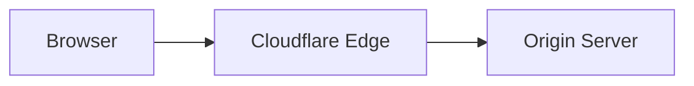
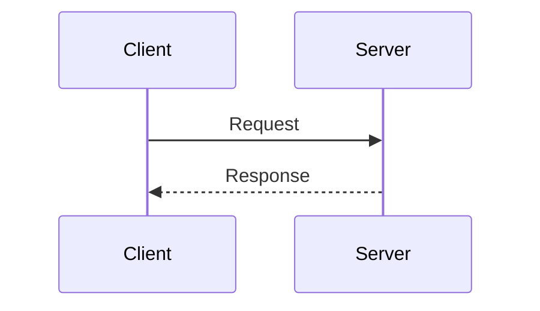
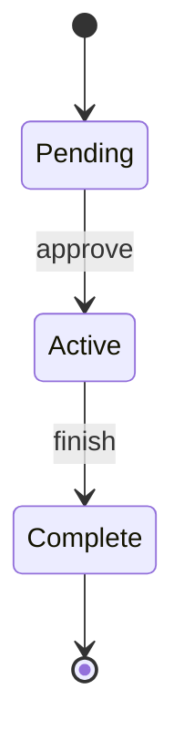
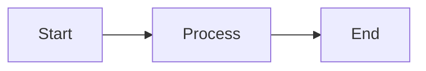
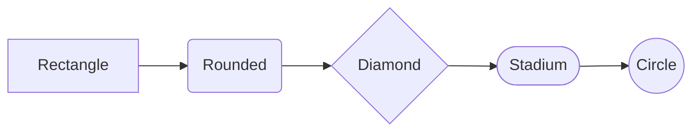

import { MermaidDiagram } from "~/components";

Use the `MermaidDiagram` component to render Mermaid diagrams at build time using [Beautiful Mermaid](https://agents.craft.do/mermaid). Diagrams use a Cloudflare-themed color scheme with orange accents.

<MermaidDiagram>

</MermaidDiagram>

```mdx
import { MermaidDiagram } from "~/components";

<MermaidDiagram>
\`\`\`mermaid
flowchart LR
A[Browser] --> B[Cloudflare Edge]
B --> C[Origin Server]
\`\`\`
</MermaidDiagram>
```

## Supported diagram types

The component supports flowcharts, sequence diagrams, state diagrams, class diagrams, and ER diagrams.

### Sequence diagram

<MermaidDiagram>

</MermaidDiagram>

```mdx
<MermaidDiagram>
\`\`\`mermaid
sequenceDiagram
accTitle: Request flow
accDescr: Shows how requests flow from client to server
Client->>Server: Request
Server-->>Client: Response
\`\`\`
</MermaidDiagram>
```

### State diagram

<MermaidDiagram>

</MermaidDiagram>

```mdx
<MermaidDiagram>
\`\`\`mermaid
stateDiagram-v2
[*] --> Pending
Pending --> Active : approve
Active --> Complete : finish
Complete --> [*]
\`\`\`
</MermaidDiagram>
```

## Accessibility

The component preserves `accTitle` and `accDescr` metadata as `aria-label` and screen-reader-only descriptions. Always include these for complex diagrams.

## Props

| Prop      | Type     | Default   | Description             |
| --------- | -------- | --------- | ----------------------- |
| `fg`      | `string` | `#1d1d1d` | Foreground/text color   |
| `bg`      | `string` | `#FFFDFB` | Background color        |
| `line`    | `string` | `#EC5829` | Edge/connector color    |
| `accent`  | `string` | `#EC5829` | Arrow heads, highlights |
| `muted`   | `string` | (derived) | Secondary text, labels  |
| `surface` | `string` | (derived) | Node fill tint          |
| `border`  | `string` | `#EC5829` | Node stroke             |

### Custom colors

<MermaidDiagram accent="#0066FF" line="#0066FF" border="#0066FF">

</MermaidDiagram>

```mdx
<MermaidDiagram accent="#0066FF" line="#0066FF" border="#0066FF">
\`\`\`mermaid
flowchart LR
A[Start] --> B[Process] --> C[End]
\`\`\`
</MermaidDiagram>
```

## Dark mode

The component automatically adapts to dark mode via CSS custom properties. No additional configuration is needed.

## Node shapes

Supported shapes include:

| Syntax     | Shape      |
| ---------- | ---------- |
| `[text]`   | Rectangle  |
| `(text)`   | Rounded    |
| `{text}`   | Diamond    |
| `([text])` | Stadium    |
| `((text))` | Circle     |
| `[[text]]` | Subroutine |
| `[(text)]` | Cylinder   |
| `{{text}}` | Hexagon    |
| `>text]`   | Asymmetric |

<MermaidDiagram>

</MermaidDiagram>
