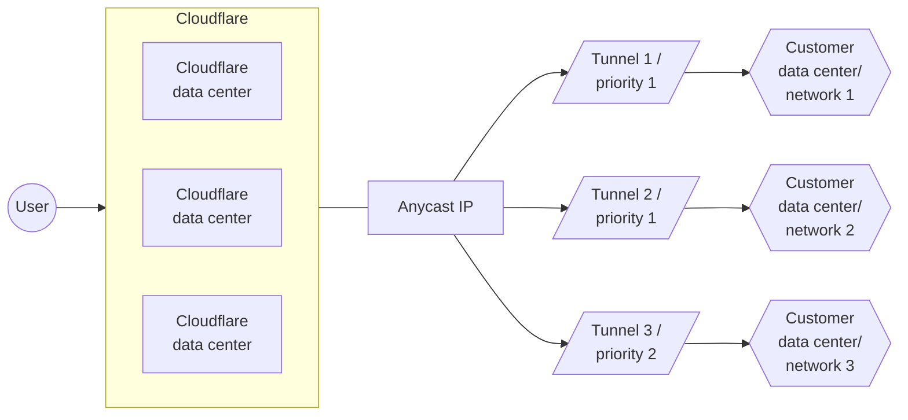

Mermaid diagrams are added with [`remark-mermaid`](https://github.com/remcohaszing/rehype-mermaid/) and [`mermaid`](https://www.npmjs.com/package/mermaid).


```mermaid
flowchart LR
accTitle: Tunnels diagram
accDescr: The example in this diagram has three tunnel routes. Tunnels 1 and 2 have top priority and Tunnel 3 is secondary.

subgraph Cloudflare
direction LR
B[Cloudflare <br/> data center]
C[Cloudflare <br/> data center]
D[Cloudflare <br/> data center]
end

A((User)) --> Cloudflare --- E[Anycast IP]
E[Anycast IP] --> F[/Tunnel 1 / <br/> priority 1/] --> I{{Customer <br/> data center/ <br/> network 1}}
E[Anycast IP] --> G[/Tunnel 2 / <br/> priority 1/] --> J{{Customer <br/> data center/ <br/> network 2}}
E[Anycast IP] --> H[/Tunnel 3 / <br/> priority 2/] --> K{{Customer <br/> data center/ <br/> network 3}}
```

````

```mermaid
flowchart LR
accTitle: Tunnels diagram
accDescr: The example in this diagram has three tunnel routes. Tunnels 1 and 2 have top priority and Tunnel 3 is secondary.

subgraph Cloudflare
direction LR
B[Cloudflare <br/> data center]
C[Cloudflare <br/> data center]
D[Cloudflare <br/> data center]
end

A((User)) --> Cloudflare --- E[Anycast IP]
E[Anycast IP] --> F[/Tunnel 1 / <br/> priority 1/] --> I{{Customer <br/> data center/ <br/> network 1}}
E[Anycast IP] --> G[/Tunnel 2 / <br/> priority 1/] --> J{{Customer <br/> data center/ <br/> network 2}}
E[Anycast IP] --> H[/Tunnel 3 / <br/> priority 2/] --> K{{Customer <br/> data center/ <br/> network 3}}
```
````