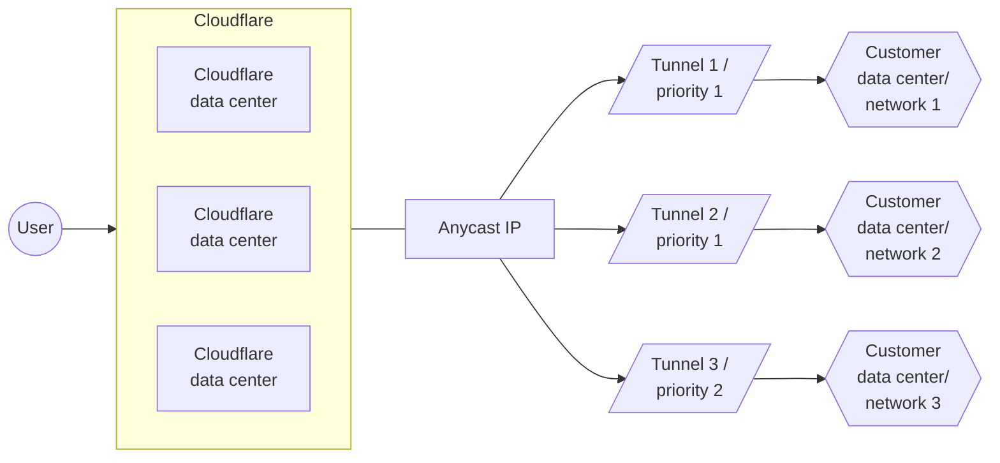

Images help a reader see a tool, a process, or an architecture. This page covers three: screenshots, diagrams, and reference diagrams. Because images cost more to maintain than text, use them intentionally.

## Screenshots

A screenshot is a picture of a software tool, in this case usually the Cloudflare dashboard. We only recommend screenshots in specific scenarios, as they have a higher maintenance cost than other types of content.

### When to use

Use screenshots sparingly and intentionally. For example, it is appropriate to use a screenshot when the task is simple but often confuses readers or is hard to describe with words alone.

A canonical example is [Find account and zone ID](/fundamentals/account/find-account-and-zone-ids/) because:

- It is a high driver of SEO traffic to our [Community](https://community.cloudflare.com).
- We tried explaining with words alone and that did not solve the confusion.
- It is a task specifically related to new users, who are less familiar with Cloudflare concepts or navigation patterns.

:::note

Use screenshots liberally in [Changelog entries](/style-guide/documentation-content-strategy/content-types/changelog/), because this content type is an accepted point-in-time reference and it is okay for these screenshots to be outdated.

:::

### Guidelines

Screenshots should:

- Maintain the original aspect-lock ratio.
- Keep resolution at 72dpi.
- Keep width at 500-600 pixels.
- Avoid sharing sensitive information (you may need to edit the underlying HTML in your browser).
- Avoid including visuals that change frequently, such as sidebar navigation.
- Have descriptive alt text.

### Usage

```mdx

```

Add screenshots to the corresponding `$PRODUCT_NAME` folder under [`/src/assets/images/`](https://github.com/cloudflare/cloudflare-docs/tree/production/src/assets/images). You may want to add subfolders for organizational purposes.

### Maintenance

We avoid screenshots without a clear purpose because they are difficult to maintain. This is because:

- The UI might change and our team might not know.
- Even if you do know what changed, it is difficult to find which screenshots reference a particular UI flow.
- If something changes, you need to fully re-take the screenshot to replace it. This could involve adding fake data or hiding sensitive information.

For more details on how we approach this maintenance, refer to [Image maintenance](/style-guide/how-we-docs/image-maintenance/).

## Diagrams

Diagrams are visualizations that depict a process, architecture, or some other form of technology. They explain complex topics in a compelling way and help a reader visualize a specific solution, process, or interaction between products. Diagrams are used in all content types. We recommend either SVG files or Mermaid diagrams.

### SVG diagrams

Use SVG files instead of PNG or JPEG because SVG scales well when a reader zooms in. Use clear and straightforward alt text with your SVG for use by screen readers. We optimize SVG files with a [recurring script](https://github.com/cloudflare/cloudflare-docs/blob/production/scripts/optimize-svgs.ts) in our repo.

Format an SVG like this:

```md

```

For example:


```md

```

### Mermaid diagrams

Use Mermaid diagrams to illustrate product or process flows. If they work for your use case, Mermaid diagrams are preferable to SVG files because they are more easily searchable and changeable. Our Mermaid diagrams are based on [`rehype-mermaid`](https://github.com/remcohaszing/rehype-mermaid/) and [`mermaid`](https://www.npmjs.com/package/mermaid).

Format a Mermaid diagram like this:

````md

````

For example, this renders as:


## Reference diagram

A single diagram that portrays all or part of Cloudflare's platform and how Cloudflare would align with a customer's infrastructure or use case.

**Used in**: [Reference architecture](/style-guide/documentation-content-strategy/content-types/reference-architecture/), [Reference architecture diagram](/style-guide/documentation-content-strategy/content-types/reference-architecture/#reference-architecture-diagrams)

Show a complete Cloudflare architecture aligned with a specific infrastructure or use case. Whenever possible, the image should be an SVG.

For example:


_Note: Labels in this image may reflect a previous product name._
