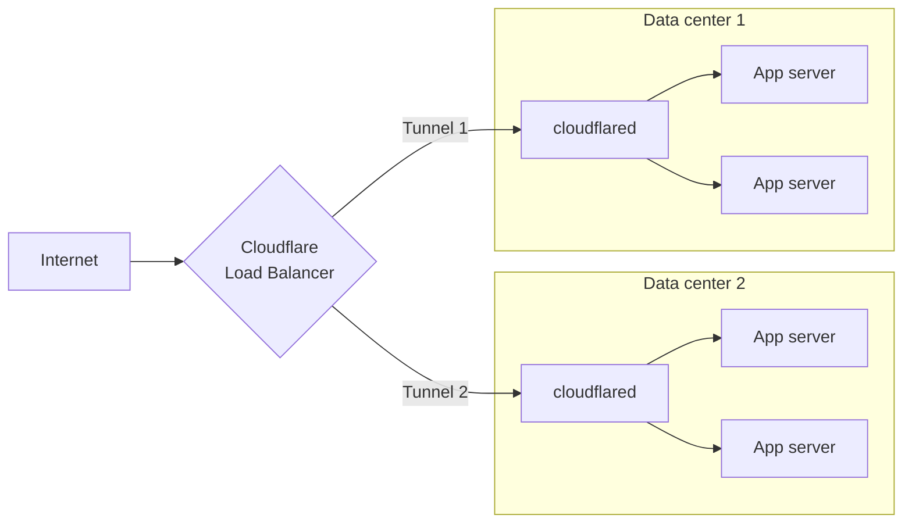

import { TabItem, Tabs, DashButton, Details } from "~/components";

Cloudflare Tunnel routes traffic from Cloudflare's network to services running behind `cloudflared`. When you [publish an application](/tunnel/setup/#publish-an-application), you map a public hostname to a local service — for example, `app.example.com` to `http://localhost:8080` — and Cloudflare applies CDN caching, WAF, and DDoS protection before forwarding the request to your origin.


## Published applications

A published application is a hostname-to-service mapping defined in your tunnel configuration. Each mapping tells `cloudflared` which local service should receive traffic for a given public hostname.

You can publish multiple applications on a single tunnel. For each application, specify:

- **Public hostname** — The domain or subdomain that users visit (for example, `app.example.com`).
- **Service** — The local address or socket where the application is running (for example, `http://localhost:8080`).

When you add a route through the dashboard, Cloudflare automatically creates a DNS record pointing the hostname to your tunnel subdomain (`<UUID>.cfargotunnel.com`).

## Supported protocols

The table below lists the service types you can route to a public hostname. Non-HTTP services require [installing `cloudflared` on the client](/cloudflare-one/access-controls/applications/non-http/cloudflared-authentication/) for end users to connect.

| Service type | Description                                                                                                                                                                                                                                                                                                                                                  | Example `service` value               |
| ------------ | ------------------------------------------------------------------------------------------------------------------------------------------------------------------------------------------------------------------------------------------------------------------------------------------------------------------------------------------------------------ | ------------------------------------- |
| HTTP         | Proxies incoming HTTPS requests to your local web service over HTTP.                                                                                                                                                                                                                                                                                         | `http://localhost:8000`               |
| HTTPS        | Proxies incoming HTTPS requests directly to your local web service. You can [disable TLS verification](/tunnel/configuration/#notlsverify) for self-signed certificates.                                                                                                                                                                                     | `https://localhost:8000`              |
| UNIX         | Same as HTTP, but uses a Unix socket.                                                                                                                                                                                                                                                                                                                        | `unix:/home/production/echo.sock`     |
| UNIX + TLS   | Same as HTTPS, but uses a Unix socket.                                                                                                                                                                                                                                                                                                                       | `unix+tls:/home/production/echo.sock` |
| TCP          | Streams TCP over a WebSocket connection. End users run `cloudflared access tcp` to connect. For long-lived connections, use [WARP-to-Tunnel](/cloudflare-one/networks/connectors/cloudflare-tunnel/private-net/cloudflared/) instead.                                                                                                                        | `tcp://localhost:2222`                |
| SSH          | Streams SSH over a WebSocket connection. End users run `cloudflared access ssh` to [connect](/cloudflare-one/networks/connectors/cloudflare-tunnel/use-cases/ssh/ssh-cloudflared-authentication/). For long-lived connections, use [WARP-to-Tunnel](/cloudflare-one/networks/connectors/cloudflare-tunnel/use-cases/ssh/ssh-infrastructure-access/) instead. | `ssh://localhost:22`                  |
| RDP          | Streams RDP over a WebSocket connection. Refer to [Connect to RDP with client-side cloudflared](/cloudflare-one/networks/connectors/cloudflare-tunnel/use-cases/rdp/rdp-cloudflared-authentication/).                                                                                                                                                        | `rdp://localhost:3389`                |
| SMB          | Streams SMB over a WebSocket connection. Refer to [Connect to SMB with client-side cloudflared](/cloudflare-one/networks/connectors/cloudflare-tunnel/use-cases/smb/#connect-to-smb-server-with-cloudflared-access).                                                                                                                                         | `smb://localhost:445`                 |
| HTTP_STATUS  | Responds to all requests with a fixed HTTP status code.                                                                                                                                                                                                                                                                                                      | `http_status:404`                     |
| BASTION      | Allows `cloudflared` to act as a jump host, providing access to any local address.                                                                                                                                                                                                                                                                           | `bastion`                             |
| HELLO_WORLD  | Test server for validating your tunnel connection ([locally managed tunnels](/tunnel/other-tunnel-types/local-management/configuration-file/#file-structure-for-published-applications) only).                                                                                                                                                               | `hello_world`                         |

## DNS records

When you create a tunnel, Cloudflare generates a subdomain at `<UUID>.cfargotunnel.com`. You point a CNAME record at this subdomain to route traffic from your hostname to the tunnel.

The `cfargotunnel.com` subdomain only proxies traffic for DNS records in the same Cloudflare account. If someone discovers your tunnel UUID, they cannot create a DNS record in another account to proxy traffic through it.

### Create a DNS record

<Tabs> <TabItem label="Dashboard">

1. Log in to the [Cloudflare dashboard](https://dash.cloudflare.com/) and go to **DNS Records** for your domain.

   <DashButton url="/?to=/:account/:zone/dns/records" />

2. Select **Add record**.
3. Enter the following values:
   - **Type**: _CNAME_
   - **Name**: Subdomain of your application
   - **Target**: `<UUID>.cfargotunnel.com`
4. Select **Save**.


</TabItem>

<TabItem label="CLI">

Run the following command to create a CNAME record pointing to your tunnel subdomain:

```sh
cloudflared tunnel route dns <UUID or NAME> www.app.com
```

This creates a CNAME record but does not proxy traffic unless the tunnel is running.

:::note
To create DNS records using `cloudflared`, the [`cert.pem`](/tunnel/other-tunnel-types/local-management/local-tunnel-terms/#certpem) file must be installed on your system.
:::

</TabItem>

</Tabs>

The DNS record and the tunnel are independent. You can create DNS records that point to a tunnel that is not running. If a tunnel stops, the DNS record is not deleted — visitors will see a `1016` error.

You can also create multiple DNS records pointing to the same tunnel subdomain. If you route traffic from multiple hostnames to multiple services, create a CNAME entry for each hostname. All entries share the same target.

## Load balancing

Use a [public load balancer](/load-balancing/load-balancers/) to distribute traffic across servers running your published applications. This provides health-check-based failover and intelligent traffic steering across regions.



### Replicas versus load balancers

Running multiple `cloudflared` [replicas](/tunnel/configuration/#replicas-and-high-availability) on the same tunnel UUID provides basic redundancy — if one host fails, other replicas continue serving traffic. However, the load balancer treats all replicas of the same tunnel UUID as a single endpoint.

For granular traffic steering and [session affinity](/load-balancing/understand-basics/session-affinity/), connect each host using a different tunnel UUID so the load balancer can address them independently.

### Add a tunnel to a load balancer pool

Prerequisites: a Cloudflare Tunnel with at least one [published application route](/tunnel/setup/#publish-an-application).

1. In the Cloudflare dashboard, go to the **Load Balancing** page.

   <DashButton url="/?to=/:account/load-balancing" />

2. Select **Create load balancer**, then select **Public load balancer**.
3. Under **Select website**, select the domain of your published application route.
4. On the **Hostname** page, enter a hostname for the load balancer (for example, `lb.example.com`).
5. On the **Pools** page, select **Create a pool** and enter a descriptive name.
6. Add a tunnel endpoint with the following values:
   - **Endpoint Name**: Name of the server running the application
   - **Endpoint Address**: `<UUID>.cfargotunnel.com` (find the Tunnel ID in the [Cloudflare dashboard](https://dash.cloudflare.com/) under **Networking** > **Tunnels**)
   - **Header value**: Hostname of your published application route (for example, `app.example.com`)
   - **Weight**: `1` (if only one endpoint)

   :::note
   A single origin pool cannot reference the same tunnel UUID twice.
   :::

7. Choose a **Fallback pool**. Refer to [traffic steering policies](/load-balancing/understand-basics/traffic-steering/steering-policies/) for routing options.
8. (Recommended) On the **Monitors** page, attach a monitor to the endpoint. For an HTTP or HTTPS application, create an HTTPS monitor:
   - **Type**: _HTTPS_
   - **Path**: `/`
   - **Port**: `443`
   - **Expected Code(s)**: `200`
   - **Header Name**: `Host`
   - **Value**: `app.example.com`
9. Save and deploy the load balancer.

To test, access your application using the load balancer hostname (`lb.example.com`).

<Details header="Monitor TCP tunnel origins">

TCP monitors are not supported for tunnel endpoints. Instead, create a health check endpoint on the `cloudflared` host and use an HTTPS monitor:

1. [Add a published application route](/tunnel/setup/#publish-an-application) for the health check:
   - **Hostname**: `health-check.example.com`
   - **Service Type**: _HTTP_STATUS_
   - **HTTP Status Code**: `200`
2. [Create a monitor](/load-balancing/monitors/create-monitor/) with these settings:
   - **Type**: _HTTPS_
   - **Path**: `/`
   - **Port**: `443`
   - **Expected Code(s)**: `200`
   - **Header Name**: `Host`
   - **Value**: `health-check.example.com`

This monitor verifies that `cloudflared` is reachable. It does not check whether the upstream service is accepting requests.

</Details>

<Details header="Local connection preference">

If you notice traffic imbalances across endpoints in different locations, you may need to adjust your load balancer configuration.

Cloudflare uses [Anycast routing](https://www.cloudflare.com/learning/cdn/glossary/anycast-network/) to direct end user requests to the nearest data center. `cloudflared` prefers to serve requests using connections in the same data center, which can affect how traffic is distributed across endpoints.

If you run [replicas](/tunnel/configuration/#replicas-and-high-availability) on the same tunnel UUID, consider switching to separate tunnels for more granular control over [traffic steering](/load-balancing/understand-basics/traffic-steering/).

</Details>

## Cloudflare settings

Published applications inherit the Cloudflare settings for their hostname, including [cache rules](/cache/how-to/cache-rules/), [WAF rules](/waf/), and other [Rules](/rules/) configurations. You can change these settings for each hostname in the [Cloudflare dashboard](https://dash.cloudflare.com/).

If you use a load balancer, settings are applied to the load balancer hostname instead.
