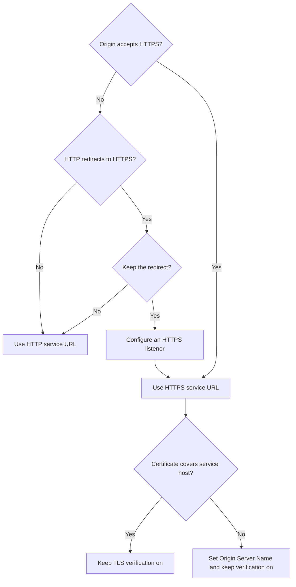

import { DashButton, Steps } from "~/components";

If your [Cloudflare Tunnel](/tunnel/) is `Healthy` but `app.example.com` fails, check the route's `Service URL`, origin certificate, and [SSL/TLS encryption mode](/ssl/origin-configuration/ssl-modes/).

A `Healthy` status confirms only that `cloudflared` connects to Cloudflare. It does not test the route's service or the local origin.

This guide covers an origin that already serves HTTPS with a Let's Encrypt certificate. You can keep the existing certificate installed.

For an Apache origin that redirects HTTP to HTTPS, use these settings:

- **Service URL**: `https://localhost:443` when `cloudflared` runs on the Apache host
- **Origin Server Name**: The hostname covered by the certificate, such as `app.example.com`
- **Disable TLS certificate verification**: Turned off
- **Encryption mode**: Leave **Automatic SSL/TLS (recommended)** selected, or choose **Full (Strict)**

## Understand the route

The public hostname is the URL that visitors request. The `Service URL` is the address, protocol, and port that `cloudflared` can reach. These values are not interchangeable. Do not use a public hostname as the service URL when that hostname points to the Tunnel CNAME.

For example, `http://localhost:80` uses HTTP for the local connection, while `https://localhost:443` uses HTTPS. Replace these examples with the address and port used by your origin.

The connection between Cloudflare and `cloudflared` is encrypted independently of the zone SSL/TLS mode. `cloudflared` validates the local origin certificate through origin parameters.

The zone SSL/TLS mode does not change the `Service URL`. Configure the local protocol in the route, then configure certificate validation with [`originServerName`](/tunnel/advanced/origin-parameters/#originservername) and the other [origin parameters](/tunnel/advanced/origin-parameters/).

If `originServerName` is empty, `cloudflared` expects the certificate to cover the host in the `Service URL`. For a service URL that uses `localhost`, set `originServerName` to the hostname covered by the certificate. This value also supplies the Server Name Indication (SNI) for the TLS connection.

## Choose route and SSL/TLS settings

Use the following decision tree to choose the local protocol and certificate settings:



If the origin has no HTTPS listener, remove or adjust its redirect before keeping an HTTP `Service URL`. Do not point an HTTPS `Service URL` at an HTTP listener.

Use this table to compare common origin and zone settings:

| Origin behavior                                                    | Service URL                                                  | Origin parameters                                                                      | Zone SSL/TLS guidance                                                                            |
| ------------------------------------------------------------------ | ------------------------------------------------------------ | -------------------------------------------------------------------------------------- | ------------------------------------------------------------------------------------------------ |
| HTTP only, with no redirect                                        | `http://127.0.0.1:80`                                        | No TLS parameters                                                                      | Automatic, Flexible, Full, and Full (strict) do not change the local HTTP connection.            |
| HTTP redirects to HTTPS                                            | `https://localhost:443`, or remove the redirect and use HTTP | Configure the route as HTTPS                                                           | Do not use **Flexible** to solve the redirect loop.                                              |
| HTTPS with a valid Let's Encrypt certificate for `app.example.com` | `https://localhost:443`                                      | Set `originServerName: app.example.com`. Keep **Disable TLS certificate verification** turned off and omit `caPool`. | Choose the zone mode separately. It does not validate the local certificate.                      |
| HTTPS with a private certificate authority (CA)                    | `https://localhost:443`                                      | Set `originServerName` and `caPool`. Keep **Disable TLS certificate verification** turned off.                       | Choose the zone mode separately. Fix certificate trust first.                                    |

For a public HTTPS hostname, **Full (strict)** is compatible with this configuration. However, `cloudflared` validates the local Let's Encrypt certificate independently. The zone mode does not replace the route's `Service URL` or `originServerName` settings.

**Full** also does not change the Tunnel service protocol or fix an origin certificate error. Do not switch to **Flexible** for either issue. Update the route's **Service URL** or origin parameters instead.

## Update a remotely-managed route

For a remotely-managed tunnel, update the route and its origin parameters in the dashboard:

<Steps>
1. In the [Cloudflare dashboard](https://dash.cloudflare.com/), go to **Networking** > **Tunnels**, then select your tunnel.

   <DashButton url="/?to=/:account/tunnels" />

2. On **Routes**, select **Edit route** for `app.example.com`.
3. In **Service URL**, enter `https://localhost:443` when the origin serves HTTPS. Use `http://127.0.0.1:80` only when the service speaks HTTP and does not redirect to HTTPS.
4. Expand **Additional application settings**. Under **TLS**, set **Origin Server Name** to `app.example.com` when the certificate covers that hostname.

   Keep **Disable TLS certificate verification** turned off. Leave **CA Pool** empty for a publicly trusted Let's Encrypt certificate. Set it only when the origin uses a private CA.

5. Select **Save changes**.
</Steps>

The route does not require you to remove an existing Let's Encrypt certificate. `cloudflared` can validate that certificate when the origin name and service protocol match.

## Keep the SSL/TLS mode separate

The zone SSL/TLS mode is separate from the Tunnel route. It does not select the local protocol or fix a certificate mismatch between `cloudflared` and the origin.

To review or change the zone mode:

<Steps>
1. In the [Cloudflare dashboard](https://dash.cloudflare.com/), go to **SSL/TLS** > **Overview**.

   <DashButton url="/?to=/:account/:zone/ssl-tls" />

2. On **SSL/TLS Overview**, select **Configure**.
3. Under **Encryption mode**, review the selected option. If **Automatic SSL/TLS (recommended)** is selected, leave it in place while troubleshooting this Tunnel route. Automatic mode does not change the route's **Service URL**.
4. To use a specific mode, select **Full (Strict)**, then select **Save**. This zone setting does not replace certificate validation by `cloudflared`.
5. Do not select **Flexible** to resolve a local origin certificate mismatch. Update the Tunnel route's **Service URL** or origin parameters instead.
</Steps>

For details about available modes, refer to [SSL/TLS encryption modes](/ssl/origin-configuration/ssl-modes/). If the origin redirects HTTP to HTTPS, an HTTP `Service URL` can cause a redirect loop. Refer to [ERR_TOO_MANY_REDIRECTS](/ssl/troubleshooting/too-many-redirects/) for other redirect causes.

## Configure a locally-managed tunnel

For a locally-managed tunnel, put the same settings in `config.yml`:

```yml title="config.yml"
tunnel: <TUNNEL_UUID>
credentials-file: /path/to/<TUNNEL_UUID>.json

ingress:
  - hostname: app.example.com
    service: https://localhost:443
    originRequest:
      originServerName: app.example.com
  - service: http_status:404
```

This example keeps TLS verification enabled. It omits `caPool` because standard Let's Encrypt certificates are publicly trusted. For a private CA, add `caPool: /path/to/ca.pem` under `originRequest`.

On Windows, if `cloudflared` reports that it cannot load the system root certificate pool, set `caPool` to a local PEM bundle that contains the certificate authority.

Use `noTLSVerify: true` only as a temporary last resort while you fix certificate trust or the origin name. Turn it off after you resolve the underlying issue.

The catch-all `http_status:404` rule is required at the end of the file. After editing `config.yml`, validate the ingress rules:

```sh
cloudflared tunnel ingress validate
```

## Run diagnostics

Run these checks from the public Internet and from the same host as `cloudflared`:

<Steps>
1. **Check the public hostname and DNS.** In the Cloudflare dashboard, go to **DNS** > **Records** for `example.com`. Confirm that `app.example.com` is a `CNAME` pointing to `<TUNNEL_ID>.cfargotunnel.com`.

   <DashButton url="/?to=/:account/:zone/dns/records" />

   Inspect the exact hostname from a terminal:

   ```sh
   dig CNAME app.example.com +short
   dig A app.example.com +short
   dig AAAA app.example.com +short
   ```

   A proxied record may return Cloudflare addresses instead of the `CNAME` target. Use the dashboard to verify the target in that case.

   Cloudflare does not silently fall back from a Tunnel to an `A` or `AAAA` record. If the tunnel stops, the DNS record remains and visitors receive a [`1016` error](/support/troubleshooting/http-status-codes/cloudflare-1xxx-errors/error-1016/). Refer to [Tunnel DNS records](/tunnel/routing/#dns-records) for more information. If traffic appears to go directly to the origin, check whether the exact hostname has an `A` or `AAAA` record instead of the expected CNAME, or whether an explicit load balancer or another route serves it.

2. **Inspect redirect headers and statuses.** From a client, request the public hostname and follow a limited number of redirects:

   ```sh
   curl -sS -D - -o /dev/null https://app.example.com/
   curl -sS -D - -o /dev/null -L --max-redirs 5 https://app.example.com/
   ```

   Look for repeated `Location` headers and `301`, `302`, `307`, or `308` status codes. From the `cloudflared` host, test an HTTP listener directly:

   ```sh
   curl -sS -D - -o /dev/null -H "Host: app.example.com" http://127.0.0.1:80/
   ```

   If the origin returns an HTTPS `Location` header, use the HTTPS `Service URL` or change the origin redirect policy. An HTTP `Service URL` sends every request to the origin over HTTP and can repeat the redirect indefinitely.

3. **Check the origin certificate and Server Name Indication (SNI).** Run this from the host where `cloudflared` runs:

   ```sh
   openssl s_client -connect 127.0.0.1:443 -servername app.example.com -verify_hostname app.example.com -verify_return_error </dev/null
   ```

   Confirm that the certificate includes `app.example.com` and that the output contains `Verify return code: 0 (ok)`. When the service URL uses `localhost` but the certificate covers `app.example.com`, set **Origin Server Name** to `app.example.com`.

4. **Stream Tunnel logs.** If the **Live logs** tab is available in the tunnel detail page, open it and select **Live**. You can also use [remote log streaming](/tunnel/monitoring/#remote-log-streaming) or run this command from an authenticated machine:

   ```sh
   cloudflared tail <TUNNEL_UUID>
   ```

   Look for `connection refused`, malformed HTTP responses, `x509` errors, and TLS handshake errors. These messages identify failures between `cloudflared` and the local origin, even when the Tunnel status remains `Healthy`.
</Steps>

For protocol details, refer to [supported Tunnel protocols](/tunnel/routing/#supported-protocols). For all origin settings, refer to [Tunnel origin parameters](/tunnel/advanced/origin-parameters/).
