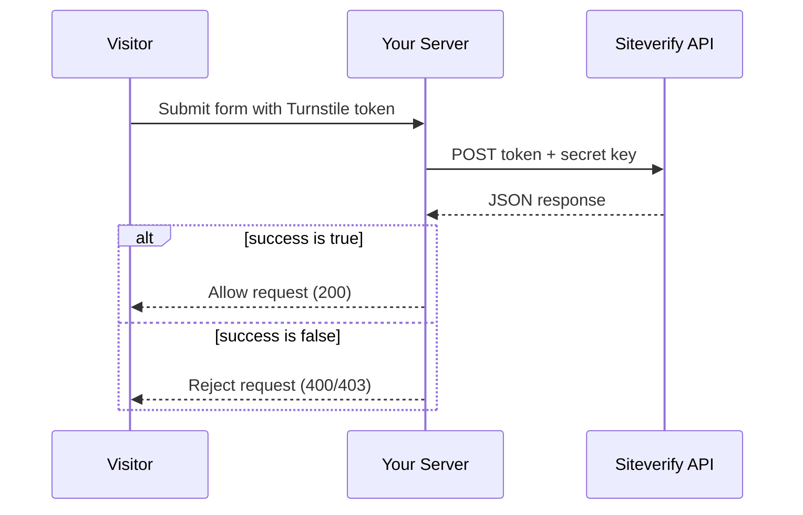

import { Render, TabItem, Tabs } from "~/components";

Learn how to securely validate Turnstile tokens on your server using the Siteverify API.

:::caution[Mandatory server-side validation]

You must call the Siteverify API to complete your Turnstile configuration. The client-side widget alone does not provide protection because tokens can be forged by attackers, expire after 5 minutes, and are single-use.

:::

## How it works

After a visitor completes a Turnstile challenge, the widget generates a single-use token. Your server must send this token to Cloudflare's Siteverify API to confirm the visitor is legitimate before processing the request. The following diagram shows the full flow, including both success and failure paths.



## Siteverify API overview

```shell title="Endpoint"
POST https://challenges.cloudflare.com/turnstile/v0/siteverify
```

### Request format

The API accepts both `application/x-www-form-urlencoded` and `application/json` requests, but always returns JSON responses.

#### Request parameters

| Parameter         | Required | Description                                            |
| ----------------- | -------- | ------------------------------------------------------ |
| `secret`          | Yes      | Your widget's secret key from the Cloudflare dashboard |
| `response`        | Yes      | The token from the client-side widget                  |
| `remoteip`        | No       | The visitor's IP address                               |
| `idempotency_key` | No       | UUID for retry protection                              |

#### Token characteristics

- **Maximum length**: 2048 characters
- **Validity period**: 300 seconds (5 minutes) from generation
- **Single use**: Each token can only be validated once

If a visitor submits the form after the token expires, the Siteverify API returns a failure with the `timeout-or-duplicate` error code. To recover, refresh the Turnstile widget to generate a new token using the `turnstile.reset` function.

### Quick test with curl

You can verify your integration by calling the Siteverify API directly from a terminal:

```bash
curl -X POST "https://challenges.cloudflare.com/turnstile/v0/siteverify" \
  -H "Content-Type: application/json" \
  --data '{
    "secret": "1x0000000000000000000000000000000AA",
    "response": "XXXX.DUMMY.TOKEN.XXXX"
  }'
```

This uses a [test secret key](/turnstile/troubleshooting/testing/) and dummy token, so it always returns `"success": true`. Replace these with your production credentials and a real client token for actual validation.

---

## Basic validation examples

<Tabs syncKey="workersExamples">
<TabItem label="TypeScript" icon="seti:typescript">

#### JSON

```ts
import type { TurnstileResponse } from "./types";

const SITEVERIFY_URL =
	"https://challenges.cloudflare.com/turnstile/v0/siteverify";

async function validateTurnstile(
	token: string,
	secretKey: string,
	remoteip?: string,
): Promise<TurnstileResponse> {
	try {
		const response = await fetch(SITEVERIFY_URL, {
			method: "POST",
			headers: { "Content-Type": "application/json" },
			body: JSON.stringify({
				secret: secretKey,
				response: token,
				...(remoteip && { remoteip }),
			}),
		});

		return (await response.json()) as TurnstileResponse;
	} catch (error) {
		console.error("Turnstile validation error:", error);
		return { success: false, "error-codes": ["internal-error"] };
	}
}
```

#### Form Data

```ts
import type { TurnstileResponse } from "./types";

const SITEVERIFY_URL =
	"https://challenges.cloudflare.com/turnstile/v0/siteverify";

async function validateTurnstile(
	token: string,
	secretKey: string,
	remoteip?: string,
): Promise<TurnstileResponse> {
	const formData = new FormData();
	formData.append("secret", secretKey);
	formData.append("response", token);
	if (remoteip) {
		formData.append("remoteip", remoteip);
	}

	try {
		const response = await fetch(SITEVERIFY_URL, {
			method: "POST",
			body: formData,
		});

		return (await response.json()) as TurnstileResponse;
	} catch (error) {
		console.error("Turnstile validation error:", error);
		return { success: false, "error-codes": ["internal-error"] };
	}
}

// Usage in a request handler
async function handleFormSubmission(request: Request): Promise<Response> {
	const body = await request.formData();
	const token = body.get("cf-turnstile-response");

	if (typeof token !== "string") {
		return new Response("Missing Turnstile token", { status: 400 });
	}

	const ip =
		request.headers.get("CF-Connecting-IP") ??
		request.headers.get("X-Forwarded-For") ??
		undefined;

	const validation = await validateTurnstile(
		token,
		process.env.TURNSTILE_SECRET_KEY!,
		ip,
	);

	if (validation.success) {
		console.log("Valid submission from:", validation.hostname);
		return new Response("OK", { status: 200 });
	}

	console.log("Invalid token:", validation["error-codes"]);
	return new Response("Invalid verification", { status: 400 });
}
```

</TabItem>
<TabItem label="JavaScript" icon="seti:javascript">

#### JSON

```js
const SECRET_KEY = "your-secret-key";

async function validateTurnstile(token, remoteip) {
	try {
		const response = await fetch(
			"https://challenges.cloudflare.com/turnstile/v0/siteverify",
			{
				method: "POST",
				headers: {
					"Content-Type": "application/json",
				},
				body: JSON.stringify({
					secret: SECRET_KEY,
					response: token,
					remoteip: remoteip,
				}),
			},
		);

		const result = await response.json();
		return result;
	} catch (error) {
		console.error("Turnstile validation error:", error);
		return { success: false, "error-codes": ["internal-error"] };
	}
}
```

#### Form Data

```js
const SECRET_KEY = "your-secret-key";

async function validateTurnstile(token, remoteip) {
	const formData = new FormData();
	formData.append("secret", SECRET_KEY);
	formData.append("response", token);
	formData.append("remoteip", remoteip);

	try {
		const response = await fetch(
			"https://challenges.cloudflare.com/turnstile/v0/siteverify",
			{
				method: "POST",
				body: formData,
			},
		);

		const result = await response.json();
		return result;
	} catch (error) {
		console.error("Turnstile validation error:", error);
		return { success: false, "error-codes": ["internal-error"] };
	}
}

// Usage in form handler
async function handleFormSubmission(request) {
	const body = await request.formData();
	const token = body.get("cf-turnstile-response");
	const ip =
		request.headers.get("CF-Connecting-IP") ||
		request.headers.get("X-Forwarded-For") ||
		"unknown";

	const validation = await validateTurnstile(token, ip);

	if (validation.success) {
		// Token is valid - process the form
		console.log("Valid submission from:", validation.hostname);
		return processForm(body);
	} else {
		// Token is invalid - reject the submission
		console.log("Invalid token:", validation["error-codes"]);
		return new Response("Invalid verification", { status: 400 });
	}
}
```

</TabItem>
<TabItem label="PHP" icon="seti:php">
```php
<?php
function validateTurnstile($token, $secret, $remoteip = null) {
    $url = 'https://challenges.cloudflare.com/turnstile/v0/siteverify';

    $data = [
        'secret' => $secret,
        'response' => $token
    ];

    if ($remoteip) {
        $data['remoteip'] = $remoteip;
    }

    $options = [
        'http' => [
            'header' => "Content-type: application/x-www-form-urlencoded\r\n",
            'method' => 'POST',
            'content' => http_build_query($data)
        ]
    ];

    $context = stream_context_create($options);
    $response = file_get_contents($url, false, $context);

    if ($response === FALSE) {
        return ['success' => false, 'error-codes' => ['internal-error']];
    }

    return json_decode($response, true);

}

// Usage
$secret_key = 'your-secret-key';
$token = $_POST['cf-turnstile-response'] ?? '';
$remoteip = $_SERVER['HTTP_CF_CONNECTING_IP'] ??
    $_SERVER['HTTP_X_FORWARDED_FOR'] ??
    $_SERVER['REMOTE_ADDR'];

$validation = validateTurnstile($token, $secret_key, $remoteip);

if ($validation['success']) {
    // Valid token - process form
    echo "Form submission successful!";
    // Process your form data here
} else {
    // Invalid token - show error
    echo "Verification failed. Please try again.";
    error_log('Turnstile validation failed: ' . implode(', ', $validation['error-codes']));
}
?>
```
</TabItem>
<TabItem label="Python" icon="seti:python">
```python
import requests

def validate_turnstile(token, secret, remoteip=None):
    url = 'https://challenges.cloudflare.com/turnstile/v0/siteverify'

    data = {
        'secret': secret,
        'response': token
    }

    if remoteip:
        data['remoteip'] = remoteip

    try:
        response = requests.post(url, data=data, timeout=10)
        response.raise_for_status()
        return response.json()
    except requests.RequestException as e:
        print(f"Turnstile validation error: {e}")
        return {'success': False, 'error-codes': ['internal-error']}

# Usage with Flask
from flask import Flask, request, jsonify

app = Flask(__name__)
SECRET_KEY = 'your-secret-key'

@app.route('/submit-form', methods=['POST'])
def submit_form():
    token = request.form.get('cf-turnstile-response')
    remoteip = request.headers.get('CF-Connecting-IP') or \
               request.headers.get('X-Forwarded-For') or \
               request.remote_addr

    validation = validate_turnstile(token, SECRET_KEY, remoteip)

    if validation['success']:
        # Valid token - process form
        return jsonify({'status': 'success', 'message': 'Form submitted successfully'})
    else:
        # Invalid token - reject submission
        return jsonify({
            'status': 'error',
            'message': 'Verification failed',
            'errors': validation['error-codes']
        }), 400
```

</TabItem>
<TabItem label="Java" icon="seti:java">
```java
import org.springframework.web.client.RestTemplate;
import org.springframework.util.LinkedMultiValueMap;
import org.springframework.util.MultiValueMap;
import org.springframework.http.HttpEntity;
import org.springframework.http.HttpHeaders;
import org.springframework.http.MediaType;
import org.springframework.http.ResponseEntity;

@Service
public class TurnstileService {
private static final String SITEVERIFY_URL = "https://challenges.cloudflare.com/turnstile/v0/siteverify";
private final String secretKey = "your-secret-key";
private final RestTemplate restTemplate = new RestTemplate();

    public TurnstileResponse validateToken(String token, String remoteip) {
        HttpHeaders headers = new HttpHeaders();
        headers.setContentType(MediaType.APPLICATION_FORM_URLENCODED);

        MultiValueMap<String, String> params = new LinkedMultiValueMap<>();
        params.add("secret", secretKey);
        params.add("response", token);
        if (remoteip != null) {
            params.add("remoteip", remoteip);
        }

        HttpEntity<MultiValueMap<String, String>> request = new HttpEntity<>(params, headers);

        try {
            ResponseEntity<TurnstileResponse> response = restTemplate.postForEntity(
                SITEVERIFY_URL, request, TurnstileResponse.class);
            return response.getBody();
        } catch (Exception e) {
            TurnstileResponse errorResponse = new TurnstileResponse();
            errorResponse.setSuccess(false);
            errorResponse.setErrorCodes(List.of("internal-error"));
            return errorResponse;
        }
    }

}

// Controller usage
@PostMapping("/submit-form")
public ResponseEntity<?> submitForm(
@RequestParam("cf-turnstile-response") String token,
HttpServletRequest request) {

    String remoteip = request.getHeader("CF-Connecting-IP");
    if (remoteip == null) {
        remoteip = request.getHeader("X-Forwarded-For");
    }
    if (remoteip == null) {
        remoteip = request.getRemoteAddr();
    }

    TurnstileResponse validation = turnstileService.validateToken(token, remoteip);

    if (validation.isSuccess()) {
        // Valid token - process form
        return ResponseEntity.ok("Form submitted successfully");
    } else {
        // Invalid token - reject submission
        return ResponseEntity.badRequest()
            .body("Verification failed: " + validation.getErrorCodes());
    }

}

```
</TabItem>
<TabItem label="C#" icon="seti:c-sharp">
```csharp
using System.Text.Json;

public class TurnstileService
{
    private readonly HttpClient _httpClient;
    private readonly string _secretKey = "your-secret-key";
    private const string SiteverifyUrl = "https://challenges.cloudflare.com/turnstile/v0/siteverify";

    public TurnstileService(HttpClient httpClient)
    {
        _httpClient = httpClient;
    }

    public async Task<TurnstileResponse> ValidateTokenAsync(string token, string remoteip = null)
    {
        var parameters = new Dictionary<string, string>
        {
            { "secret", _secretKey },
            { "response", token }
        };

        if (!string.IsNullOrEmpty(remoteip))
        {
            parameters.Add("remoteip", remoteip);
        }

        var postContent = new FormUrlEncodedContent(parameters);

        try
        {
            var response = await _httpClient.PostAsync(SiteverifyUrl, postContent);
            var stringContent = await response.Content.ReadAsStringAsync();

            return JsonSerializer.Deserialize<TurnstileResponse>(stringContent);
        }
        catch (Exception ex)
        {
            return new TurnstileResponse
            {
                Success = false,
                ErrorCodes = new[] { "internal-error" }
            };
        }
    }
}

// Controller usage
[HttpPost("submit-form")]
public async Task<IActionResult> SubmitForm([FromForm] string cfTurnstileResponse)
{
    var remoteip = HttpContext.Request.Headers["CF-Connecting-IP"].FirstOrDefault() ??
                   HttpContext.Request.Headers["X-Forwarded-For"].FirstOrDefault() ??
                   HttpContext.Connection.RemoteIpAddress?.ToString();

    var validation = await _turnstileService.ValidateTokenAsync(cfTurnstileResponse, remoteip);

    if (validation.Success)
    {
        // Valid token - process form
        return Ok("Form submitted successfully");
    }
    else
    {
        // Invalid token - reject submission
        return BadRequest($"Verification failed: {string.Join(", ", validation.ErrorCodes)}");
    }
}
```

</TabItem>
</Tabs>

---

## Advanced validation techniques

<Tabs syncKey="workersExamples">
<TabItem label="TypeScript" icon="seti:typescript">

```ts title="Idempotency keys for retry protection"
import type { TurnstileResponse } from "./types";

const SITEVERIFY_URL =
	"https://challenges.cloudflare.com/turnstile/v0/siteverify";

async function validateWithRetry(
	token: string,
	secretKey: string,
	remoteip?: string,
	maxRetries = 3,
): Promise<TurnstileResponse> {
	const idempotencyKey = crypto.randomUUID();

	for (let attempt = 1; attempt <= maxRetries; attempt++) {
		try {
			const formData = new FormData();
			formData.append("secret", secretKey);
			formData.append("response", token);
			formData.append("idempotency_key", idempotencyKey);
			if (remoteip) {
				formData.append("remoteip", remoteip);
			}

			const response = await fetch(SITEVERIFY_URL, {
				method: "POST",
				body: formData,
			});

			// Siteverify always returns HTTP 200.
			// Check the success field, not the HTTP status.
			return (await response.json()) as TurnstileResponse;
		} catch (error) {
			if (attempt === maxRetries) {
				return { success: false, "error-codes": ["internal-error"] };
			}

			// Exponential backoff before retrying on network errors
			await new Promise((resolve) =>
				setTimeout(resolve, Math.pow(2, attempt) * 1000),
			);
		}
	}

	// Unreachable, but satisfies the return type
	return { success: false, "error-codes": ["internal-error"] };
}
```

```ts title="Enhanced validation with custom checks"
import type { TurnstileResponse } from "./types";

interface ValidationOptions {
	expectedAction?: string;
	expectedHostname?: string;
}

type ValidationResult =
	| { valid: true; data: TurnstileResponse; tokenAgeMinutes: number }
	| { valid: false; reason: string; details?: Record<string, unknown> };

async function validateTurnstileEnhanced(
	token: string,
	secretKey: string,
	remoteip: string | undefined,
	options: ValidationOptions = {},
): Promise<ValidationResult> {
	const validation = await validateTurnstile(token, secretKey, remoteip);

	if (!validation.success) {
		return {
			valid: false,
			reason: "turnstile_failed",
			details: { errors: validation["error-codes"] },
		};
	}

	if (options.expectedAction && validation.action !== options.expectedAction) {
		return {
			valid: false,
			reason: "action_mismatch",
			details: {
				expected: options.expectedAction,
				received: validation.action,
			},
		};
	}

	if (
		options.expectedHostname &&
		validation.hostname !== options.expectedHostname
	) {
		return {
			valid: false,
			reason: "hostname_mismatch",
			details: {
				expected: options.expectedHostname,
				received: validation.hostname,
			},
		};
	}

	const challengeTime = new Date(validation.challenge_ts!);
	const tokenAgeMinutes = (Date.now() - challengeTime.getTime()) / 60_000;

	if (tokenAgeMinutes > 4) {
		console.warn(`Token is ${tokenAgeMinutes.toFixed(1)} minutes old`);
	}

	return { valid: true, data: validation, tokenAgeMinutes };
}

// Usage
const result = await validateTurnstileEnhanced(token, secretKey, remoteip, {
	expectedAction: "login",
	expectedHostname: "example.com",
});

if (result.valid) {
	console.log("Validation successful:", result.data);
} else {
	console.log("Validation failed:", result.reason, result.details);
}
```

</TabItem>
<TabItem label="JavaScript" icon="seti:javascript">

```js title="Idempotency keys for retry protection"
async function validateWithRetry(token, remoteip, maxRetries = 3) {
	const idempotencyKey = crypto.randomUUID();

	for (let attempt = 1; attempt <= maxRetries; attempt++) {
		try {
			const formData = new FormData();
			formData.append("secret", SECRET_KEY);
			formData.append("response", token);
			formData.append("remoteip", remoteip);
			formData.append("idempotency_key", idempotencyKey);

			const response = await fetch(
				"https://challenges.cloudflare.com/turnstile/v0/siteverify",
				{
					method: "POST",
					body: formData,
				},
			);

			const result = await response.json();

			// Siteverify always returns HTTP 200.
			// Check the success field, not the HTTP status.
			return result;
		} catch (error) {
			// Retry on network errors only
			if (attempt === maxRetries) {
				return { success: false, "error-codes": ["internal-error"] };
			}

			// Wait before retrying (exponential backoff)
			await new Promise((resolve) =>
				setTimeout(resolve, Math.pow(2, attempt) * 1000),
			);
		}
	}
}
```

```js title="Enhanced validation with custom checks"
async function validateTurnstileEnhanced(
	token,
	remoteip,
	expectedAction = null,
	expectedHostname = null,
) {
	const validation = await validateTurnstile(token, remoteip);

	if (!validation.success) {
		return {
			valid: false,
			reason: "turnstile_failed",
			errors: validation["error-codes"],
		};
	}

	// Check if action matches expected value (if specified)
	if (expectedAction && validation.action !== expectedAction) {
		return {
			valid: false,
			reason: "action_mismatch",
			expected: expectedAction,
			received: validation.action,
		};
	}

	// Check if hostname matches expected value (if specified)
	if (expectedHostname && validation.hostname !== expectedHostname) {
		return {
			valid: false,
			reason: "hostname_mismatch",
			expected: expectedHostname,
			received: validation.hostname,
		};
	}

	// Check token age (warn if older than 4 minutes)
	const challengeTime = new Date(validation.challenge_ts);
	const now = new Date();
	const ageMinutes = (now - challengeTime) / (1000 * 60);

	if (ageMinutes > 4) {
		console.warn(`Token is ${ageMinutes.toFixed(1)} minutes old`);
	}

	return {
		valid: true,
		data: validation,
		tokenAge: ageMinutes,
	};
}

// Usage
const result = await validateTurnstileEnhanced(
	token,
	remoteip,
	"login", // expected action
	"example.com", // expected hostname
);

if (result.valid) {
	// Process the request
	console.log("Validation successful:", result.data);
} else {
	// Handle validation failure
	console.log("Validation failed:", result.reason);
}
```

</TabItem>
</Tabs>

---

## API response format

<Tabs>
<TabItem label="Successful response">
```json title="Example"
{
  "success": true,
  "challenge_ts": "2022-02-28T15:14:30.096Z",
  "hostname": "example.com",
  "error-codes": [],
  "action": "login",
  "cdata": "sessionid-123456789",
  "metadata": {
    "ephemeral_id": "x:9f78e0ed210960d7693b167e"
  }
}
```
</TabItem>
<TabItem label="Failed response">
```json title="Example"
{
  "success": false,
  "error-codes": ["invalid-input-response"],
  "messages": []
}
```
</TabItem>
</Tabs>

### Response fields

| Field | Type | Always present | Description |
| --- | --- | --- | --- |
| `success` | `boolean` | Yes | `true` if the token is valid, `false` otherwise. This is the primary field your server should check. |
| `challenge_ts` | `string` | On success | ISO 8601 timestamp (for example, `2022-02-28T15:14:30.096Z`) of when the challenge was solved. |
| `hostname` | `string` | On success | The hostname of the site where the challenge was served. You can verify this matches your expected domain. |
| `error-codes` | `string[]` | Yes | Array of [error codes](#error-codes-reference). Empty on success. |
| `action` | `string` | On success | The custom action name passed via the `data-action` attribute on the client widget. Only present if set. |
| `cdata` | `string` | On success | The custom data payload passed via the `data-cdata` attribute on the client widget. Only present if set. |
| `messages` | `string[]` | On failure | Array of informational messages. Typically empty, but may contain details for `bad-request` errors. |
| `metadata.ephemeral_id` | `string` | Enterprise only | Device fingerprint identifier. Only returned for Enterprise widgets with [ephemeral IDs](/turnstile/concepts/ephemeral-id/) turned on. |
| `metadata.result_with_testing_key` | `boolean` | Test keys only | `true` when the response was generated using a [test secret key](/turnstile/troubleshooting/testing/). Not present with production keys. |

### TypeScript interface

Use the following interface to type Siteverify responses in your application:

```ts title="TurnstileResponse"
interface TurnstileResponse {
  success: boolean;
  "error-codes": string[];
  challenge_ts?: string;
  hostname?: string;
  action?: string;
  cdata?: string;
  messages?: string[];
  metadata?: {
    ephemeral_id?: string;
    result_with_testing_key?: boolean;
  };
}
```

### Error codes reference

| Error code               | Description                             | Action required                                   |
| ------------------------ | --------------------------------------- | ------------------------------------------------- |
| `missing-input-secret`   | Secret parameter not provided           | Ensure secret key is included                     |
| `invalid-input-secret`   | Secret key is invalid or expired        | Check your secret key in the Cloudflare dashboard |
| `missing-input-response` | Response parameter was not provided     | Ensure token is included                          |
| `invalid-input-response` | Token is invalid, malformed, or expired | User should retry the challenge                   |
| `bad-request`            | Request is malformed                    | Check request format and parameters               |
| `timeout-or-duplicate`   | Token has already been validated        | Each token can only be used once                  |
| `internal-error`         | Internal error occurred                 | Retry the request                                 |

---

## Full implementation example

The following class combines input validation, timeout handling, idempotency, and hostname/action verification into a single reusable validator.

<Tabs syncKey="workersExamples">
<TabItem label="TypeScript" icon="seti:typescript">

```ts title="TurnstileValidator class"
interface TurnstileResponse {
	success: boolean;
	"error-codes": string[];
	challenge_ts?: string;
	hostname?: string;
	action?: string;
	cdata?: string;
	messages?: string[];
	metadata?: {
		ephemeral_id?: string;
		result_with_testing_key?: boolean;
	};
}

interface ValidateOptions {
	idempotencyKey?: string;
	expectedAction?: string;
	expectedHostname?: string;
}

type ValidateResult =
	| TurnstileResponse
	| { success: false; error: string; expected?: string; received?: string };

const SITEVERIFY_URL =
	"https://challenges.cloudflare.com/turnstile/v0/siteverify";
const MAX_TOKEN_LENGTH = 2048;

class TurnstileValidator {
	private readonly secretKey: string;
	private readonly timeoutMs: number;

	constructor(secretKey: string, timeoutMs = 10_000) {
		this.secretKey = secretKey;
		this.timeoutMs = timeoutMs;
	}

	async validate(
		token: string,
		remoteip?: string,
		options: ValidateOptions = {},
	): Promise<ValidateResult> {
		if (!token || typeof token !== "string") {
			return { success: false, error: "Invalid token format" };
		}

		if (token.length > MAX_TOKEN_LENGTH) {
			return { success: false, error: "Token exceeds maximum length" };
		}

		const controller = new AbortController();
		const timeoutId = setTimeout(() => controller.abort(), this.timeoutMs);

		try {
			const formData = new FormData();
			formData.append("secret", this.secretKey);
			formData.append("response", token);

			if (remoteip) {
				formData.append("remoteip", remoteip);
			}
			if (options.idempotencyKey) {
				formData.append("idempotency_key", options.idempotencyKey);
			}

			const response = await fetch(SITEVERIFY_URL, {
				method: "POST",
				body: formData,
				signal: controller.signal,
			});

			const result = (await response.json()) as TurnstileResponse;

			if (result.success) {
				if (
					options.expectedAction &&
					result.action !== options.expectedAction
				) {
					return {
						success: false,
						error: "Action mismatch",
						expected: options.expectedAction,
						received: result.action,
					};
				}
				if (
					options.expectedHostname &&
					result.hostname !== options.expectedHostname
				) {
					return {
						success: false,
						error: "Hostname mismatch",
						expected: options.expectedHostname,
						received: result.hostname,
					};
				}
			}

			return result;
		} catch (error) {
			if (error instanceof DOMException && error.name === "AbortError") {
				return { success: false, error: "Validation timeout" };
			}
			console.error("Turnstile validation error:", error);
			return { success: false, error: "Internal error" };
		} finally {
			clearTimeout(timeoutId);
		}
	}
}

// Usage
const validator = new TurnstileValidator(process.env.TURNSTILE_SECRET_KEY!);

const result = await validator.validate(token, remoteip, {
	expectedAction: "login",
	expectedHostname: "example.com",
});

if (result.success) {
	// Process the request
} else {
	console.log("Validation failed:", result);
}
```

</TabItem>
<TabItem label="JavaScript" icon="seti:javascript">

```js title="TurnstileValidator class"
class TurnstileValidator {
	constructor(secretKey, timeout = 10000) {
		this.secretKey = secretKey;
		this.timeout = timeout;
	}

	async validate(token, remoteip, options = {}) {
		// Input validation
		if (!token || typeof token !== "string") {
			return { success: false, error: "Invalid token format" };
		}

		if (token.length > 2048) {
			return { success: false, error: "Token too long" };
		}

		// Prepare request
		const controller = new AbortController();
		const timeoutId = setTimeout(() => controller.abort(), this.timeout);

		try {
			const formData = new FormData();
			formData.append("secret", this.secretKey);
			formData.append("response", token);

			if (remoteip) {
				formData.append("remoteip", remoteip);
			}

			if (options.idempotencyKey) {
				formData.append("idempotency_key", options.idempotencyKey);
			}

			const response = await fetch(
				"https://challenges.cloudflare.com/turnstile/v0/siteverify",
				{
					method: "POST",
					body: formData,
					signal: controller.signal,
				},
			);

			const result = await response.json();

			// Additional validation
			if (result.success) {
				if (
					options.expectedAction &&
					result.action !== options.expectedAction
				) {
					return {
						success: false,
						error: "Action mismatch",
						expected: options.expectedAction,
						received: result.action,
					};
				}

				if (
					options.expectedHostname &&
					result.hostname !== options.expectedHostname
				) {
					return {
						success: false,
						error: "Hostname mismatch",
						expected: options.expectedHostname,
						received: result.hostname,
					};
				}
			}

			return result;
		} catch (error) {
			if (error.name === "AbortError") {
				return { success: false, error: "Validation timeout" };
			}

			console.error("Turnstile validation error:", error);
			return { success: false, error: "Internal error" };
		} finally {
			clearTimeout(timeoutId);
		}
	}
}

// Usage
const validator = new TurnstileValidator(process.env.TURNSTILE_SECRET_KEY);

const result = await validator.validate(token, remoteip, {
	expectedAction: "login",
	expectedHostname: "example.com",
});

if (result.success) {
	// Process the request
} else {
	// Handle failure
	console.log("Validation failed:", result.error);
}
```

</TabItem>
</Tabs>

---

## Testing

<Render file="test-secret-key" product="turnstile" />

---

## Best practices

### Security

- Store your secret keys securely. Use environment variables or secure key management.
- Validate the token on every request. Never trust client-side validation alone.
- Check additional fields. Validate the action and hostname when specified.
- Monitor for abuse and log failed validations and unusual patterns.
- Use HTTPS. Always validate over secure connections.
- Only call the Siteverify API in your backend environment. If you expose the secret key in the front-end client code to call Siteverify, attackers can bypass the security check. Ensure that your client-side code sends the validation token to your backend, and that your backend is the sole caller of the Siteverify API.

### Performance

- Set reasonable timeouts. Do not wait indefinitely for Siteverify responses.
- Implement retry logic and handle temporary network issues.
- Cache validation results for the same token, if it is needed for your flow.
- Monitor your API latency. Track the Siteverify response time.

### Error handling

- Have fallback behavior for API failures.
- Use user-friendly messaging. Do not expose internal error details to users.
- Properly log errors for debugging without exposing secrets.
- Rate limit to protect against validation flooding.
