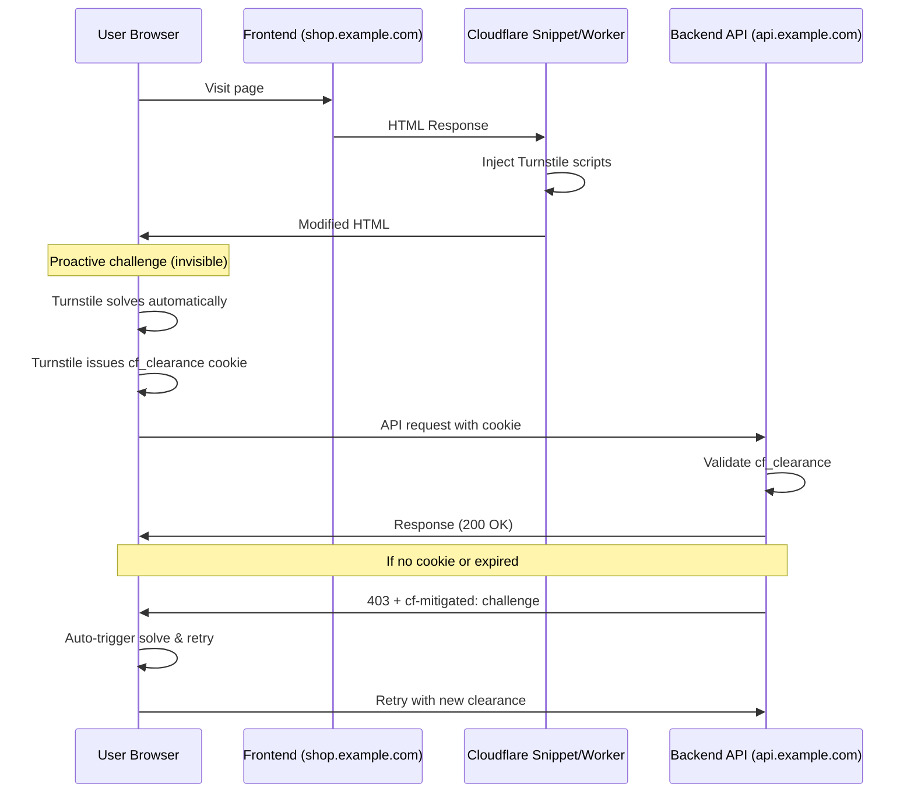

import { Steps, Render, TabItem, Tabs } from "~/components";

This tutorial demonstrates how to protect backend API endpoints from automated abuse using Turnstile Pre-Clearance. Unlike traditional implementations that require manual widget integration, this approach automatically injects Turnstile challenge handling into your frontend, transparently protecting API calls without modifying existing application code.

## Use case

Modern web applications often separate their frontend (shop site) from backend APIs. Attackers can bypass traditional bot protections by:

- Sending requests directly to API endpoints
- Using residential proxy networks to mimic legitimate users
- Spoofing user agents and browser fingerprints
- Achieving bot scores in the "human" range (30-99)

This pattern is common in:
- E-commerce sites (flight search, inventory checking, checkout APIs)
- Ticketing platforms
- Limited release/drop sites
- API-driven applications with public endpoints

## Solution overview

The solution uses Cloudflare Snippets (or Workers) to inject JavaScript that:

1. **Proactively solves Turnstile challenges** when the page loads (invisible to users)
2. **Intercepts all API requests** made via `fetch()` or `XMLHttpRequest`
3. **Automatically handles challenge responses** with retry logic
4. **Tracks solve state** across page refreshes and browser tabs

Combined with WAF Managed Challenges on the API endpoints, this creates a defense-in-depth approach:
- Legitimate users get pre-clearance and pass through seamlessly
- Direct API attacks without clearance receive Managed Challenges
- Rate limiting prevents clearance cookie abuse

## Architecture



## Before you begin

- Your site must be on Cloudflare (for Managed Challenges and zone merging)
- Access to create Turnstile widgets
- Access to configure Snippets or Workers
- Access to WAF custom rules

## Prerequisites

### Merge frontend and API zones

If your frontend (`shop.example.com`) and API (`api.example.com`) are in separate zones, you must merge them. This allows Turnstile clearance cookies to be shared between both domains.

Refer to [Zone management](/fundamentals/setup/manage-domains/merge-zones/) for guidance.

## Step 1: Create Turnstile widget

<Steps>
1. In the Cloudflare dashboard, go to **Turnstile**.
2. Select **Add widget** and configure:
   - **Widget name**: API Protection Pre-Clearance
   - **Domains**: Add your frontend domain (e.g., `shop.example.com`)
   - **Widget Mode**: Managed (required for pre-clearance)
   - **Pre-Clearance Support**: Enable

3. Copy the **Site Key** for use in Step 2.
</Steps>

:::note
Pre-Clearance mode allows Turnstile to **issue** `cf_clearance` cookies upon successful challenge completion. This enables visitors to bypass WAF Managed Challenges on subsequent requests, creating seamless integration between client-side challenges and network-level protection.
:::

## Step 2: Inject Turnstile Pre-Clearance handler

You can deploy the pre-clearance handler using either Cloudflare Snippets (recommended) or Workers.

<Tabs>
<TabItem label="Snippets (Recommended)">

Snippets run at the edge without requiring a separate Worker deployment.

1. In the Cloudflare dashboard, go to **Rules** > **Snippets**.
2. Select **Create snippet** with the following configuration:
   - **Snippet Name**: `turnstile-api-protection`
   - **Expression**: `(http.host eq "shop.example.com") and (http.response.content_type contains "text/html")`
   - **Snippet Code**: See [Snippet example](/rules/snippets/examples/turnstile-api-protection/)

</TabItem>
<TabItem label="Workers">

For more complex requirements or existing Worker infrastructure:

1. Create a new Worker
2. Deploy the code from [Snippet example](/rules/snippets/examples/turnstile-api-protection/)
3. Add a Worker route for your frontend domain

</TabItem>
</Tabs>

### Configuration

Update the configuration object in the snippet/worker:

```js
const CONFIG = {
  TURNSTILE_SITEKEY: "YOUR_SITEKEY_FROM_STEP1",
  PROTECTED_API_HOST: "api.example.com", // Your API hostname
  CLEARANCE_LIFETIME_MS: 30 * 60 * 1000, // Track solve state (note: actual cookie lifetime set by Challenge Passage)
  MAX_RETRIES: 1,
  DEBUG: false // Set true for development
};
```

## Step 3: Protect API endpoints with Managed Challenge

Create a WAF Custom Rule to challenge requests without valid clearance:

<Steps>
1. In the Cloudflare dashboard, go to **Security** > **WAF**.
2. Select **Create rule** with the following configuration:
   - **Rule name**: Challenge API without clearance
   - **Expression**: `(http.host eq "api.example.com") and not (cf.bot_management.verified_bot)`
   - **Action**: Managed Challenge

3. Deploy the rule.
</Steps>

This configuration:
- Challenges all API requests (bots must solve to get `cf_clearance` cookie)
- Exempts verified bots (search engines, monitoring services)
- Allows requests with valid clearance to pass through

## Step 4: Add rate limiting

Prevent abuse of valid clearance cookies:

<Steps>
1. In the Cloudflare dashboard, go to **Security** > **WAF** > **Rate limiting rules**.
2. Select **Create rule** with the following configuration:
   - **Rule name**: Rate limit by clearance cookie
   - **Expression**: `(http.host eq "api.example.com")`
   - **Counting expression**: `http.cookie["cf_clearance"]`
   - **Rate**: Adjust based on your traffic patterns (e.g., 100 requests per minute)
   - **Action**: Block

3. Deploy the rule.
</Steps>

## How it works

### What does Pre-Clearance actually do?

When Pre-Clearance is enabled on a Turnstile widget, **Turnstile issues a `cf_clearance` cookie** upon successful challenge completion. This cookie:
- Is issued by making a special fetch request to `/cdn-cgi/` endpoint
- Has a lifetime controlled by your zone's **Challenge Passage** setting (not configurable per-widget)
- Allows the visitor to bypass WAF Managed Challenges for the duration of the cookie
- Is the same type of cookie issued by Cloudflare Challenge Pages

The TurnstileClearance module in our implementation:
- **Does NOT create or manage the `cf_clearance` cookie itself**
- Tracks solve timestamps in `localStorage` to avoid redundant Turnstile solves
- Intercepts API requests and handles challenge responses automatically

### Proactive solving

When a user loads the frontend page:

1. Cloudflare Snippet injects two scripts into `<head>`:
   - Turnstile API (`challenges.cloudflare.com/turnstile/v0/api.js`)
   - TurnstileClearance module (intercept handler)

2. On page load, the module:
   - Checks `localStorage` for recent solve timestamp
   - If no recent solve (or expired timestamp), triggers an invisible Turnstile challenge
   - Upon successful solve, **Turnstile** (not our code) issues a `cf_clearance` cookie via /cdn-cgi/ endpoint
   - Module stores solve timestamp in `localStorage` to avoid redundant challenges

### Request interception

The module intercepts all `fetch()` and `XMLHttpRequest` calls to the protected API:

```js
// Application code - unchanged
fetch('https://api.example.com/search')
  .then(res => res.json())
  .then(data => console.log(data));

// Behind the scenes:
// 1. Interceptor waits for valid clearance
// 2. Adds credentials: 'include' to send cookie
// 3. If response is 403/challenged:
//    - Invalidates old clearance
//    - Triggers new solve
//    - Retries original request
```

### Challenge recovery

If an API request receives a challenge response:

1. Detect `cf-mitigated: challenge` header or `403` status
2. Invalidate stored clearance
3. Trigger Turnstile solve (renders visible widget if needed)
4. Wait for solve completion
5. Retry original request with new clearance

This happens transparently - the application sees a slight delay but receives the expected response.

### Cross-tab synchronization

Uses `BroadcastChannel` to share solve timestamps across browser tabs:
- User solves challenge in Tab A (Turnstile issues `cf_clearance` cookie)
- Solve timestamp is broadcast to Tabs B, C, D via BroadcastChannel
- All tabs update their `localStorage` with the solve timestamp
- All tabs can make API requests without triggering redundant Turnstile solves
- The `cf_clearance` cookie is automatically shared across tabs by the browser

## Testing

### Verify injection

1. Open your frontend site in a browser
2. Open DevTools Console
3. Look for logs: `[TC] === TurnstileClearance initializing ===`
4. Verify proactive solve completes: `[TC] <<< Turnstile solved successfully`

### Verify API protection

1. Use `curl` to test direct API access (should be challenged):

```bash
curl -i https://api.example.com/search
# Expected: 403 with challenge HTML
```

2. Access API through your frontend (should work seamlessly):

```js
// In browser console on your frontend
fetch('https://api.example.com/search')
  .then(res => console.log(res.status))
// Expected: 200
```

### Verify clearance persistence

1. Load frontend page, let Turnstile solve
2. Check `localStorage`: Key `tc_clearance_api_example_com`
3. Refresh page - should not re-solve (clearance reused)
4. Wait 30 minutes - next API call should trigger new solve

## Troubleshooting

### API requests fail with CORS errors

**Cause**: API doesn't allow credentials (cookies) in CORS requests.

**Solution**: Configure your API's CORS headers:

```
Access-Control-Allow-Origin: https://shop.example.com
Access-Control-Allow-Credentials: true
```

### Turnstile widget remains visible

**Cause**: The widget mode might be set to Interactive instead of Managed.

**Solution**: Verify widget configuration in Turnstile dashboard. For invisible pre-clearance, use **Managed** mode.

### Requests still getting challenged after solve

**Cause**: Cookie domain mismatch or zones not merged.

**Solution**: 
- Verify frontend and API are in the same Cloudflare zone
- Check that `cf_clearance` cookie domain matches both hostnames
- Use browser DevTools > Application > Cookies to inspect

### High false positive rate

**Cause**: Turnstile sensitivity too high, or legitimate users flagged.

**Solution**:
- Adjust Turnstile widget mode to Managed (less strict than Interactive)
- Review Bot Management settings if enabled
- Check for issues with specific user agents or regions

## Performance considerations

| Component | Latency Impact |
|-----------|----------------|
| Snippet HTML injection | ~1-2ms (edge processing) |
| Proactive Turnstile solve | 500-2000ms (non-blocking, runs in background) |
| Request interception | <1ms (JavaScript Promise chain) |
| Challenge retry flow | 500-2000ms (only when clearance expired) |

**Key point**: Proactive solving happens immediately on page load. By the time users interact with the site and trigger API calls, clearance is typically already obtained with zero user-facing latency.

## Security considerations

### Clearance cookie lifetime

The `cf_clearance` cookie lifetime is controlled by your zone's **Challenge Passage** setting (not by the TurnstileClearance module's `CLEARANCE_LIFETIME_MS` config, which only tracks solve timestamps locally).

To configure Challenge Passage:
- Go to **Security** > **Settings** > **Challenge Passage**
- Choose from: 15 min, 30 min (default), 1 hour, 2 hours, etc.

Consider:
- **Shorter lifetime** (15-30 min): More secure, but users may need to re-solve more frequently
- **Longer lifetime** (1-2 hours): Better UX, but longer window for cookie theft

:::note
The `CLEARANCE_LIFETIME_MS` in the TurnstileClearance module should match (or be slightly shorter than) your Challenge Passage setting to avoid showing redundant challenges.
:::

### Rate limiting thresholds

Start conservative and adjust based on legitimate traffic:
- Monitor false positives in Security Analytics
- Use different limits for authenticated vs. anonymous users
- Consider burst allowances for legitimate use cases

### Defense in depth

This solution works best combined with:
- **Bot Management**: Network-level fingerprinting
- **WAF Custom Rules**: Application-specific logic (geography, IP reputation)
- **DDoS Protection**: Volumetric attack mitigation

## Related resources

- [Turnstile Pre-Clearance](/turnstile/concepts/pre-clearance/)
- [Snippets Documentation](/rules/snippets/)
- [WAF Managed Challenge](/waf/managed-challenge/)
- [Bot Management](/bots/)
- [Complete code example](/rules/snippets/examples/turnstile-api-protection/)
