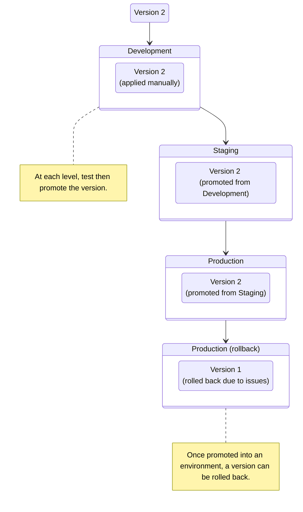

import { Render } from "~/components"

Version Management works through a combination of **environments** and **versions**.

## Environments

<Render file="environment-definition" />  

After you [enable](/version-management/how-to/enable/) version management, you will have the ability to create default environments:

<Render file="environment-defaults" />

When you [create](/version-management/how-to/versions/#create-version) a new version, that version will be available to apply to your **Development** environment (or whatever environment has the lowest rank). Once you test a version in your **Development** environment, you would promote that version to the **Staging** environment and - with no issues - then promote it to **Production**.

To send traffic to specific environments, send requests to that environment that match the pattern specified in its [traffic filters](/version-management/reference/traffic-filters/).

## Versions

<Render file="version-definition" />  

<Render file="enable-default-creation" />

When your version is ready, you would then test and promote it through various environments until it reaches **Production** (or whatever your final environment is).

You can create a new version at any time by choosing to [**Clone**](/version-management/how-to/versions/#create-version) an existing version, which automatically copies over configurations from an existing version.

Version configurations are applied to zone traffic when you [promote a version](/version-management/how-to/environments/#promote-a-version) to a new environment and then send traffic to that environment that matches the pattern specified in its [traffic filters](/version-management/reference/traffic-filters/).
