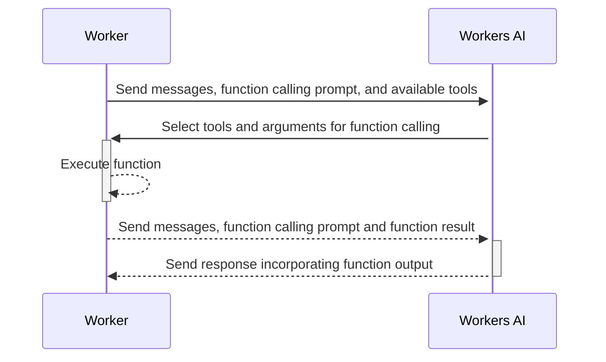

This guide will instruct you through setting up and deploying your first Workers AI project with embedded function calling. You will use Workers, a Workers AI binding, the [`ai-utils package`](https://github.com/cloudflare/ai-utils), and a large language model (LLM) to deploy your first AI-powered application on the Cloudflare global network with embedded function calling.

## 1. Create a Worker project with Workers AI

Follow the [Workers AI Get Started Guide](/workers-ai/get-started/workers-wrangler/) until step 2.

## 2. Install additional npm package

Next, run the following command in your project repository to install the Worker AI utilities package.

```sh
npm install @cloudflare/ai-utils --save
```

## 3. Add Workers AI Embedded function calling

Update the `index.ts` file in your application directory with the following code:

```ts title="Embedded function calling example"
import { runWithTools } from "@cloudflare/ai-utils";

type Env = {
	AI: Ai;
};

export default {
	async fetch(request, env, ctx) {
		// Define function
		const sum = (args: { a: number; b: number }): Promise<string> => {
			const { a, b } = args;
			return Promise.resolve((a + b).toString());
		};
		// Run AI inference with function calling
		const response = await runWithTools(
			env.AI,
			// Model with function calling support
			"@hf/nousresearch/hermes-2-pro-mistral-7b",
			{
				// Messages
				messages: [
					{
						role: "user",
						content: "What the result of 123123123 + 10343030?",
					},
				],
				// Definition of available tools the AI model can leverage
				tools: [
					{
						name: "sum",
						description: "Sum up two numbers and returns the result",
						parameters: {
							type: "object",
							properties: {
								a: { type: "number", description: "the first number" },
								b: { type: "number", description: "the second number" },
							},
							required: ["a", "b"],
						},
						// reference to previously defined function
						function: sum,
					},
				],
			},
		);
		return new Response(JSON.stringify(response));
	},
} satisfies ExportedHandler<Env>;
```

This example imports the utils with `import { runWithTools} from "@cloudflare/ai-utils"` and follows the API reference below.

Moreover, in this example we define and describe a list of tools that the LLM can leverage to respond to the user query. Here, the list contains of only one tool, the `sum` function.

Abstracted by the `runWithTools` function, the following steps occur:



The `ai-utils package` is also open-sourced on [Github](https://github.com/cloudflare/ai-utils).

## 4. Local development & deployment

Follow steps 4 and 5 of the [Workers AI Get Started Guide](/workers-ai/get-started/workers-wrangler/) for local development and deployment.

:::note[Workers AI Embedded Function Calling charges]

Embedded function calling runs Workers AI inference requests. Standard charges for inference (e.g. tokens) usage will be charged.
Resources consumed (e.g. CPU time) during embedded functions' code execution will be charged just as any other Worker's code execution.

:::

## API reference

For more details, refer to [API reference](/workers-ai/function-calling/embedded/api-reference/).
