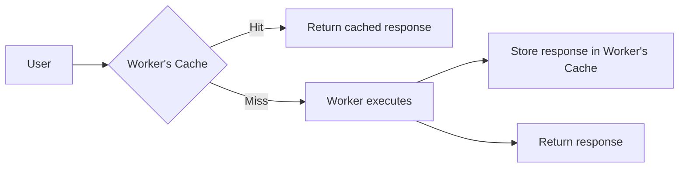

import { TypeScriptExample, WranglerConfig } from "~/components";

Your Worker has a separate [Cloudflare Cache](/cache/) that can return cached HTTP responses without executing your Worker to improve application performance. 

## Overview

Workers Cache lets you return cached HTTP responses without executing your Worker. When a HTTP request matches a cached response, Cloudflare serves the cached response directly, reducing latency and Workers usage.

A Worker's Cache is separate from any [Cloudflare zone's](/fundamentals/concepts/accounts-and-zones/) cache settings, including [Cache Rules](/cache/how-to/cache-rules/). Each zone has its own cache configuration that applies to traffic proxied through that zone. Workers can run across multiple zones via [Routes or Custom Domains](/workers/configuration/routing/#what-is-best-for-me), but the Worker's Cache operates independently.

You control a Worker's Cache using standard HTTP [`Cache-Control`](https://developer.mozilla.org/en-US/docs/Web/HTTP/Reference/Headers/Cache-Control) directives on responses from your Worker. When a response includes cacheable directives like `s-maxage`, Cloudflare stores the response and serves it for matching subsequent requests.

## Enable a Worker's Cache

To enable caching for a Worker, add the `cache` configuration to your Wrangler configuration file or enable cache via Workers Settings UI. 

<WranglerConfig>

```jsonc
{
	"name": "my-worker",
	"main": "src/index.ts",
	"compatibility_date": "$today",
	"cache": {
		"enabled": true
	}
}
```

</WranglerConfig>

## Cache before a Worker

When enabled, Cloudflare checks for a HTTP cached response before invoking your Worker. If a matching cached response exists, Cloudflare returns it directly. If not, your Worker executes and returns a response. When your Worker returns a response with cacheable `Cache-Control` directives, Cloudflare stores the response in the Worker's Cache for subsequent requests.



To cache responses from your Worker, set [`Cache-Control`](https://developer.mozilla.org/en-US/docs/Web/HTTP/Reference/Headers/Cache-Control) headers on the response. Use `s-maxage` to control how long Cloudflare caches the response:

<TypeScriptExample filename="src/index.ts">

```ts
export default {
	async fetch(request: Request): Promise<Response> {
		const data = await fetchDataFromOrigin();

		return new Response(JSON.stringify(data), {
			headers: {
				"Content-Type": "application/json",
				// Cache for 1 hour in the Worker's Cache, allow stale responses for 5 minutes
				"Cache-Control": "public, s-maxage=3600, stale-while-revalidate=300",
			},
		});
	},
};
```

</TypeScriptExample>

Use `max-age` and `s-maxage` together to control caching in the browser and in Cloudflare separately:

<TypeScriptExample filename="src/index.ts">

```ts
export default {
	async fetch(request: Request): Promise<Response> {
		const data = await fetchDataFromOrigin();

		return new Response(JSON.stringify(data), {
			headers: {
				"Content-Type": "application/json",
				// Browser caches for 5 minutes, Cloudflare caches for 1 hour
				"Cache-Control": "public, max-age=300, s-maxage=3600",
			},
		});
	},
};
```

</TypeScriptExample>

## Cache between Workers

When one Worker calls another via a [service binding](/workers/runtime-apis/bindings/service-bindings/), the calling Worker can leverage the called Worker's Cache. If the called Worker has a cached response, Cloudflare returns it without invoking the called Worker.


Worker A calls Worker B via a service binding. If Worker B has cache enabled and a matching response exists, Worker A receives the cached response immediately. Worker B does not execute.

<WranglerConfig>

```jsonc
// wrangler.jsonc — Worker A
{
	"name": "worker-a",
	"main": "src/index.ts",
	"compatibility_date": "$today",
	"services": [
		{ "binding": "API", "service": "worker-b" }
	]
}
```

</WranglerConfig>

<TypeScriptExample filename="src/index.ts">

```ts
// Worker A — calls Worker B via service binding
export default {
	async fetch(request: Request, env: Env): Promise<Response> {
		// This request goes through Worker B's cache
		return env.API.fetch(request);
	},
};
```

</TypeScriptExample>

<WranglerConfig>

```jsonc
// wrangler.jsonc — Worker B
{
	"name": "worker-b",
	"main": "src/index.ts",
	"compatibility_date": "$today",
	"cache": {
		"enabled": true
	}
}
```

</WranglerConfig>

<TypeScriptExample filename="src/index.ts">

```ts
// Worker B — returns cacheable responses
export default {
	async fetch(request: Request): Promise<Response> {
		const data = await fetchExpensiveData();

		return new Response(JSON.stringify(data), {
			headers: {
				"Content-Type": "application/json",
				"Cache-Control": "public, s-maxage=3600",
			},
		});
	},
};
```

</TypeScriptExample>

## Smart Placed Worker

TODO

## Cache purge

TODO

## Billing

TODO

## Frameworks

TODO

## Known limitations

TODO
