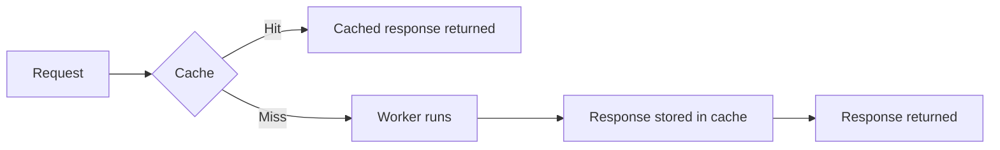
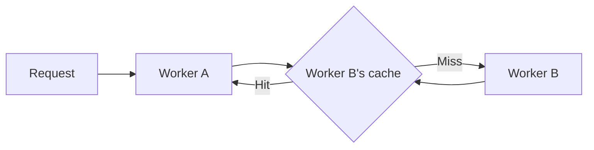

import {
	DirectoryListing,
	TypeScriptExample,
	WranglerConfig,
} from "~/components";

Workers Caching lets Cloudflare return cached HTTP responses from your Worker without executing your Worker code. When an incoming request matches a cached response, Cloudflare serves the response directly from its edge cache — reducing latency and Workers CPU usage.

Caching works for eyeball requests (requests from browsers and API clients), requests sent through [service bindings](/workers/runtime-apis/bindings/service-bindings/), and loopback calls via [`ctx.exports`](/workers/runtime-apis/bindings/service-bindings/rpc/). You control caching with standard HTTP `Cache-Control` directives on your responses.

## Your Worker's cache

Workers Caching is **your Worker's cache**. It is owned by your Worker, operated by your Worker, and private to your Worker.

A Worker is a zoneless entity — a Worker can be bound to any number of zones, run on `workers.dev`, or be invoked entirely through service bindings without ever touching a zone. The cache follows the Worker, not a zone, so:

- **No zone configuration for caching applies to Workers Caching.** [Cache Rules](/cache/how-to/cache-rules/), [Cache Response Rules](/cache/how-to/cache-response-rules/), Page Rules, cache level settings, the zone's default cached-file-extensions list, and every other zone-level cache control have no effect on a Worker's cache.
- **Your Worker is in full control.** You set `Cache-Control` headers on your responses, and Cloudflare honors them per [RFC 9111](https://www.rfc-editor.org/rfc/rfc9111). That is the entire configuration surface.
- **The cache is shared across every way the Worker can be invoked.** A Worker bound to `api.example.com`, `api.example.net`, and invoked over a service binding serves the same cached responses to all three — the cache is keyed by the request path, entrypoint, and `ctx.props`, not by hostname. See [Cache keys](/workers/cache/cache-keys/).

### The Worker is the configuration surface

A Worker is **already infinitely customizable**. You can change response bodies, rewrite headers, branch on any request attribute, call out to other Workers via service bindings or [`ctx.exports`](/workers/runtime-apis/bindings/service-bindings/rpc/), and compose logic across an entire system.

Workers Caching leans on that. Instead of introducing a separate configuration layer for caching behavior, it lets your Worker express that intent directly — through the `Cache-Control` headers it returns, the `ctx.props` it accepts, and the programmatic purges it issues. Anything you might want to configure about caching, you can configure in code:

- Want a longer TTL for certain paths? Branch on the path in your Worker and set a different `s-maxage`.
- Want to strip a tracking query parameter before caching? Rewrite the URL or `ctx.props` in a gateway Worker before dispatching.
- Want per-tenant cache partitioning? Set the tenant identifier in `ctx.props` — that is in the cache key.
- Want to bypass the cache for authenticated users? Return `Cache-Control: private`, or rely on the [automatic bypass](/cache/concepts/cache-responses/#bypass) triggered by `Set-Cookie` and `Authorization`.

The Worker you already wrote is the configuration mechanism. Workers Caching runs in front of it and honors whatever headers the Worker returns.

## When caching helps

Caching is a good fit for Workers that:

- Perform CPU-intensive work whose result can be reused across requests — content generation, template rendering, data transformation.
- Fetch data from a slow origin or third-party API and want to absorb that latency for subsequent requests.
- Power a server-rendered or statically generated site where many requests produce identical responses.

Caching is not useful for per-user responses that change on every request, non-idempotent operations (`POST`, `PUT`, `DELETE`), or responses that must be computed fresh every time.

## How it works

With caching enabled, Cloudflare checks the cache before running your Worker. On a hit, the cached response is returned directly. On a miss, your Worker runs, and if the response is cacheable per its `Cache-Control` header, Cloudflare stores it for the next request.



## Quickstart

This quickstart walks you through enabling caching, deploying, and observing the cache in action.

### 1. Enable caching in your Wrangler configuration

<WranglerConfig>

```jsonc
{
	"name": "my-worker",
	"main": "src/index.ts",
	"compatibility_date": "$today",
	"cache": {
		"enabled": true,
	},
}
```

</WranglerConfig>

### 2. Return a cacheable response from your Worker

Use `s-maxage` to control how long Cloudflare caches each response:

<TypeScriptExample filename="src/index.ts">

```ts
export default {
	async fetch(request): Promise<Response> {
		const body = JSON.stringify({
			timestamp: new Date().toISOString(),
			random: Math.random(),
		});

		return new Response(body, {
			headers: {
				"Content-Type": "application/json",
				// Cache for 1 hour; serve stale for up to 5 minutes while revalidating.
				"Cache-Control": "public, s-maxage=3600, stale-while-revalidate=300",
			},
		});
	},
} satisfies ExportedHandler;
```

</TypeScriptExample>

### 3. Deploy and observe the cache

Deploy your Worker:

```sh
npx wrangler deploy
```

Then send two requests and look at the `Cf-Cache-Status` response header:

```sh
curl -I https://my-worker.example.workers.dev/
```

```txt title="First request — expected"
HTTP/2 200
cache-control: public, s-maxage=3600, stale-while-revalidate=300
cf-cache-status: MISS
```

```sh
curl -I https://my-worker.example.workers.dev/
```

```txt title="Second request — expected"
HTTP/2 200
cache-control: public, s-maxage=3600, stale-while-revalidate=300
cf-cache-status: HIT
```

The second request receives the cached response. The `timestamp` and `random` values in the body are identical between the two requests, even though the Worker generates fresh ones on every run — confirming that the second request did not execute your Worker.

## What gets cached

- All HTTP invocations of the Worker are eligible for caching, including eyeball requests, service binding calls, and loopback calls via `ctx.exports`.
- Only `GET` and `HEAD` requests are cached. Other methods always invoke your Worker.
- Cacheability is determined by the response headers your Worker returns. Workers Caching follows the semantics defined in [RFC 9111](https://www.rfc-editor.org/rfc/rfc9111). Refer to [Cache-Control](/cache/concepts/cache-control/) for the full list of directives Cloudflare respects.
- Cloudflare's standard [cache bypass conditions](/cache/concepts/cache-responses/#bypass) apply. In particular, responses with a `Set-Cookie` header and requests with an `Authorization` header trigger automatic bypass.

The `Cf-Cache-Status` response header tells you what happened for each request (`HIT`, `MISS`, `UPDATING`, `BYPASS`). Refer to [Cloudflare cache responses](/cache/concepts/cache-responses/) for the full set of values.

## Caching between Workers

When one Worker calls another over a [service binding](/workers/runtime-apis/bindings/service-bindings/), the **callee's** cache is consulted. If the callee has caching enabled and has a matching cached response, the caller receives it without invoking the callee.



The cache key for service binding calls includes the caller's [`ctx.props`](/workers/runtime-apis/bindings/service-bindings/rpc/#ctxprops), so different callers with different authorization context are cached separately. For details, refer to [Cache keys](/workers/cache/cache-keys/).

## Cache Durable Object responses

[Durable Objects](/durable-objects/) are never cached directly by Workers Caching. However, since Workers Caching runs in front of any Worker entrypoint, you can cache a Durable Object's HTTP responses by wrapping the Durable Object behind a [named Worker entrypoint](/workers/runtime-apis/bindings/service-bindings/rpc/#named-entrypoints) and caching the entrypoint.

The wrapper entrypoint forwards the request into the Durable Object and sets `Cache-Control` on the response it returns. Because Workers Caching sits in front of the entrypoint, subsequent requests are served from cache without re-entering the Durable Object:

<TypeScriptExample filename="src/index.ts">

```ts
import { WorkerEntrypoint } from "cloudflare:workers";

interface Env {
	COUNTER: DurableObjectNamespace;
}

// Cached entrypoint. Requests to this entrypoint are served from cache
// when possible; on a miss, the Durable Object is invoked and its
// response is stored.
export class CachedCounter extends WorkerEntrypoint<Env> {
	async fetch(request: Request): Promise<Response> {
		const id = this.env.COUNTER.idFromName("global");
		const stub = this.env.COUNTER.get(id);
		const response = await stub.fetch(request);

		// Attach cache headers. Clone into a new Response so the headers
		// are mutable.
		return new Response(response.body, {
			status: response.status,
			headers: {
				...Object.fromEntries(response.headers),
				"Cache-Control": "public, s-maxage=30",
			},
		});
	}
}

// Default entrypoint. Delegates to the cached entrypoint via ctx.exports,
// which routes through the cache.
export default {
	async fetch(request, env, ctx): Promise<Response> {
		return ctx.exports.CachedCounter.fetch(request);
	},
} satisfies ExportedHandler<Env>;
```

</TypeScriptExample>

## Interaction with Smart Placement

Caching runs **before** [Smart Placement](/workers/configuration/placement/). A cached response is returned without your Worker running, and therefore without being placed. On a cache miss, Smart Placement continues to work as normal.

## Purging the cache

Your Worker can invalidate its own cache at any time using `ctx.cache.purge()`. Tags are the most flexible mechanism — tag responses with `Cache-Tag` when returning them, and purge those tags later:

<TypeScriptExample filename="src/index.ts">

```ts
export default {
	async fetch(request, env, ctx): Promise<Response> {
		await ctx.cache.purge({ tags: ["blog-posts"] });
		return new Response("Purged", { status: 200 });
	},
} satisfies ExportedHandler;
```

</TypeScriptExample>

You can also [import `cache` from `cloudflare:workers`](/workers/cache/purge/#two-ways-to-call-purge) and call `cache.purge({...})` when you do not have `ctx` in scope — for example, from a utility module. For all purge modes and patterns, refer to [Purging the cache](/workers/cache/purge/).

## Billing

Requests to a Worker with caching enabled are billed at the standard [Workers request rate](/workers/platform/pricing/) whether the response comes from cache or your Worker. **CPU time is only billed when your Worker runs** — cache hits do not consume CPU time.

| Request type                                                            | Request charge | CPU time charge |
| ----------------------------------------------------------------------- | -------------- | --------------- |
| Cache `HIT` (Worker does not run)                                       | Standard rate  | Not billed      |
| Cache `MISS` (Worker runs)                                              | Standard rate  | Billed          |
| Cache `BYPASS` (Worker runs)                                            | Standard rate  | Billed          |
| [Static asset request](/workers/static-assets/billing-and-limitations/) | Free           | Not billed      |

For a worked example, refer to [Pricing example: Worker with caching](/workers/platform/pricing/#example-5-worker-with-caching).

## Next steps

<DirectoryListing />
