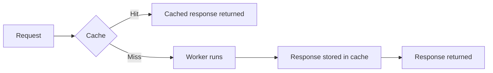
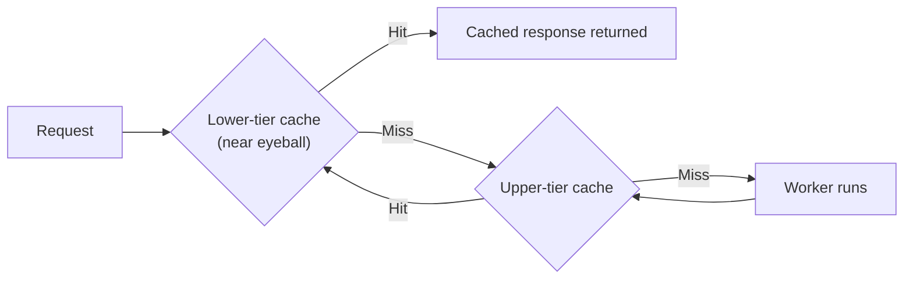
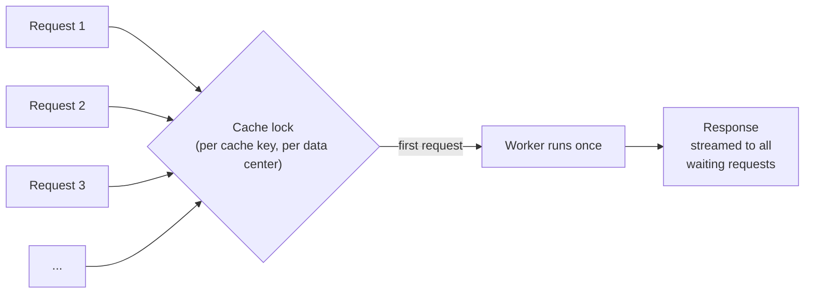
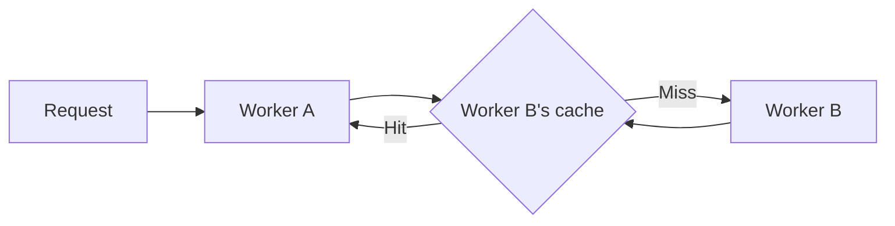
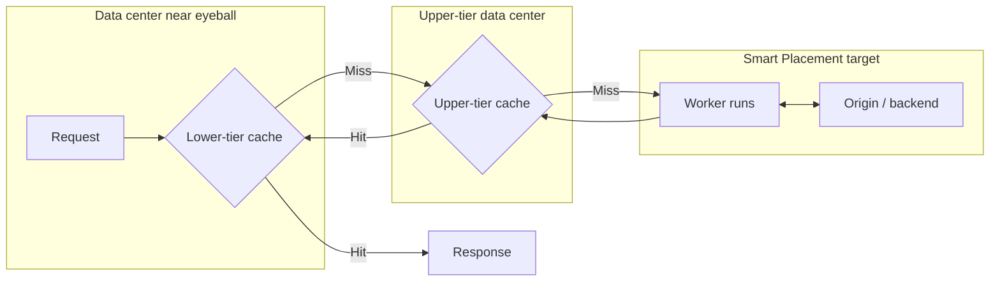

import {
	DirectoryListing,
	TypeScriptExample,
	WranglerConfig,
} from "~/components";

Workers Cache lets Cloudflare return cached HTTP responses from your Worker without executing your Worker code. When an incoming request matches a cached response, Cloudflare serves the response directly from its edge cache — reducing latency and Workers CPU usage.

Caching works for any `fetch()` invocation of the Worker — eyeball requests (requests from browsers and API clients), requests sent through [service bindings](/workers/runtime-apis/bindings/service-bindings/), and loopback `fetch()` calls between entrypoints via [`ctx.exports`](/workers/runtime-apis/bindings/service-bindings/rpc/). You control caching with standard HTTP `Cache-Control` directives on your responses.

## Your Worker's cache

Workers Cache is **your Worker's cache**. It is owned by your Worker, operated by your Worker, and private to your Worker.

A Worker is a zoneless entity — a Worker can be bound to any number of [zones](/fundamentals/concepts/accounts-and-zones/#zones), run on `workers.dev`, or be invoked entirely through service bindings without ever touching a zone. The cache follows the Worker, not a zone, so:

- **No zone configuration for caching applies to Workers Caching.** [Cache Rules](/cache/how-to/cache-rules/), [Cache Response Rules](/cache/how-to/cache-response-rules/), Page Rules, cache level settings, the zone's default cached-file-extensions list, and every other zone-level cache control have no effect on a Worker's cache.
- **Your Worker is in full control.** You set `Cache-Control` headers on your responses, and Cloudflare honors them per [RFC 9111](https://www.rfc-editor.org/rfc/rfc9111). That is the entire configuration surface.
- **The cache is shared across every way the Worker can be invoked.** A Worker bound to `api.example.com`, `api.example.net`, and invoked over a service binding serves the same cached responses to all three — the cache is keyed by the request path, entrypoint, `ctx.props`, and (by default) the Worker version, not by hostname. See [Cache keys](/workers/cache/cache-keys/).

### The Worker is the configuration surface

A Worker is **already infinitely customizable**. You can change response bodies, rewrite headers, branch on any request attribute, call out to other Workers via service bindings or [`ctx.exports`](/workers/runtime-apis/bindings/service-bindings/rpc/), and compose logic across an entire system.

Workers Caching leans on that. Instead of introducing a separate configuration layer for caching behavior, it lets your Worker express that intent directly — through the `Cache-Control` headers it returns, the `ctx.props` it accepts, and the programmatic purges it issues. Anything you might want to configure about caching, you can configure in code:

- Want a longer TTL for certain paths? Branch on the path in your Worker and set a different `max-age`.
- Want to strip a tracking query parameter before caching? Rewrite the URL or `ctx.props` in a gateway Worker before dispatching.
- Want per-tenant cache partitioning? Set the tenant identifier in `ctx.props` — that is in the cache key.
- Want to bypass the cache for authenticated users? Return `Cache-Control: private`, or rely on the [automatic bypass](/cache/concepts/cache-responses/#bypass) triggered by `Set-Cookie` and `Authorization`.

The Worker you already wrote is the configuration mechanism. Workers Caching runs in front of it and honors whatever headers the Worker returns.

## When caching helps

Caching is a good fit for Workers that:

- Perform CPU-intensive work whose result can be reused across requests — content generation, template rendering, data transformation.
- Fetch data from a slow origin or third-party API and want to absorb that latency for subsequent requests.
- Power a server-rendered or statically generated site where many requests produce identical responses.

Caching is not useful for per-user responses that change on every request, non-idempotent operations (`POST`, `PUT`, `DELETE`), or responses that must be computed fresh every time.

## How it works

With caching enabled, Cloudflare checks the cache before running your Worker. On a hit, the cached response is returned directly. On a miss, your Worker runs, and if the response is cacheable per its `Cache-Control` header, Cloudflare stores it for the next request.



## Tiered cache

Workers Caching is **tiered by default**. Cloudflare operates two layers of cache for your Worker:

- **Lower tier** — a cache in the Cloudflare data center closest to the eyeball. Every data center that receives traffic for your Worker has its own lower-tier cache.
- **Upper tier** — a smaller set of data centers that every lower tier consults on a miss. The upper tier aggregates cache fills across the whole network.

A request is served from the lower tier if it is a hit there. If it is a miss, the lower tier asks the upper tier. If the upper tier also misses, your Worker finally runs to generate the response — and that response is stored in **both** tiers on the way back out, so subsequent requests from any data center benefit.



This is the same topology that powers [Tiered Cache](/cache/how-to/tiered-cache/) for zones, applied automatically to your Worker. You do not configure it, and the tiering runs regardless of whether your Worker uses [Smart Placement](#smart-placement-and-the-cache).

**Why this matters:** the first request for a given cache key anywhere on Earth populates the upper tier. Every later request, from any Cloudflare data center, can be served from the upper tier without running your Worker — even if the lower tier at that location has never seen the request before. Cache hit ratios are substantially higher than a single flat cache layer.

## Request collapsing

When many requests for the same cache key arrive simultaneously at a Cloudflare data center and the response is not yet cached, Cloudflare runs your Worker **once** and serves the resulting response to every waiting request. This is the same [request collapsing](/cache/concepts/default-cache-behavior/#request-collapsing) mechanism the zone cache uses, applied automatically to Workers Caching. The waiting requests block on a per-cache-key [cache lock](/cache/concepts/default-cache-behavior/#request-collapsing) until the first request produces a response.



**Why this matters:** without request collapsing, a sudden burst of traffic to a fresh URL would invoke your Worker once per request, multiplying CPU billing and load on any backend the Worker calls. With request collapsing, that burst still produces one Worker invocation.

A few details to keep in mind:

- **Collapsing is per cache key, per data center.** Requests that produce different cache keys do not collapse with each other. Two data centers that both miss simultaneously each run your Worker once (the upper tier consolidates further; refer to [Tiered cache](#tiered-cache)).
- **Streaming responses are collapsed too.** Waiting requests are joined to the in-flight response stream so they receive the body as it is produced — they do not have to wait for the full response before any bytes are returned.
- **Collapsing does not apply to uncacheable responses.** If the Worker's response is uncacheable (`BYPASS`, `DYNAMIC`), each request gets its own invocation. The cache only collapses requests that produce a response the cache is allowed to store.

This is one of the most significant differences between Workers Caching and the [Cache API](/workers/runtime-apis/cache/) — the Cache API does not collapse concurrent requests, so a burst of traffic to a fresh URL invokes your Worker once per request.

## Quickstart

This quickstart walks you through enabling caching, deploying, and observing the cache in action.

### 1. Enable caching in your Wrangler configuration

<WranglerConfig>

```jsonc
{
 "name": "my-worker",
 "main": "src/index.ts",
 "compatibility_date": "$today",
 "cache": {
  "enabled": true,
 },
}
```

</WranglerConfig>

### 2. Return a cacheable response from your Worker

Use `max-age` to control how long Cloudflare caches each response:

<TypeScriptExample filename="src/index.ts">

```ts
export default {
	async fetch(request): Promise<Response> {
		const body = JSON.stringify({
			timestamp: new Date().toISOString(),
			random: Math.random(),
		});

		return new Response(body, {
			headers: {
				"Content-Type": "application/json",
				// Cache for 1 hour; serve stale for up to 5 minutes while revalidating.
				"Cache-Control": "public, max-age=3600, stale-while-revalidate=300",
			},
		});
	},
} satisfies ExportedHandler;
```

</TypeScriptExample>

### 3. Deploy and observe the cache

Deploy your Worker:

```sh
npx wrangler deploy
```

Then send two requests and look at the `Cf-Cache-Status` response header:

```sh
curl -I https://my-worker.example.workers.dev/
```

```txt title="First request — expected"
HTTP/2 200
cache-control: public, max-age=3600, stale-while-revalidate=300
cf-cache-status: MISS
```

```sh
curl -I https://my-worker.example.workers.dev/
```

```txt title="Second request — expected"
HTTP/2 200
cache-control: public, max-age=3600, stale-while-revalidate=300
cf-cache-status: HIT
```

The second request receives the cached response. The `timestamp` and `random` values in the body are identical between the two requests, even though the Worker generates fresh ones on every run — confirming that the second request did not execute your Worker.

## What gets cached

- HTTP invocations of the Worker's [`fetch`](/workers/runtime-apis/fetch/) handler are eligible for caching, including eyeball requests, service binding `fetch()` calls, and loopback `fetch()` calls via `ctx.exports`.
- Only `GET` and `HEAD` requests are cached. Other methods always invoke your Worker. `GET` and `HEAD` for the same URL share a single cache entry — see [Cache keys](/workers/cache/cache-keys/#what-goes-into-the-cache-key).
- **Only `fetch()` invocations go through the cache.** Custom [RPC methods](/workers/runtime-apis/rpc/) on a `WorkerEntrypoint` (for example `ctx.exports.Backend.getUser(id)`) bypass the cache entirely and always run the callee. To cache a piece of work, expose it as a `fetch` handler on its own entrypoint.
- **WebSocket upgrade requests bypass the cache.** A `GET` request carrying `Upgrade: websocket` always invokes your Worker.
- Other invocation types — [`scheduled`](/workers/configuration/cron-triggers/) (Cron Triggers), [`queue`](/queues/configuration/javascript-apis/#consumer) consumers, [Workflows](/workflows/), [Tail Workers](/workers/observability/logs/tail-workers/), [Durable Object](/durable-objects/) invocations, [Email Workers](/email-service/api/route-emails/email-handler/) — always run without cache involvement.
- Cacheability is determined by the response headers your Worker returns. Workers Caching follows the semantics defined in [RFC 9111](https://www.rfc-editor.org/rfc/rfc9111), including [heuristic freshness](https://www.rfc-editor.org/rfc/rfc9111#name-calculating-heuristic-fresh) for responses that do not carry `Cache-Control`. Refer to [Cache-Control](/cache/concepts/cache-control/) for the full list of directives Cloudflare respects.
- Cloudflare's standard [cache bypass conditions](/cache/concepts/cache-responses/#bypass) apply. In particular, responses with a `Set-Cookie` header and requests with an `Authorization` header trigger automatic bypass.
- [Preview URLs](/workers/versions-and-deployments/preview-urls/) are supported. Each preview caches independently of your production deployment, so testing a cache-affecting change in a preview never touches production's cached responses.
- [Workers for Platforms](/cloudflare-for-platforms/workers-for-platforms/) is supported. Each user Worker has its own cache, isolated from the dispatcher and from other user Workers in the namespace.

The `Cf-Cache-Status` response header tells you what happened for each request.
The values you will see most often are `HIT`, `MISS`, `EXPIRED`, `REVALIDATED`,
`UPDATING`, `STALE`, and `BYPASS`. Refer to [Cloudflare cache
responses](/cache/concepts/cache-responses/) for the full set of values.

## Content negotiation with `Vary`

Workers Caching honors the [`Vary`](https://www.rfc-editor.org/rfc/rfc9110.html#name-vary) response header as defined in [RFC 9110](https://www.rfc-editor.org/rfc/rfc9110.html) and [RFC 9111](https://www.rfc-editor.org/rfc/rfc9111.html#name-calculating-cache-keys-with). When your Worker returns a `Vary` header, Cloudflare stores a separate cached variant per distinct combination of the listed request header values, and only returns a cached variant when the incoming request's headers match the ones the variant was stored under.

This lets a single URL cache multiple representations — for example, different encodings, different content types, or different languages — without your Worker coordinating content negotiation by hand:

<TypeScriptExample filename="src/index.ts">

```ts
export default {
	async fetch(request): Promise<Response> {
		const accept = request.headers.get("Accept") ?? "";
		const wantsWebp = accept.includes("image/webp");

		const body = wantsWebp ? await fetchWebpImage() : await fetchJpegImage();

		return new Response(body, {
			headers: {
				"Content-Type": wantsWebp ? "image/webp" : "image/jpeg",
				"Cache-Control": "public, max-age=3600",
				// Cache a separate variant per distinct Accept header value.
				Vary: "Accept",
			},
		});
	},
} satisfies ExportedHandler;
```

</TypeScriptExample>

Notes:

- `Vary: *` disables caching for the response. A wildcard variance cannot be satisfied deterministically from request headers, so Cloudflare does not store the response.
- Variants share a single cache entry for purge purposes — [purging](/workers/cache/purge/) a tag or path prefix that matches any variant invalidates all variants of that URL. All variants of a URL must therefore use the same `Cache-Tag` values.
- `Vary` is not compatible with image-transformation features that already produce their own variants (Polish, Image Resizing). Responses rewritten by those features ignore `Vary`.
- Variants are stored per exact request-header value. Clients that send semantically equivalent but textually different values — for example `Accept-Encoding: gzip, br` and `Accept-Encoding: br, gzip` — produce separate variants. Shape the headers your Worker sees (for example, by normalizing them in a gateway Worker before passing the request on) if you need to reduce variant fan-out.

## Caching between Workers

When one Worker calls another over a [service binding](/workers/runtime-apis/bindings/service-bindings/), the **callee's** cache is consulted. If the callee has caching enabled and has a matching cached response, the caller receives it without invoking the callee.



The cache key for service binding calls includes the caller's [`ctx.props`](/workers/runtime-apis/bindings/service-bindings/rpc/#ctxprops), so different callers with different authorization context are cached separately. For details, refer to [Cache keys](/workers/cache/cache-keys/).

For same-account calls, the calling Worker can also tailor the callee's caching for an individual request by setting [`cf.cacheKey`](/workers/cache/cache-keys/#custom-cache-keys) to override the cache key or [`cf.cacheControl`](/workers/cache/configuration/#override-cache-control-from-the-calling-worker) to supply a `Cache-Control` directive.

## Cache Durable Object responses

[Durable Objects](/durable-objects/) are never cached directly by Workers Caching. However, since Workers Caching runs in front of any Worker entrypoint, you can cache a Durable Object's HTTP responses by wrapping the Durable Object behind a [named Worker entrypoint](/workers/runtime-apis/bindings/service-bindings/rpc/#named-entrypoints) and caching the entrypoint.

The wrapper entrypoint forwards the request into the Durable Object and sets `Cache-Control` on the response it returns. Because Workers Caching sits in front of the entrypoint, subsequent requests are served from cache without re-entering the Durable Object.

The default entrypoint here is a gateway that should run on every request, so disable caching on it and enable it on `CachedCounter` (see [Per-entrypoint caching](/workers/cache/configuration/#per-entrypoint-caching)):

<WranglerConfig>

```jsonc
{
	"name": "my-worker",
	"main": "src/index.ts",
	"compatibility_date": "$today",
	"cache": { "enabled": true },
	"exports": {
		"default": { "type": "worker", "cache": { "enabled": false } },
		"CachedCounter": { "type": "worker", "cache": { "enabled": true } },
	},
}
```

</WranglerConfig>

<TypeScriptExample filename="src/index.ts">

```ts
import { WorkerEntrypoint } from "cloudflare:workers";

interface Env {
	COUNTER: DurableObjectNamespace;
}

// Cached entrypoint. Requests to this entrypoint are served from cache
// when possible; on a miss, the Durable Object is invoked and its
// response is stored.
export class CachedCounter extends WorkerEntrypoint<Env> {
	async fetch(request: Request): Promise<Response> {
		const id = this.env.COUNTER.idFromName("global");
		const stub = this.env.COUNTER.get(id);
		const response = await stub.fetch(request);

		// Attach cache headers. Clone into a new Response so the headers
		// are mutable.
		return new Response(response.body, {
			status: response.status,
			headers: {
				...Object.fromEntries(response.headers),
				"Cache-Control": "public, max-age=30",
			},
		});
	}
}

// Default entrypoint. Delegates to the cached entrypoint via ctx.exports,
// which routes through the cache.
export default {
	async fetch(request, env, ctx): Promise<Response> {
		return ctx.exports.CachedCounter.fetch(request);
	},
} satisfies ExportedHandler<Env>;
```

</TypeScriptExample>

For more patterns that combine a gateway entrypoint with cached inner entrypoints, refer to [Examples](/workers/cache/examples/).

## Smart placement and the cache

[Smart Placement](/workers/configuration/placement/) moves **where your Worker runs** when it runs — typically closer to a slow origin or database. It does not move the cache. Workers Caching always has a lower tier near the eyeball and an upper tier aggregating the network, exactly as described in [Tiered cache](#tiered-cache) above, whether or not Smart Placement is enabled.

The cache is always consulted before Smart Placement is considered. Concretely:

- **Lower-tier hit:** the response is returned from the data center nearest the eyeball. Your Worker does not run. Smart Placement is not consulted.
- **Lower-tier miss, upper-tier hit:** the response is returned from the upper tier. Your Worker does not run. Smart Placement is not consulted.
- **Both tiers miss:** Smart Placement routes execution of your Worker to the placement target (for example, near your origin). The resulting response is stored in both cache tiers on the way back to the eyeball.

Importantly, the **upper tier and the Smart Placement target are independent locations**. The upper tier is chosen by Cloudflare to aggregate cache fills across the network; the Smart Placement target is chosen to minimize latency between your Worker and its backend. They are generally not in the same data center.



On a full cache miss, a request therefore traverses three locations: the lower-tier data center near the eyeball, the upper-tier data center, and the Smart Placement target. The cache tiers absorb this cost so that the slow trip to the placement target is only paid once for the whole network — the upper tier shields the placement target from every lower-tier miss.

:::note[Future optimization]

Because the upper tier and the Smart Placement target are chosen independently today, a cache miss pays for an extra hop between them. Future updates may bring these choices closer together — for example, by co-locating the upper tier with the placement target, or by having a single placement decision account for both — so that full cache misses incur one wide-area trip instead of two.

:::

## Purging the cache

Your Worker can invalidate its own cache at any time using `ctx.cache.purge()`. Tags are the most flexible mechanism — tag responses with `Cache-Tag` when returning them, and purge those tags later:

<TypeScriptExample filename="src/index.ts">

```ts
export default {
	async fetch(request, env, ctx): Promise<Response> {
		await ctx.cache.purge({ tags: ["blog-posts"] });
		return new Response("Purged", { status: 200 });
	},
} satisfies ExportedHandler;
```

</TypeScriptExample>

You can also [import `cache` from `cloudflare:workers`](/workers/cache/purge/#two-ways-to-call-purge) and call `cache.purge({...})` when you do not have `ctx` in scope — for example, from a utility module. For all purge modes and patterns, refer to [Purging the cache](/workers/cache/purge/).

## Pricing

Workers Cache has no separate pricing. When you enable Workers Cache, all requests to your Worker are billed at the standard [Workers request rate](/workers/platform/pricing/) — the same per-request rate as any other request to your Worker — whether the response comes from cache or from your Worker. There is no charge beyond the standard request rate. **CPU time is only billed when your Worker runs** — cache hits do not consume CPU time.

:::caution[Caching bills requests that are normally free]

When caching is enabled, every request to your Worker is charged at the standard Workers request rate, including requests that are normally free: [static asset requests](/workers/static-assets/billing-and-limitations/) and [worker-to-worker invocations](/workers/platform/pricing/#service-bindings) through service bindings or `ctx.exports`.

:::

| Request type                                                               | Request charge | CPU time charge       |
| -------------------------------------------------------------------------- | -------------- | --------------------- |
| Cache `HIT` (Worker does not run)                                          | Standard rate  | Not billed            |
| Cache `MISS` (Worker runs)                                                 | Standard rate  | Billed                |
| Cache `BYPASS` (Worker runs)                                               | Standard rate  | Billed                |
| [Static asset request](/workers/static-assets/billing-and-limitations/)    | Standard rate  | Not billed            |
| [Worker-to-worker invocation](/workers/platform/pricing/#service-bindings) | Standard rate  | Billed if Worker runs |

For an example, refer to [Pricing example: Worker with caching](/workers/platform/pricing/#example-5-worker-with-caching).

## Next steps

<DirectoryListing />
