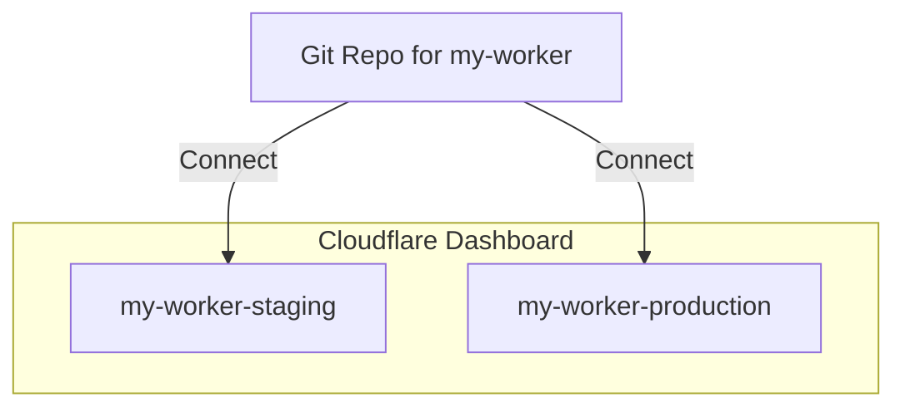

## Monorepos

While the Workers Builds beta has limited support for monorepos, it is still possible to set up a monorepo workflow. In the Cloudflare Dashboard, you must connect your monorepo to each of the existing Worker projects. When a new commit is detected in the monorepo, a new build/deploy will trigger for each Worker.

### Example

In the example `ecommerce-monorepo`, a Workers project should be created for `product-service`, `auth-service`, `order-service`, and `notification-service`.

A git connection to `ecommerce-monorepo` should be added in all of the Workers projects. If you are using a monorepo tool (e.g. [Turborepo](https://turbo.build/)), you can configure a different deploy command for each Worker (e.g. `turbo deploy -F product-service`). When a new commit is made to `ecommerce-monorepo`, a build and deploy will be triggered for each of the Workers (i.e. `product-service`, `auth-service`, `order-service`, `notification-service`) and respect the configured commands for that Worker.

```
ecommerce-monorepo/
│
├── workers/
│ ├── product-service/
│ │ ├── src/
│ │ └── wrangler.toml
│ ├── auth-service/
│ │ ├── src/
│ │ └── wrangler.toml
│ ├── order-service/
│ │ ├── src/
│ │ └── wrangler.toml
│ └── notification-service/
│ ├── src/
│ └── wrangler.toml
├── shared/
│ └── utils/
└── README.md
```

## Wrangler environments

If you are using [Wrangler Environments](/workers/wrangler/environments/), you can choose to continue using with Workers Builds with a bit of set up:

1. [Deploy via Wrangler](/workers/wrangler/commands/#deploy) to create the Workers for your environments in the Dashboard, if you don't already have them.
2. Find the Workers for your environments. They are typically named `[name of Worker] - [environment name]`.
3. Connect your repository to each of the Workers for your environment.
4. In each of the Workers, edit your Wrangler deploy command to include the flag `--env: <environment name>` in the build configurations.

When a new commit is detected in the repository, a new build/deploy will trigger for each associated Worker.

### Example

Imagine you have a Worker named `my-worker`, and you want to set up two environments `staging` and `production` set in the `wrangler.toml`. If you haven't already, you can deploy `my-worker` for each environment using the commands `wrangler deploy --env staging` and `wrangler deploy --env production`.

In your Cloudflare Dashboard, you should find two Workers `my-worker-staging` and `my-worker-production`. A git connection to a `my-worker` git repository should be added to both of the environment Workers. In the build configurations of each environment Worker, edit the deploy commands to be `npx wrangler deploy --env staging` and `npx wrangler deploy --env production` respectively.


