import { Aside } from "~/components";

This guide shows you how to use the [Workers Builds REST API](/api/resources/workers_builds/) to programmatically trigger builds, manage triggers, and monitor build status. The examples use `curl` commands that you can run directly in your terminal or adapt to your preferred programming language.

## Before you start

### 1. Create an API token with the correct permissions

To use the Builds API, you need an API token to authenticate your requests. The Builds API requires a **user-scoped** API token, account-scoped tokens are not supported and will return "Invalid token" errors.

Create your token at [dash.cloudflare.com/profile/api-tokens](https://dash.cloudflare.com/profile/api-tokens) with the following permissions:

| Permission                   | Access level | Why you need it                                                                                                                                                                   |
| ---------------------------- | ------------ | --------------------------------------------------------------------------------------------------------------------------------------------------------------------------------- |
| Workers Builds Configuration | Edit         | Trigger builds, manage triggers, configure environment variables                                                                                                                  |
| Workers Scripts              | Read         | Only needed for [one endpoint](#step-1-get-your-worker-tag) to retrieve your Worker's tag (documented as [`external_script_id`](#2-worker-tags-documented-as-external_script_id)) |

<Aside type="note">
	This API token is different from a **build token**. Build tokens are used by
	the build system to deploy your Worker. By default, Cloudflare automatically
	generates a build token for your account, but you can also [create your
	own](/workers/ci-cd/builds/configuration/#api-token-optional). The API token
	described above is what you use to call the Builds API itself.
</Aside>

### 2. Worker tags (documented as external_script_id)

The Builds API identifies Workers by their **tag**, an immutable UUID assigned by Cloudflare. In API responses and parameters, this value appears as `external_script_id`.

| Identifier                        | Example                            | Where it comes from                   |
| --------------------------------- | ---------------------------------- | ------------------------------------- |
| Worker name (`id`)                | `my-worker`                        | The name you gave your Worker         |
| Worker tag (`external_script_id`) | `1a2b3c4d5e6f7a8b9c0d1e2f3a4b5c6d` | Immutable UUID assigned by Cloudflare |

Every Builds API endpoint that references a Worker requires the **tag**, not the name.

### 3. What is a trigger?

A **trigger** is a configuration that defines how your Worker gets built and deployed. It specifies the build command, deploy command, environment variables, and which branches should trigger builds. Each Worker has up to **two triggers**: one for production (runs on your [production branch](/workers/ci-cd/builds/build-branches/#change-production-branch)) and one for preview (runs on all other branches).

**Trigger fields:**

| Field                   | Type    | Description                                                              |
| ----------------------- | ------- | ------------------------------------------------------------------------ |
| `trigger_name`          | string  | Display name for the trigger                                             |
| `build_command`         | string  | Command to build your project (for example, `npm run build`)             |
| `deploy_command`        | string  | Command to deploy your Worker (for example, `npx wrangler deploy`)       |
| `root_directory`        | string  | Path to your project root                                                |
| `branch_includes`       | array   | Branch patterns that trigger builds (for example, `["main"]` or `["*"]`) |
| `branch_excludes`       | array   | Branch patterns to exclude                                               |
| `path_includes`         | array   | File path patterns that trigger builds                                   |
| `path_excludes`         | array   | File path patterns to ignore                                             |
| `build_caching_enabled` | boolean | Enable or disable build caching                                          |
| `environment_variables` | object  | Build-time variables specific to this trigger                            |

## Workflow overview

Most Builds API operations follow this pattern: first get your Worker's tag, then get the trigger UUID, then perform build operations.

```mermaid
flowchart TD
    A["1. Get Worker tag<br/><strong>GET /workers/scripts</strong><br/>Find your Worker and note the tag UUID"] --> B["2. Get trigger UUID<br/><strong>GET /builds/workers/&#123;tag&#125;/triggers</strong><br/>List triggers for your Worker and note trigger_uuid"]
    B --> C{"3. Perform build operations"}
    C --> D["Trigger a build<br/><strong>POST /builds/triggers/&#123;uuid&#125;/builds</strong>"]
    C --> E["List builds<br/><strong>GET /builds/workers/&#123;tag&#125;/builds</strong>"]
    C --> F["Get build logs<br/><strong>GET /builds/builds/&#123;uuid&#125;/logs</strong>"]
    C --> G["Cancel a build<br/><strong>PUT /builds/builds/&#123;uuid&#125;/cancel</strong>"]
```



## Step 1: Get your Worker tag

Call the [Workers Scripts API](/api/resources/workers/subresources/scripts/methods/list/) to list all your Workers and find the `tag` for the Worker you want to work with:

```bash
curl -s "https://api.cloudflare.com/client/v4/accounts/{account_id}/workers/scripts" \
  --header "Authorization: Bearer <API_TOKEN>" \
  | jq '.result[] | {name: .id, tag: .tag}'
```

Example output:

```json
{
  "name": "my-worker",
  "tag": "1a2b3c4d5e6f7a8b9c0d1e2f3a4b5c6d"
}
{
  "name": "another-worker",
  "tag": "8a1b2c3d4e5f67890abcdef123456789"
}
```

Save the `tag` value for your Worker. You will use it in all subsequent API calls.

## Step 2: Get your trigger UUID

Use the [`GET /builds/workers/{tag}/triggers`](/api/resources/workers_builds/subresources/triggers/methods/list/) endpoint to list triggers for your Worker:

```bash
curl -s "https://api.cloudflare.com/client/v4/accounts/{account_id}/builds/workers/{worker_tag}/triggers" \
  --header "Authorization: Bearer <API_TOKEN>" \
  | jq '.result[] | {trigger_uuid, trigger_name, branch_includes, branch_excludes}'
```

Example output:

```json
{
  "trigger_uuid": "f47ac10b-58cc-4372-a567-0e02b2c3d479",
  "trigger_name": "Deploy production",
  "branch_includes": ["main"],
  "branch_excludes": []
}
{
  "trigger_uuid": "a1b2c3d4-e5f6-7890-abcd-ef1234567890",
  "trigger_name": "Deploy non-production branches",
  "branch_includes": ["*"],
  "branch_excludes": ["main"]
}
```

Save the `trigger_uuid` for the trigger you want to work with. Remember, you will have at most two triggers: one for your production branch (for example, `main`) that deploys to your live Worker, and optionally one for all other branches that creates preview deployments.

## Step 3: Work with builds

Now that you have the Worker tag and trigger UUID, you can trigger builds, list build history, and get logs.

### Trigger a manual build

Use the [`POST /builds/triggers/{uuid}/builds`](/api/resources/workers_builds/subresources/builds/methods/create/) endpoint with the `trigger_uuid` from [Step 2](#step-2-get-your-trigger-uuid).

```bash
curl -s "https://api.cloudflare.com/client/v4/accounts/{account_id}/builds/triggers/{trigger_uuid}/builds" \
  --header "Authorization: Bearer <API_TOKEN>" \
  --header "Content-Type: application/json" \
  --request POST \
  --data '{"branch": "main"}'
```

You can specify either `branch` or `commit_hash`:

| Field         | Description                                    |
| ------------- | ---------------------------------------------- |
| `branch`      | Git branch name to build (for example, `main`) |
| `commit_hash` | Specific commit SHA to build                   |

The response includes the `build_uuid` which you can use to monitor the build.

### List builds for a Worker

Use the [`GET /builds/workers/{tag}/builds`](/api/resources/workers_builds/subresources/builds/methods/list/) endpoint with the `worker_tag` from [Step 1](#step-1-get-your-worker-tag).

```bash
curl -s "https://api.cloudflare.com/client/v4/accounts/{account_id}/builds/workers/{worker_tag}/builds" \
  --header "Authorization: Bearer <API_TOKEN>" \
  | jq '.result[] | {build_uuid, status, branch, created_at}'
```

The response includes `build_uuid` for each build, which you need for getting logs or canceling builds.

### Get build logs

Use the [`GET /builds/builds/{uuid}/logs`](/api/resources/workers_builds/subresources/builds/methods/get_logs/) endpoint. Get the `build_uuid` from:

- [List builds](#list-builds-for-a-worker)
- The response when [triggering a build](#trigger-a-manual-build)
- [Get latest builds by script IDs](/api/resources/workers_builds/subresources/builds/methods/get_latest_by_script_ids/)
- The last segment of the URL on your build details page in the dashboard

```bash
curl -s "https://api.cloudflare.com/client/v4/accounts/{account_id}/builds/builds/{build_uuid}/logs" \
  --header "Authorization: Bearer <API_TOKEN>"
```

### Cancel a running build

Use the [`PUT /builds/builds/{uuid}/cancel`](/api/resources/workers_builds/subresources/builds/methods/cancel/) endpoint. Get the `build_uuid` from:

- [List builds](#list-builds-for-a-worker)
- The response when [triggering a build](#trigger-a-manual-build)
- [Get latest builds by script IDs](/api/resources/workers_builds/subresources/builds/methods/get_latest_by_script_ids/)
- The last segment of the URL on your build details page in the dashboard

```bash
curl -s "https://api.cloudflare.com/client/v4/accounts/{account_id}/builds/builds/{build_uuid}/cancel" \
  --header "Authorization: Bearer <API_TOKEN>" \
  --request PUT
```

## Update trigger configuration

Use the [`PATCH /builds/triggers/{uuid}`](/api/resources/workers_builds/subresources/triggers/methods/update/) endpoint with the `trigger_uuid` from [Step 2](#step-2-get-your-trigger-uuid). You can update any of the trigger fields described in [Understand triggers](#3-understand-triggers).

```bash
curl -s "https://api.cloudflare.com/client/v4/accounts/{account_id}/builds/triggers/{trigger_uuid}" \
  --header "Authorization: Bearer <API_TOKEN>" \
  --header "Content-Type: application/json" \
  --request PATCH \
  --data '{
    "build_command": "npm run build:prod",
    "deploy_command": "npx wrangler deploy"
  }'
```

## Manage build environment variables

Environment variables are set per trigger, meaning you can have different values for production and preview builds. For example, you might set `NODE_ENV=production` on your production trigger and `NODE_ENV=development` on your preview trigger. Refer to the [environment variables API reference](/api/resources/workers_builds/subresources/environment_variables/) for full endpoint details.

<Aside type="note">
	These are **build-time** environment variables, available only during the
	build process. For runtime environment variables, refer to [Environment
	variables](/workers/configuration/environment-variables/).
</Aside>

### List environment variables

Use the `trigger_uuid` from [Step 2](#step-2-get-your-trigger-uuid).

```bash
curl -s "https://api.cloudflare.com/client/v4/accounts/{account_id}/builds/triggers/{trigger_uuid}/environment_variables" \
  --header "Authorization: Bearer <API_TOKEN>"
```

### Set environment variables

You can set different variables for each trigger. For example, to set production environment variables:

```bash
curl -s "https://api.cloudflare.com/client/v4/accounts/{account_id}/builds/triggers/{production_trigger_uuid}/environment_variables" \
  --header "Authorization: Bearer <API_TOKEN>" \
  --header "Content-Type: application/json" \
  --request PATCH \
  --data '{
    "variables": [
      {"key": "NODE_ENV", "value": "production", "type": "text"},
      {"key": "API_KEY", "value": "prod-secret-key", "type": "secret"}
    ]
  }'
```

And different values for preview builds:

```bash
curl -s "https://api.cloudflare.com/client/v4/accounts/{account_id}/builds/triggers/{preview_trigger_uuid}/environment_variables" \
  --header "Authorization: Bearer <API_TOKEN>" \
  --header "Content-Type: application/json" \
  --request PATCH \
  --data '{
    "variables": [
      {"key": "NODE_ENV", "value": "development", "type": "text"},
      {"key": "API_KEY", "value": "dev-secret-key", "type": "secret"}
    ]
  }'
```

Use `type: "text"` for plain values and `type: "secret"` for sensitive values that should be masked in logs.

### Delete an environment variable

Use the `trigger_uuid` from [Step 2](#step-2-get-your-trigger-uuid). The `variable_key` is the key name you set (for example, `NODE_ENV`).

```bash
curl -s "https://api.cloudflare.com/client/v4/accounts/{account_id}/builds/triggers/{trigger_uuid}/environment_variables/{variable_key}" \
  --header "Authorization: Bearer <API_TOKEN>" \
  --request DELETE
```

## Purge build cache

Use the [`POST /builds/triggers/{uuid}/purge_build_cache`](/api/resources/workers_builds/subresources/triggers/methods/purge_build_cache/) endpoint with the `trigger_uuid` from [Step 2](#step-2-get-your-trigger-uuid). This clears cached dependencies and build artifacts for that trigger.

```bash
curl -s "https://api.cloudflare.com/client/v4/accounts/{account_id}/builds/triggers/{trigger_uuid}/purge_build_cache" \
  --header "Authorization: Bearer <API_TOKEN>" \
  --request POST
```

## Examples

The following examples show common use cases for the Builds API.

### Set up Workers Builds from scratch

This example walks through the complete process of connecting a GitHub repository to a Worker and setting up automated builds using only the API.

```mermaid
flowchart TD
    A["1. Get GitHub account and repo IDs<br/><strong>GET api.github.com/users/...</strong> → note account ID<br/><strong>GET api.github.com/repos/...</strong> → note repo ID"] --> B["2. Create repo connection<br/><strong>PUT /builds/repos/connections</strong><br/>Links your GitHub repo to Cloudflare<br/>Save the repo_connection_uuid"]
    B --> C["3. Get Worker tag<br/><strong>GET /workers/scripts</strong><br/>Find your Worker and note the tag UUID"]
    C --> D["4. Create triggers<br/><strong>POST /builds/triggers</strong>"]
    D --> D1["Production trigger<br/>branch_includes: main<br/>deploy_command: wrangler deploy"]
    D --> D2["Preview trigger (optional)<br/>branch_includes: *<br/>branch_excludes: main<br/>deploy_command: wrangler versions upload"]
    D1 --> E["5. Set environment variables (optional)<br/><strong>PATCH /builds/triggers/&#123;uuid&#125;/environment_variables</strong><br/>Configure per-trigger build-time variables"]
    D2 --> E
    E --> F["6. Trigger first build<br/><strong>POST /builds/triggers/&#123;uuid&#125;/builds</strong><br/>Start your first production deployment"]
```



#### Prerequisites

Before using the API, you must first install the Cloudflare GitHub App through the dashboard:

1. Go to **Workers & Pages** in the [Cloudflare dashboard](https://dash.cloudflare.com).
2. Select any Worker and go to **Settings** > **Builds** > **Connect**.
3. Select **GitHub** and authorize the Cloudflare GitHub App for your account or organization.

This one-time setup creates the connection between your GitHub account and Cloudflare. Once complete, you can use the API for everything else.

#### Step 1: Get your GitHub account information

After installing the GitHub App, you need your GitHub account ID and repository ID. You can find these from an existing trigger or from the GitHub API.

From GitHub's API:

```bash
# Get your GitHub user/org ID
curl -s "https://api.github.com/users/<GITHUB_USERNAME>" | jq '.id'

# Get a repository ID
curl -s "https://api.github.com/repos/<GITHUB_USERNAME>/<REPO_NAME>" | jq '.id'
```

#### Step 2: Create a repository connection

Create a connection between your GitHub repository and Cloudflare:

```bash
curl -s "https://api.cloudflare.com/client/v4/accounts/{account_id}/builds/repos/connections" \
  --header "Authorization: Bearer <API_TOKEN>" \
  --header "Content-Type: application/json" \
  --request PUT \
  --data '{
    "provider_type": "github",
    "provider_account_id": "<GITHUB_USER_ID>",
    "provider_account_name": "<GITHUB_USERNAME>",
    "repo_id": "<GITHUB_REPO_ID>",
    "repo_name": "<REPO_NAME>"
  }'
```

Save the `repo_connection_uuid` from the response.

#### Step 3: Get your Worker tag

```bash
curl -s "https://api.cloudflare.com/client/v4/accounts/{account_id}/workers/scripts" \
  --header "Authorization: Bearer <API_TOKEN>" \
  | jq '.result[] | {name: .id, tag: .tag}'
```

#### Step 4: Create a production trigger

Create a trigger that deploys when you push to `main`:

```bash
curl -s "https://api.cloudflare.com/client/v4/accounts/{account_id}/builds/triggers" \
  --header "Authorization: Bearer <API_TOKEN>" \
  --header "Content-Type: application/json" \
  --request POST \
  --data '{
    "external_script_id": "<WORKER_TAG>",
    "repo_connection_uuid": "<REPO_CONNECTION_UUID>",
    "trigger_name": "Deploy production",
    "build_command": "npm run build",
    "deploy_command": "npx wrangler deploy",
    "root_directory": "/",
    "branch_includes": ["main"],
    "branch_excludes": [],
    "path_includes": ["*"],
    "path_excludes": []
  }'
```

#### Step 5: Create a preview trigger (optional)

Create a second trigger for preview deployments on all other branches:

```bash
curl -s "https://api.cloudflare.com/client/v4/accounts/{account_id}/builds/triggers" \
  --header "Authorization: Bearer <API_TOKEN>" \
  --header "Content-Type: application/json" \
  --request POST \
  --data '{
    "external_script_id": "<WORKER_TAG>",
    "repo_connection_uuid": "<REPO_CONNECTION_UUID>",
    "trigger_name": "Deploy preview branches",
    "build_command": "npm run build",
    "deploy_command": "npx wrangler versions upload",
    "root_directory": "/",
    "branch_includes": ["*"],
    "branch_excludes": ["main"],
    "path_includes": ["*"],
    "path_excludes": []
  }'
```

Note the different `deploy_command`: production uses `wrangler deploy` while preview uses `wrangler versions upload` to create preview URLs without affecting the live deployment.

#### Step 6: Set environment variables for each trigger

Set production environment variables:

```bash
curl -s "https://api.cloudflare.com/client/v4/accounts/{account_id}/builds/triggers/{production_trigger_uuid}/environment_variables" \
  --header "Authorization: Bearer <API_TOKEN>" \
  --header "Content-Type: application/json" \
  --request PATCH \
  --data '{
    "variables": [
      {"key": "NODE_ENV", "value": "production", "type": "text"}
    ]
  }'
```

Set preview environment variables:

```bash
curl -s "https://api.cloudflare.com/client/v4/accounts/{account_id}/builds/triggers/{preview_trigger_uuid}/environment_variables" \
  --header "Authorization: Bearer <API_TOKEN>" \
  --header "Content-Type: application/json" \
  --request PATCH \
  --data '{
    "variables": [
      {"key": "NODE_ENV", "value": "development", "type": "text"}
    ]
  }'
```

#### Step 7: Trigger your first build

```bash
curl -s "https://api.cloudflare.com/client/v4/accounts/{account_id}/builds/triggers/{production_trigger_uuid}/builds" \
  --header "Authorization: Bearer <API_TOKEN>" \
  --header "Content-Type: application/json" \
  --request POST \
  --data '{"branch": "main"}'
```

Your Worker is now connected to GitHub. Future pushes to `main` will automatically trigger production deployments, and pushes to other branches will create preview deployments.

### Redeploy current deployment

Redeploy your current active deployment to refresh build-time data. This is useful when you need to rebuild without code changes.

```mermaid
flowchart TD
    A["1. Get active deployment<br/><strong>GET /workers/scripts/&#123;name&#125;/deployments</strong><br/>Find the current live deployment<br/>and note the version_id"] --> B["2. Find the build for that version<br/><strong>GET /builds/builds?version_ids=&#123;id&#125;</strong><br/>Look up trigger_uuid, branch,<br/>and commit_hash from the original build"]
    B --> C["3. Retrigger with same branch and commit<br/><strong>POST /builds/triggers/&#123;uuid&#125;/builds</strong><br/>Rebuild using the same trigger, branch,<br/>and commit_hash to refresh build-time data"]
```



This script chains multiple API calls together:

```js
async function redeploy() {
	const accountId = "<ACCOUNT_ID>";
	const workerName = "<WORKER_NAME>";
	const apiToken = process.env.CF_API_TOKEN;

	// Step 1: Get the active deployment's version ID
	const deploymentsResponse = await fetch(
		`https://api.cloudflare.com/client/v4/accounts/${accountId}/workers/scripts/${workerName}/deployments`,
		{
			headers: { Authorization: `Bearer ${apiToken}` },
		},
	);
	const deployments = await deploymentsResponse.json();
	const versionId = deployments.result.deployments[0].versions[0].version_id;

	// Step 2: Get the build that created this version
	const buildsResponse = await fetch(
		`https://api.cloudflare.com/client/v4/accounts/${accountId}/builds/builds?version_ids=${versionId}`,
		{
			headers: { Authorization: `Bearer ${apiToken}` },
		},
	);
	const buildsByVersion = await buildsResponse.json();
	const build = buildsByVersion.result.builds[versionId];

	// Step 3: Retrigger using the same trigger, branch, and commit
	await fetch(
		`https://api.cloudflare.com/client/v4/accounts/${accountId}/builds/triggers/${build.trigger.trigger_uuid}/builds`,
		{
			method: "POST",
			headers: {
				Authorization: `Bearer ${apiToken}`,
				"Content-Type": "application/json",
			},
			body: JSON.stringify({
				branch: build.build_trigger_metadata.branch,
				commit_hash: build.build_trigger_metadata.commit_hash,
			}),
		},
	);

	console.log("Redeploy triggered successfully");
}

redeploy();
```

## Troubleshooting

### "Resource not found" error

You are likely using the Worker name instead of the Worker tag. The Builds API requires the `tag` (a UUID like `1a2b3c4d5e6f7a8b9c0d1e2f3a4b5c6d`), not the Worker name. Refer to [Step 1](#step-1-get-your-worker-tag) to get your Worker tag.

For other build errors, refer to [Troubleshooting builds](/workers/ci-cd/builds/troubleshoot/).

## Related resources

- [Workers Builds REST API reference](/api/resources/workers_builds/) - Complete endpoint documentation
- [Workers Scripts REST API reference](/api/resources/workers/subresources/scripts/) - For retrieving Worker tags
- [Workers Builds overview](/workers/ci-cd/builds/) - Dashboard setup and configuration
- [Build configuration](/workers/ci-cd/builds/configuration/) - Build settings and options
- [Create API token](/fundamentals/api/get-started/create-token/) - How to create tokens with the correct permissions
