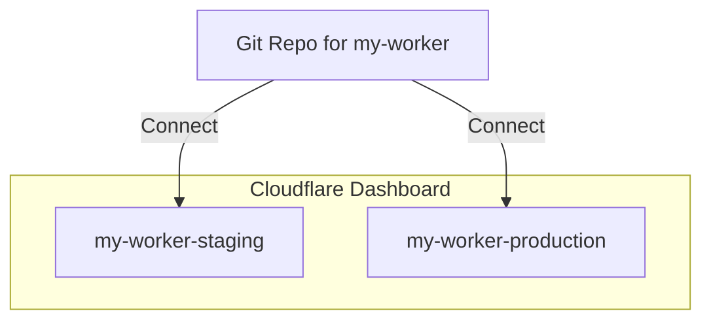

You can choose to use [Wrangler Enviornments](/workers/wrangler/environments/) with Workers Builds. Here is how you can set it up:

## Set up

To set up Workers Builds with [Wrangler Enviornments](/workers/wrangler/environments/):

1. (Optional) [Deploy via Wrangler](/workers/wrangler/commands/#deploy) to create the Workers for your environments in the Dashboard, if you don't already have them.
2. Find the Workers for your environments. They are typically named `[name of Worker] - [environment name]`.
3. Connect your repository to each of the Workers for your environment.
4. In each of the Workers, edit your Wrangler deploy command to include the flag `--env: <environment name>` in the build configurations.

When a new commit is detected in the repository, all the associated Workers will trigger a new build and deploy.

## Example

Imagine you have a Worker named `my-worker`, and you want to set up two environments `staging` and `production` set in the wrangler.toml. If you haven't already, you can deploy `my-worker` for each environment using the commands `wrangler deploy --env staging` and `wrangler deploy --env production`.

In your Cloudflare Dashboard, you should find two Workers `my-worker-staging` and `my-worker-production`. A git connection to a `my-worker` git repository should be added to both of the environment Workers. In the build configurations of each environment Worker, edit the deploy commands to be `npx wrangler deploy --env staging` and `npx wrangler deploy --env production` respectively.

