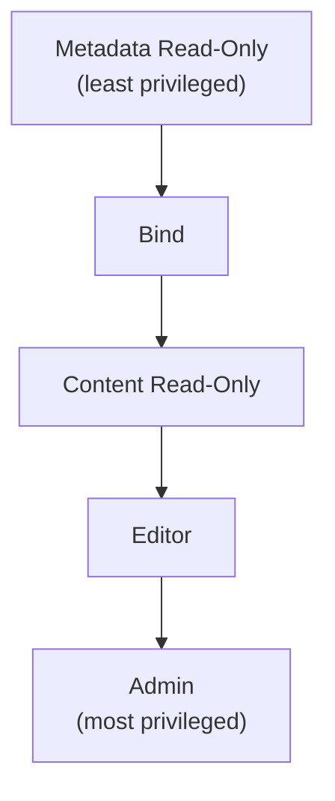

import { Details } from "~/components";

When you add members to your Cloudflare account or create API tokens, you can assign roles that control access to Workers and other Developer Platform resources. Roles determine what actions users can perform, from viewing metadata to creating and managing resources.

For information about managing account members, refer to [Manage members](/fundamentals/manage-members/manage/). For information about creating API tokens, refer to [Create API tokens](/fundamentals/api/get-started/create-token/).

## Overview

For every product within the [Developer Platform](/products/?product-group=Developer+platform), you can assign one or more of the following role types to users or API tokens on your Cloudflare account:

- **Metadata Read-Only**: Allows viewing resource lists, settings, and observability data (metrics, logs, traces) without access to product content.
- **Bind**: Can [bind a Worker](https://developers.cloudflare.com/workers/runtime-apis/bindings/) to product resources. 
- **Content Read-Only**: Allows reading product content (such as D1 database content or Worker code) without the ability to modify it.
- **Editor**: Allows reading and writing product content, and updating settings. Cannot create, delete, or rename resources.
- **Admin**: Full control over resources, including the ability to create, rename, delete, and grant access to other users.
- **Create**: Allows creating new resources. The user who creates a resource automatically becomes the Admin for that resource. Does not grant access to existing resources.

As a best practice, developers building with the Developer Platform should have **Developer Platform Metadata Read-Only** combined with a product-specific **Create** role. This approach allows developers to view resources and observability data across the platform while creating and managing their own resources.

Users can have multiple roles, both account-wide and per-resource.

:::note
Roles are ordered from least to most privileged: Metadata Read-Only < Bind < Content Read-Only < Editor < Admin. More privileged roles include all access granted by less privileged roles.

Page below describes roles for Workers and D1. The same pattern would be followed for all products within Developer Platform.
:::

## Developer Platform roles

Developer Platform roles grant access to all products in the Developer Platform, including Workers, D1, KV, R2, Durable Objects, and other related products.

| Role                                                                                                   | Description                                                                                                                                                                                          |
| ------------------------------------------------------------------------------------------------------ | ---------------------------------------------------------------------------------------------------------------------------------------------------------------------------------------------------- |
| Developer Platform Metadata Read-Only                                                                    | Can see all resources.   Can read metadata such as settings and observability (metrics, logs, traces).   Cannot read product content or manage resources.                                                                 |
| [Developer Platform Read-Only](/fundamentals/manage-members/roles/#account-scoped-roles) (existing role) | Can read metadata and product content (KV namespace values, Worker code).   Cannot manage resources or update settings.                                                                          |
| Developer Platform Editor                                                                                | Can read and write product content.   Can update settings and create new versions and deployments.   Cannot create, delete, or rename resources.   Cannot manage resource access.        |
| [Developer Platform Admin](/fundamentals/manage-members/roles/#account-scoped-roles) (existing role)     | Can read metadata and product content.   Can update settings.   Can create, rename, and delete resources.   Can grant resource access to other users.                                    |
| Developer Platform Create                                                                                | Can create new resources across Developer Platform products (Workers, D1, KV).   User who creates a resource becomes Admin for that resource.   Does not grant access to existing resources. |

## Product roles

Product roles can apply to all resources for that product or to individual resources, such as a specific Worker script or D1 database, depending on the scope you specify in the user membership or API token permission policy.

### Workers roles

| Role                       | Description                                                                                                                                                                                                                                                                                        |
| -------------------------- | -------------------------------------------------------------------------------------------------------------------------------------------------------------------------------------------------------------------------------------------------------------------------------------------------- |
| Workers Metadata Read-Only | Can see Worker exists (list).   Can see settings (limits, compatibility flags).   Can see bindings configuration, routes, custom domains, cron triggers, and deployment history.   Can see observability (metrics, logs, traces, tail).   Cannot see script code or secret values. |
| Workers Bind               | Can bind to a Worker via service bindings.   Cannot deploy changes, read script code, or modify other settings.                                                                                                                                                                                        |
| Workers Content Read-Only  | Can view Worker script source code.   Cannot deploy changes or modify settings.                                                                                                                                                                                                                |
| Workers Editor             | Can deploy Worker changes to production.   Can create versions and deployments.   Can update Worker settings and bindings.   Can manage routes, custom domains, cron triggers, and secrets.   Cannot create or delete Workers.                                                     |
| Workers Admin              | Can create, rename, and delete Workers.   Can manage subdomain (\*.workers.dev) settings and account-level Workers settings.   Can grant resource access to other users.                                                                                                                   |
| Workers Create             | Can create a new Worker and become Worker Admin for your Worker.   Does not grant access to existing Workers.                                                                                                                                                                                  |

### D1 product roles

:::note
When deploying a Worker with a D1 binding, user must have **D1 Bind** role or higher for the binding's database. Workers accessing resource bindings do not make granular authorization checks at runtime.
:::

| Role                  | Description                                                                                                                                                 |
| --------------------- | ----------------------------------------------------------------------------------------------------------------------------------------------------------- |
| D1 Metadata Read-Only | Can list databases and read database metadata.   Cannot read or write database content.                                                                 |
| D1 Bind               | Can bind D1 database to Workers.   Cannot read or write database content or manage database.                                                         |
| D1 Content Read-Only  | Can bind D1 database to Workers.   Can read database content with read-only queries.   Can read all metadata.   Cannot write to database or update settings.                          |
| D1 Editor             | Can bind D1 database to Workers.   Can read and write database content.   Can read all metadata.   Cannot manage databases or update settings.                                         |
| D1 Admin              | Can bind D1 database to Workers.   Can create, list, read, update, and delete database.   Can grant access to other users.                |
| D1 Create             | Can create new databases.   User who creates a database becomes D1 Admin for that specific database.   Does not grant access to existing databases. |

## FAQ

In general, product metadata includes settings and observability (metrics, logs, traces) data. Product content includes customer-provided content, such as your Worker script code or D1 database data.

## Related resources

- [Manage account members](/fundamentals/manage-members/manage/) - Add and remove members from your account.
- [Roles](/fundamentals/manage-members/roles/) - View all available roles for your account.
- [Create API tokens](/fundamentals/api/get-started/create-token/) - Create tokens with specific permissions.
