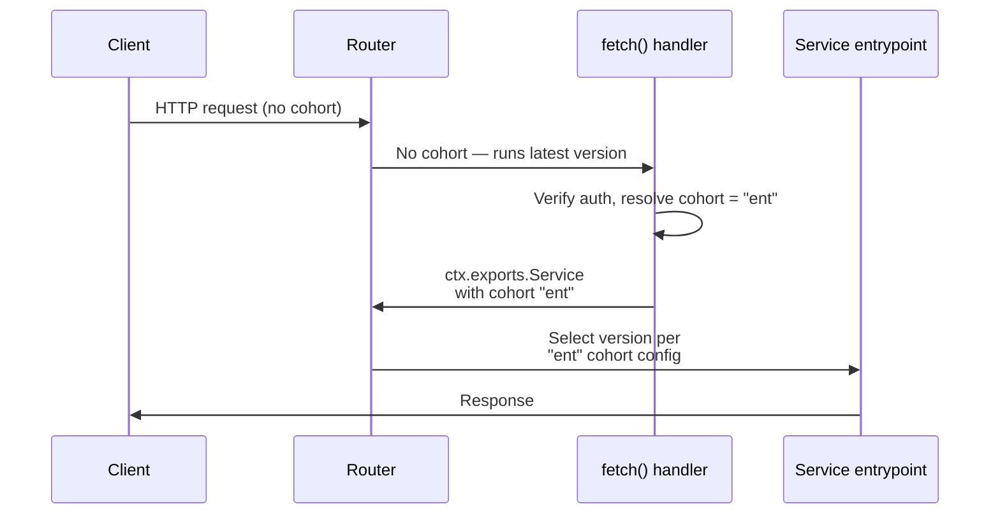

import { Example, TypeScriptExample } from "~/components";

Cohort-based deployments extend [gradual deployments](/workers/configuration/versions-and-deployments/gradual-deployments/) by routing requests to different version configurations based on named user segments. Instead of applying one percentage split to all traffic, you define independent version percentages for each cohort.

Use cohort-based deployments to:

- Test changes with internal users or beta testers before external customers.
- Roll out to free-tier customers before enterprise customers to limit blast radius.
- Hold back specific user segments during incident response.

:::note
Cohort-based deployments share the same [two-version limit](/workers/configuration/versions-and-deployments/gradual-deployments/) as gradual deployments. All cohorts must reference the same two version IDs — you can only assign different _percentages_ of those versions to each cohort.
:::

For example, this is what you can do:

```txt
Version: v1 (stable) and v2 (new)

default:    100% v1,  0% v2   <- most users stay on stable
canary:      50% v1, 50% v2   <- canary users get 50/50
employee:     0% v1, 100% v2  <- employees fully on new version
```

This is what you **cannot** do:

```txt
default:    100% v1            <- v1
canary:     100% v2            <- v2
enterprise: 100% v3            <- v3 -- ERROR: only 2 versions allowed
```

## How cohort-based deployments work

When a request arrives, the system selects a version in two steps:

**Step 1 -- Select the version configuration.**

1. If the request has a `Cloudflare-Workers-Version-Overrides` header that matches a version ID present anywhere in the deployment (default or any cohort), that version is used immediately. No further routing applies. Refer to [Version overrides](/workers/configuration/versions-and-deployments/version-overrides/).
2. If the request has a `Cloudflare-Workers-Cohort` header that matches a defined cohort name, that cohort's `versions` array is used. This header is set by trusted sources such as [Transform Rules](#transform-rules), the [gateway entrypoint pattern](#gateway-entrypoint-pattern), or [service bindings](/workers/runtime-apis/bindings/service-bindings/) -- not by external HTTP clients directly.
3. Otherwise, the default `versions` array is used.

**Step 2 -- Select a version within the chosen configuration.**

1. If the request has a `Cloudflare-Workers-Version-Key` header, deterministic hashing selects a version from the configuration chosen in Step 1. This provides version affinity -- the same key always routes to the same version within a given configuration.
2. Otherwise, a version is selected randomly based on configured percentages.

A request can carry both a cohort header and a version key. In that case, the cohort selects which version configuration to use and the version key provides deterministic (sticky) selection within that configuration.

## Create a cohort-based deployment

Create a cohort-based deployment through the API. The following example keeps default traffic on the stable version, while `canary` users get a 50/50 split and `employee` users are fully on the new version:

```json
{
  "strategy": "percentage",
  "versions": [
    {
      "version_id": "abc123-stable-version",
      "percentage": 100
    }
  ],
  "cohorts": [
    {
      "name": "canary",
      "versions": [
        {
          "version_id": "abc123-stable-version",
          "percentage": 50
        },
        {
          "version_id": "def456-new-version",
          "percentage": 50
        }
      ]
    },
    {
      "name": "employee",
      "versions": [
        {
          "version_id": "def456-new-version",
          "percentage": 100
        }
      ]
    }
  ]
}
```

Percentages within each cohort's `versions` array must sum to 100. Each cohort operates independently -- changing the `canary` split does not affect `employee` or the default.

## Assign requests to cohorts

Defining cohorts in your deployment configuration only sets up the version splits. You still need a way to assign incoming requests to the correct cohort. There are two approaches:

| Approach | Requires Worker code? | Use when |
|---|---|---|
| [Gateway entrypoint pattern](#gateway-entrypoint-pattern) | Yes | You need custom logic like JWT verification, database lookups, or API calls to determine cohort |
| [Transform Rules](#transform-rules) | No | You can determine cohort from request properties (geo, cookie, header, URL) |

### Gateway entrypoint pattern

Use this pattern when you need custom application logic to determine the cohort -- for example, verifying JWTs, querying a database, or calling an external auth service -- and you want to keep all the logic in a single Worker rather than deploying a separate upstream Worker.

This pattern splits your Worker into two entry points:

1. **Default `fetch` handler** -- receives the raw request, determines the cohort, and forwards to the service entrypoint via a [loopback binding](/workers/runtime-apis/context/#exports).
2. **Service entrypoint** -- contains your business logic. This is the code that gets gradually deployed across cohorts.

<TypeScriptExample>

```ts
import { WorkerEntrypoint } from "cloudflare:workers";

// Default entrypoint -- resolves cohort, not gradually deployed
export default {
  async fetch(request: Request, env: Env, ctx: ExecutionContext) {
    // Determine cohort using your application logic
    const token = request.headers.get("Authorization");
    const user = await verifyToken(token, env);

    let cohort = "default";
    if (user.isEmployee) cohort = "employee";
    else if (user.plan === "enterprise") cohort = "ent";
    else if (user.plan === "free") cohort = "free";

    // Forward to Service entrypoint with resolved cohort
    return ctx.exports.Service({ version: { cohort } }).handle(request);
  },
};

// Service entrypoint -- your business logic, gradually deployed per cohort
export class Service extends WorkerEntrypoint {
  async handle(request: Request) {
    // This code is version-routed based on the cohort resolved above.
    // Implement your business logic here.
    return new Response("OK");
  }
}
```

</TypeScriptExample>

The loopback call (`ctx.exports.Service(...)`) goes back through the platform's version routing system. The platform sees the cohort and selects the correct version of the `Service` class based on your deployment configuration.

There are a few important behaviors to keep in mind when using this pattern:

- **Loopback calls without a cohort are version-locked.** If you call `ctx.exports.Service()` without passing `version: \{ cohort \}`, the platform routes to the same version the caller is already running — not the default configuration. You must explicitly pass a cohort to get cohort-based routing.
- **The `fetch` handler is not version-routed.** It always runs the latest deployed version. Only the `Service` entrypoint (and anything it calls) is gradually deployed across cohorts. Keep your `fetch` handler minimal — ideally just authentication and cohort resolution.
- **`ctx.exports` requires a compatibility flag.** You must enable the [`enable_ctx_exports` compatibility flag](/workers/configuration/compatibility-flags/#enable-ctxexports) in your Wrangler configuration.

#### How it works



This all happens within a single request. The client sends one request and receives one response.

### Transform Rules

Use [Transform Rules](/rules/transform/request-header-modification/) to set the `Cloudflare-Workers-Cohort` header based on request properties without writing any Worker code. This is the simplest approach when cohort membership can be derived from information already in the request.

#### Example: Cohort from a cookie

If your application sets a `cohort` cookie on users (for example, during login or signup), you can extract it with a Transform Rule:

**Expression Editor:**
```txt
http.cookie contains "cohort="
```

**Operation:** Set dynamic

**Header name:** `Cloudflare-Workers-Cohort`

**Value:** `regex_replace(http.cookie, ".*cohort=([^;]+).*", "$\{1\}")`

#### Example: Cohort from geography

Route users from specific countries to a canary cohort:

**Expression Editor:**
```txt
ip.geoip.country in {"US" "CA" "GB"}
```

**Operation:** Set static

**Header name:** `Cloudflare-Workers-Cohort`

**Value:** `canary`

#### Example: Cohort from a request header

If an upstream service (like an API gateway or CDN) already attaches user metadata to headers:

**Expression Editor:**
```txt
http.request.headers["x-user-plan"][0] eq "enterprise"
```

**Operation:** Set static

**Header name:** `Cloudflare-Workers-Cohort`

**Value:** `ent`

## Accessing version metadata in your code

Use `ctx.version` to access cohort and version selection metadata. This is useful for including version information in your logs, metrics, and traces.

```ts
export default {
  async fetch(request: Request, env: Env, ctx: ExecutionContext) {
    const { cohort, override, key, reason, metadata } = ctx.version;
    console.log(`version: ${metadata.id}, cohort: ${cohort}, reason: ${reason}`);
    // ...
  },
};
```

| Property | Type | Description |
|---|---|---|
| `cohort` | `string \| undefined` | The matched cohort name, if a valid `Cloudflare-Workers-Cohort` header matched a defined cohort. Populated even if a version override took precedence over cohort-based routing. `undefined` if the header was missing, invalid, or did not match any defined cohort. |
| `override` | `string \| undefined` | The matched version ID from a `Cloudflare-Workers-Version-Overrides` header, if it matched a version ID in the deployment. `undefined` if the header was missing or did not match. |
| `key` | `string \| undefined` | The version key from a `Cloudflare-Workers-Version-Key` header, if present. |
| `reason` | `string` | How the version was selected: `override`, `versionKey`, or `random`. |
| `metadata` | `object` | An object containing `id` (version ID), `tag` (version tag), and `timestamp` (creation time) of the selected version. |

When none of cohort, key, or override are specified (or none match), `ctx.version` is an empty object (`{}`).

:::caution[Avoid branching on cohort in application logic]
Do not use `ctx.version.cohort` to implement feature flags or change application behavior per cohort. Cohort-based deployments control which **version** of your code runs -- the code itself should behave the same regardless of cohort. If you write `if (cohort === "enterprise") \{ ... \}`, that logic will not be exercised by the new version until the new version reaches that cohort, defeating the purpose of gradual rollout.

Use `ctx.version` for **observability only** -- logging, metrics, and tracing.
:::

## Service bindings and cohort propagation

Cohort routing applies to the initial request only. Cohorts **do not** automatically propagate across [service bindings](/workers/runtime-apis/bindings/service-bindings/).

When Worker A calls Worker B through a service binding, Worker B uses its own deployment configuration. If Worker B also uses cohort-based deployments, Worker A must explicitly pass the cohort:

```ts
// Worker A -- explicitly passing cohort to Worker B
const cohort = ctx.version.cohort ?? "default";
const result = await env.WORKER_B({ version: { cohort } }).someMethod();
```

If Worker A does not pass a cohort, Worker B falls back to its default version configuration.

## Durable Objects

### Current behavior

:::warning
Cohort-based deployments do not currently affect [Durable Object](/durable-objects/) version routing. Durable Objects ignore the `Cloudflare-Workers-Cohort` header and follow the standard [gradual deployments behavior for Durable Objects](/workers/configuration/versions-and-deployments/gradual-deployments/#gradual-deployments-for-durable-objects).
:::

With [gradual deployments](/workers/configuration/versions-and-deployments/gradual-deployments/#gradual-deployments-for-durable-objects), each Durable Object instance is assigned a version based on a hash of its unique ID and the deployment percentages. The assignment is deterministic and sticky -- the same instance stays on the same version until a new deployment is created. However, you have no control over which instances get which version.

```txt
Deployment: Version A @ 60%, Version B @ 40%

DO Namespace: USER_DO
┌──────────────────────────────────┬──────────────────────┐
│  Version A (60%)                 │  Version B (40%)     │
│  ┌──────┐ ┌──────┐ ┌──────┐    │  ┌──────┐ ┌──────┐  │
│  │alice │ │carol │ │eve   │    │  │ bob  │ │dave  │  │
│  └──────┘ └──────┘ └──────┘    │  └──────┘ └──────┘  │
│                                  │                      │
│  Assigned by: hash(DO ID)        │                      │
│  You cannot choose.              │                      │
└──────────────────────────────────┴──────────────────────┘
```

This means you cannot say "I want all paid users' Durable Objects on the new version." The hash decides, and a high-value customer's Durable Object might end up on the untested version.

### Planned: Cohort-based version routing for Durable Objects

:::note
The following describes planned behavior that is not yet available. The API and behavior may change before release.
:::

Cohort-based deployments for Durable Objects will let you control which instances run which version based on your business logic. Instead of a random hash deciding, your Worker code explicitly assigns a cohort when obtaining a stub to a Durable Object instance.

#### How it will work

Your deployment configuration maps cohorts to versions, the same as for stateless Workers:

```txt
Deployment config:
  cohort "free"    → Version A (stable)
  cohort "paid"    → Version B (new features)
  default (null)   → Version A
```

Your Worker passes the cohort at `.get()` time -- when obtaining a [stub](/durable-objects/best-practices/access-durable-objects-from-a-worker/#2-create-durable-object-stubs) to a Durable Object, not when making an RPC call on it:

```ts
export default {
  async fetch(request: Request, env: Env) {
    const userId = getUserId(request);
    const plan = getUserPlan(request); // "free" or "paid"

    const id = env.USER_DO.idFromName(userId);

    // Pass the cohort when getting the stub
    const stub = env.USER_DO.get(id, {
      version: { cohort: plan }
    });

    // Make the RPC call -- no cohort here, the version is already decided
    const result = await stub.getProfile();
    return Response.json(result);
  },
};
```

The Durable Object sees its cohort at runtime:

```ts
export class UserDO extends DurableObject {
  async getProfile() {
    const myCohort = this.ctx.version.cohort;   // "free" or "paid"
    const myVersion = this.env.CF_VERSION_METADATA.id; // version UUID

    return {
      cohort: myCohort,
      version: myVersion,
    };
  }
}
```

#### Version locking

A Durable Object instance locks to the version of the cohort it was instantiated with. If a subsequent request passes a different cohort, the instance stays on its original version. This prevents the Durable Object from flipping between code versions mid-lifetime, which would risk data corruption.

```txt
Request 1: get(bobId, { version: { cohort: "paid" } })
→ bob starts on Version B, cohort "paid" is saved

Request 2: get(bobId, { version: { cohort: "free" } })
→ bob is ALREADY RUNNING on "paid" / Version B
→ the "free" hint is ignored
→ bob stays on Version B (no reset, no flapping)
```

#### Sticky across evictions

The cohort will be persisted so that when a Durable Object is [evicted](/durable-objects/concepts/durable-object-lifecycle/) from memory (due to inactivity or server maintenance) and later reinstantiated, it returns to the same cohort and version.

```txt
1. bob starts with cohort "paid" → Version B
   Cohort "paid" is persisted.

2. bob is evicted (idle overnight).
   Stored data and cohort persist.

3. New request arrives for bob.
   System reads persisted cohort → "paid"
   → bob reinstantiates on Version B ✅

4. bob has a scheduled alarm that fires.
   No incoming request, no caller cohort.
   System reads persisted cohort → "paid"
   → bob runs on Version B ✅
```

This means not every caller needs to know the correct cohort. Once a Durable Object's cohort is set, it sticks until you change it or create a new deployment.

#### Cohort is optional

If you do not pass a cohort, the Durable Object uses the default version selection -- the same behavior as standard gradual deployments. Existing code that does not pass a cohort will continue to work without changes.

```ts
// No cohort -- uses default version selection (hash-based)
const stub = env.USER_DO.get(id);

// With cohort -- uses cohort-based version selection
const stub = env.USER_DO.get(id, { version: { cohort: "paid" } });
```

#### Why this matters

The key difference from gradual deployments is the type of control you get over version assignment:

```txt
Gradual deployments (today):
  "Roughly 40% of my DO instances will run the new code."
  "I do not know which ones. The hash decides."

Cohort-based deployments (planned):
  "All paid users' DOs run the new code."
  "All free users' DOs stay on the stable code."
  "I decide, based on my business logic, and it sticks."
```

With gradual deployments, you have **statistical** control -- "approximately this percentage." With cohort-based deployments, you have **semantic** control -- "these specific user segments." You can start with your lowest-risk instances, verify everything works, then move higher-value instances over deliberately.

| | Gradual deployments | Cohort-based deployments |
|---|---|---|
| Who decides the version | hash of DO ID | Your Worker code via `.get()` |
| You choose which instances get new code | No | Yes |
| Sticky across evictions | Yes (hash is deterministic) | Yes (cohort is persisted) |
| Survives alarms | Yes | Yes |
| Use case | "Roll out to 10% of instances" | "Free users get stable, paid users get new" |

## Observability

To monitor cohort-based deployments, use the following tools:

- **`ctx.version` in your Worker** -- Include `cohort`, `reason`, and `metadata.id` in your application logs via `console.log()`.
- **[Workers Logs](/workers/observability/logs/workers-logs/)** -- Filter invocation logs by version to compare error rates across versions.
- **[Tail Workers](/workers/observability/logs/tail-workers/)** -- Process version and cohort metadata in real time for custom alerting or forwarding to third-party observability tools.
- **[Logpush](/workers/observability/logs/logpush/)** -- The `ScriptVersion` field in Workers Trace Events includes version ID, tag, and message. Use this alongside `ctx.version.cohort` logged from your Worker to build per-cohort dashboards.

## Error handling

**At deploy time:** Invalid cohort names, duplicate names, exceeding cohort or version limits, or percentages that do not sum to 100 cause the deployment to fail with a `400` error.

**At runtime:** If the `Cloudflare-Workers-Cohort` header value does not match any defined cohort name, the request falls back to the default `versions` configuration. No error is returned to the client.

## Cohort limitations

The following constraints apply to cohort-based deployments.

### Naming rules

| Rule | Detail |
|---|---|
| Allowed characters | Alphanumeric, hyphens (`-`), and underscores (`_`) |
| Maximum length | 10 characters |
| Case sensitivity | Case-insensitive (`CANARY` and `canary` resolve to the same cohort) |
| Uniqueness | Each cohort name must be unique within a deployment |

Invalid or duplicate cohort names cause the deployment to fail with a `400` error.

### Deployment limits

| Limit | Value |
|---|---|
| Maximum cohorts per deployment | 5 |
| Maximum unique version IDs across default and all cohorts | 2 |

The unique version limit means that you can use at most two distinct version IDs in a single deployment, but you can reference those same IDs in multiple cohorts with different percentages.

## Migration from gradual deployments

If you are already using [gradual deployments](/workers/configuration/versions-and-deployments/gradual-deployments/) with percentage-based traffic splitting, cohort-based deployments are a superset of that behavior. Your existing `versions` array becomes the default configuration. You can add cohorts alongside it without disrupting current traffic routing.

A deployment with no `cohorts` array behaves identically to a standard gradual deployment.

## Related resources

- [Gradual deployments](/workers/configuration/versions-and-deployments/gradual-deployments/) -- Learn how percentage-based traffic splitting works, including version affinity, static assets handling, and Durable Objects behavior.
- [Version overrides](/workers/configuration/versions-and-deployments/version-overrides/) -- Send a specific request to a specific version of your Worker, bypassing percentage-based and cohort-based routing.
- [Service bindings](/workers/runtime-apis/bindings/service-bindings/) -- Learn how Workers communicate with each other.
- [`ctx.exports` API](/workers/runtime-apis/context/#exports) -- Reference for loopback bindings used in the gateway entrypoint pattern.
