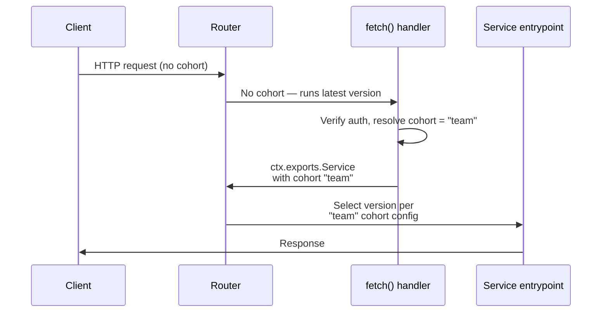

import { Details, Example, TypeScriptExample } from "~/components";

Cohort-based deployments let you test your deployments in production by choosing exactly who sees them.

You define named groups — called **cohorts** — and control which Worker version each group runs. Deploy a new version, route only your team's traffic to it, verify it works, then expand to more users. If something breaks, roll back instantly. Everyone else stays on the stable version the entire time.

```txt
team:         0% stable, 100% new    <- your team sees the new version
beta:        50% stable,  50% new    <- beta testers get a 50/50 split
vip:        100% stable,   0% new    <- VIP users stay on stable
```


Traffic that does not match any cohort uses your [gradual deployment](/workers/configuration/versions-and-deployments/gradual-deployments/) split. You set this split yourself when you deploy, and it can be anything:

```txt
stable 100%, new 0%          <- only cohorted traffic sees the new version
stable 90%, new 10%          <- non-cohorted traffic gets a 90/10 gradual split
stable 50%, new 50%          <- non-cohorted traffic gets a 50/50 split
```

The gradual deployment split and cohort splits are set together in the same deployment. Cohort-based deployments are a superset of gradual deployments. If you already use gradual deployments, add cohorts alongside your existing configuration without disrupting current traffic.

## Why cohort-based deployments

- **Test in production before anyone else sees it.** Route your team's traffic to a new version with a [Transform Rule](#assign-cohorts-with-transform-rules). No one else is affected. [Get started](#quick-start-roll-out-to-your-team-first).
- **Control the blast radius.** Roll out to [beta users](#roll-out-to-beta-users), a [single country](#canary-by-country), or a [specific tenant](#test-per-tenant) before deploying globally.
- **Test the entire release artifact, not just a code path.** Cohorts control which **version** runs — code, bindings, compatibility date, and static assets. You can catch problems that feature flags cannot: a broken compat date bump, a misconfigured binding, a bundling regression.
- **Secure by default.** The platform [ignores the cohort header](#security) when it comes from external HTTP clients. Users cannot assign themselves to a cohort.
- **Control which Durable Object instances run new code.** Route users' [Durable Object](#durable-objects) instances to the new version based on your app logic, instead of leaving it to a random hash.
- **Instant rollback.** Deploy the stable version at 100% and every cohort is overridden. One command.

Cohorts are for rollout, not for permanent version divergence. Every scenario ends the same way: once you are confident, deploy the new version to everyone.

## How it works

### 1. Define cohorts in your deployment

A cohort is a name (up to 10 characters) with its own version percentage split. You can have up to **5 cohorts** per deployment, and all cohorts share the same two version IDs. Define cohorts via [Wrangler](#with-wrangler) or the [API](#with-the-api).

### 2. Determine which users belong to which cohort

You decide how to identify which requests belong to which cohort by setting the `Cloudflare-Workers-Cohort` header on incoming requests. There are three ways to do this:

| Method                                                               | When to use                                                  | Needs code? |
| -------------------------------------------------------------------- | ------------------------------------------------------------ | ----------- |
| [Transform Rules](#assign-cohorts-with-transform-rules)              | Match on cookies, headers, geography, URL patterns, and more | No          |
| [Gateway entrypoint pattern](#assign-cohorts-with-application-logic) | JWT verification, database lookups, custom logic             | Yes         |
| [Service bindings](#assign-cohorts-via-service-bindings)             | Upstream Worker decides the cohort                           | Yes         |

### 3. The platform routes to the right version

When a request arrives with a matching cohort header, the platform uses that cohort's version split. Requests without a cohort header use the default split. Refer to [How version selection works](#how-version-selection-works) for the full algorithm.

## Security

The `Cloudflare-Workers-Cohort` header is set by trusted sources — [Transform Rules](/rules/transform/request-header-modification/), your Worker code, or [service bindings](/workers/runtime-apis/bindings/service-bindings/). The platform ignores this header when it originates from an external HTTP client, so users cannot assign themselves to a cohort.

## Get started

- **[Quick start: Roll out to your team first](#quick-start-roll-out-to-your-team-first)** — No code changes. The best way to try cohort-based deployments for the first time.
- **[Tutorial: Safe production rollouts with Astro](/workers/configuration/versions-and-deployments/ab-testing-with-cohorts/)** — Build an Astro site and use cohorts to test a new version on your team before rolling out to everyone. Shows the full server-to-client cookie loop.
- **[Tutorial: Controlled Durable Object rollouts](/workers/configuration/versions-and-deployments/testing-gradual-deployments/)** — Deploy new code to specific Durable Object instances instead of leaving it to chance.

## Use cases

The table below shows common use cases with one example approach each. Any use case can be implemented with any [assignment method](#2-determine-which-users-belong-to-which-cohort).

| Use case                          | Example approach                               | Details                                                     |
| --------------------------------- | ---------------------------------------------- | ----------------------------------------------------------- |
| Roll out to your team             | Transform Rule (Access, cookie, or IP)         | [Quick start](#quick-start-roll-out-to-your-team-first)     |
| Roll out to beta users            | Cookie set at signup + Transform Rule          | [Example](#roll-out-to-beta-users)                          |
| Canary a country or region        | `ip.geoip.country` in Transform Rule           | [Example](#canary-by-country)                               |
| Test per-tenant                   | Gateway entrypoint or service binding          | [Example](#test-per-tenant)                                 |
| Control Durable Object rollout    | Cohort at `.get()` time                        | [Durable Objects](#durable-objects)                         |
| Hold back a group during incident | Deploy stable at 100% for that cohort          | [Manage deployments](#manage-deployments)                   |
| Mobile app version rollout        | `User-Agent` or custom header + Transform Rule | [Transform Rules](#assign-cohorts-with-transform-rules)     |
| Route by API version              | URL path match in Transform Rule               | [Transform Rules](#assign-cohorts-with-transform-rules)     |
| Internal dogfooding               | Gateway entrypoint with auth check             | [Application logic](#assign-cohorts-with-application-logic) |

:::note
Cohort-based deployments share the same [two-version limit](/workers/configuration/versions-and-deployments/gradual-deployments/) as gradual deployments. All cohorts reference the same two version IDs — you can only change the _percentages_ per cohort, not use different versions.
:::

---

## Quick start: roll out to your team first

The best way to get started. Deploy a new version, route your team's traffic to it, and verify it works. Everyone else stays on the current version.

:::note[Just need to test a single request?]
Use [version overrides](/workers/configuration/versions-and-deployments/version-overrides/) instead. One curl command with a header, no Transform Rule needed. Refer to [Version overrides vs. cohorts](/workers/configuration/versions-and-deployments/version-overrides-vs-cohorts/) to pick the right tool.
:::

**Prerequisites:**

- An existing deployed Worker. If you do not have one, [create one first](/workers/get-started/guide/).
- [Wrangler](/workers/wrangler/install-and-update/) 3.40.0 or later.
- Your Worker must be routed through a [zone](/workers/configuration/routing/) (required for Transform Rules).

### Step 1: Upload a new version

Make any visible change to your Worker code (like modifying a response body), then upload without deploying:

```sh
npx wrangler versions upload
```

Note the **Version ID** in the output. See all versions with:

```sh
npx wrangler versions list
```

You now have two versions: the one currently serving traffic (call it `STABLE`) and the one you just uploaded (call it `NEW`).

### Step 2: Create a Transform Rule to identify your team

Create a [Transform Rule](/rules/transform/request-header-modification/) in the Cloudflare dashboard that sets the `Cloudflare-Workers-Cohort` header for your team's requests. How you identify your team depends on your setup. Here are a few options:

**If you use Cloudflare Access** — match on the authenticated email domain:

<Example>

Text in **Expression Editor**:

```txt
http.request.headers["cf-access-authenticated-user-email"][0] contains "@yourcompany.com"
```

Selected operation under **Modify request header**: _Set static_

**Header name**: `Cloudflare-Workers-Cohort`

**Value**: `team`

</Example>

**If you identify users by cookie** — match on a cookie your app sets for internal users:

<Example>

Text in **Expression Editor**:

```txt
http.cookie contains "internal=true"
```

Selected operation under **Modify request header**: _Set static_

**Header name**: `Cloudflare-Workers-Cohort`

**Value**: `team`

</Example>

**If your team is on a known network** — match on IP range or ASN:

<Example>

Text in **Expression Editor**:

```txt
ip.src in {192.0.2.0/24}
```

Selected operation under **Modify request header**: _Set static_

**Header name**: `Cloudflare-Workers-Cohort`

**Value**: `team`

</Example>

### Step 3: Deploy with a `team` cohort

Keep 100% of default traffic on the stable version. Create a `team` cohort that sends 100% of matching traffic to the new version:

```sh
npx wrangler versions deploy \
  STABLE_VERSION_ID@100% \
  --cohort team=NEW_VERSION_ID@100% \
  --message "Team testing new version" -y
```

Replace `STABLE_VERSION_ID` and `NEW_VERSION_ID` with your actual IDs. Nothing changes for your users yet — only requests matched by the Transform Rule see the new version.

### Step 4: Verify

```sh
# Team member (matched by Transform Rule) — hits the new version
curl -s https://your-worker.example.com -H "Cookie: internal=true"

# Everyone else — hits the stable version
curl -s https://your-worker.example.com
```

### Step 5: Expand or roll back

Confident it works? Expand to 10% of all traffic while keeping your team on the new version:

```sh
npx wrangler versions deploy \
  STABLE_VERSION_ID@90% NEW_VERSION_ID@10% \
  --cohort team=NEW_VERSION_ID@100% \
  --message "Expanding to 10% of default traffic" -y
```

Deploy to everyone:

```sh
npx wrangler versions deploy NEW_VERSION_ID@100% -y
```

Something wrong? Roll back instantly:

```sh
npx wrangler versions deploy STABLE_VERSION_ID@100% -y
```

---

## Roll out to beta users

Set a `cohort=beta` cookie when users opt into your beta program (for example, from a settings page). Then create a Transform Rule:

<Example>

Text in **Expression Editor**:

```txt
http.cookie contains "cohort=beta"
```

Selected operation under **Modify request header**: _Set static_

**Header name**: `Cloudflare-Workers-Cohort`

**Value**: `beta`

</Example>

Deploy with a `beta` cohort:

```sh
npx wrangler versions deploy \
  STABLE_VERSION_ID@100% \
  --cohort beta=NEW_VERSION_ID@100% \
  --message "Beta users on new version" -y
```

Beta users see the new version. Everyone else stays on stable. When you are ready, deploy the new version to everyone.

## Canary by country

Route traffic from specific countries to a canary cohort using a Transform Rule:

<Example>

Text in **Expression Editor**:

```txt
ip.geoip.country in {"US" "CA"}
```

Selected operation under **Modify request header**: _Set static_

**Header name**: `Cloudflare-Workers-Cohort`

**Value**: `canary`

</Example>

Deploy:

```sh
npx wrangler versions deploy \
  STABLE_VERSION_ID@100% \
  --cohort canary=STABLE_VERSION_ID@50%,NEW_VERSION_ID@50% \
  --message "50/50 canary in US and CA" -y
```

Users in the US and Canada get a 50/50 split. Everyone else stays on stable.

## Test per-tenant

If your application identifies tenants by a JWT claim, API key, or database lookup, use the [gateway entrypoint pattern](#assign-cohorts-with-application-logic) to resolve the cohort in your Worker:

<TypeScriptExample>

```ts
import { WorkerEntrypoint } from "cloudflare:workers";

export default {
	async fetch(request: Request, env: Env, ctx: ExecutionContext) {
		const tenantId = await getTenantId(request, env);

		// Route one specific tenant to the canary cohort
		const cohort = tenantId === "acme-corp" ? "canary" : "default";

		return ctx.exports.Service({ version: { cohort } }).handle(request);
	},
};

export class Service extends WorkerEntrypoint {
	async handle(request: Request) {
		return new Response("OK");
	}
}
```

</TypeScriptExample>

Deploy:

```sh
npx wrangler versions deploy \
  STABLE_VERSION_ID@100% \
  --cohort canary=NEW_VERSION_ID@100% \
  --message "Testing on acme-corp tenant" -y
```

Only requests from the `acme-corp` tenant hit the new version. All other tenants stay on stable.

---

## Assign cohorts with Transform Rules

[Transform Rules](/rules/transform/request-header-modification/) let you set the `Cloudflare-Workers-Cohort` header based on any request property with no code changes to your Worker. The use case sections above show examples using cookies, IP ranges, Access headers, and country. Here are additional patterns.

For the full list of available fields, refer to the [Rules language fields reference](/ruleset-engine/rules-language/fields/).

### From a hostname

If you serve multiple domains (for example, via [SSL for SaaS](/ssl/ssl-for-saas/) or [custom domains](/workers/configuration/routing/custom-domains/)) and want to canary one domain first:

<Example>

Text in **Expression Editor**:

```txt
http.host eq "beta.example.com"
```

Selected operation under **Modify request header**: _Set static_

**Header name**: `Cloudflare-Workers-Cohort`

**Value**: `canary`

</Example>

### From a URL path

Route requests to a specific API version to a cohort:

<Example>

Text in **Expression Editor**:

```txt
starts_with(http.request.uri.path, "/v2")
```

Selected operation under **Modify request header**: _Set static_

**Header name**: `Cloudflare-Workers-Cohort`

**Value**: `apiv2`

</Example>

### From a User-Agent

Route traffic from a specific mobile app version:

<Example>

Text in **Expression Editor**:

```txt
http.user_agent contains "MyApp/2.0"
```

Selected operation under **Modify request header**: _Set static_

**Header name**: `Cloudflare-Workers-Cohort`

**Value**: `appv2`

</Example>

### From a cookie (dynamic extraction)

If your application sets a `cohort` cookie and you want to use the cookie value directly as the cohort name:

<Example>

Text in **Expression Editor**:

```txt
http.cookie contains "cohort="
```

Selected operation under **Modify request header**: _Set dynamic_

**Header name**: `Cloudflare-Workers-Cohort`

**Value**: `regex_replace(http.cookie, ".*cohort=([^;]+).*", "$\{1\}")`

</Example>

### From a request header

If an upstream service or API gateway attaches metadata:

<Example>

Text in **Expression Editor**:

```txt
http.request.headers["x-tenant-id"][0] eq "acme"
```

Selected operation under **Modify request header**: _Set static_

**Header name**: `Cloudflare-Workers-Cohort`

**Value**: `canary`

</Example>

## Assign cohorts with application logic

When you need custom logic to determine the cohort — like verifying a JWT, querying a database, or looking up a tenant — use the **gateway entrypoint pattern**.

This splits your Worker into two parts:

1. A **`fetch` handler** that determines the cohort and forwards to the business logic via a [loopback binding](/workers/runtime-apis/context/#exports).
2. A **`Service` entrypoint** that contains your application code. This is the part that gets version-routed per cohort.

<TypeScriptExample>

```ts
import { WorkerEntrypoint } from "cloudflare:workers";

export default {
	async fetch(request: Request, env: Env, ctx: ExecutionContext) {
		const user = await getUser(request, env);

		let cohort = "default";
		if (user.email.endsWith("@mycompany.com")) cohort = "team";
		else if (user.isBetaTester) cohort = "beta";

		return ctx.exports.Service({ version: { cohort } }).handle(request);
	},
};

export class Service extends WorkerEntrypoint {
	async handle(request: Request) {
		return new Response("OK");
	}
}
```

</TypeScriptExample>

**Important details:**

- **The `fetch` handler always runs the latest version.** Only the `Service` entrypoint is version-routed. Keep `fetch` minimal.
- **Loopback calls without a cohort are version-locked.** If you call `ctx.exports.Service()` without passing `version: \{ cohort \}`, the platform routes to the same version the caller is already running. You must explicitly pass a cohort to get cohort-based routing.
- **Requires a compatibility flag.** Enable [`enable_ctx_exports`](/workers/configuration/compatibility-flags/#enable-ctxexports) in your Wrangler configuration.



This all happens within a single request. The client sends one request and receives one response.

## Assign cohorts via service bindings

When Worker A calls Worker B through a [service binding](/workers/runtime-apis/bindings/service-bindings/), cohorts do not propagate automatically. Worker A must pass the cohort explicitly:

```ts
const cohort = ctx.version.cohort ?? "default";
const result = await env.WORKER_B({ version: { cohort } }).someMethod();
```

If Worker A does not pass a cohort, Worker B falls back to its default version configuration.

---

## Manage deployments

### With Wrangler

:::note
Minimum required Wrangler version: 3.40.0. Versions before 3.73.0 require you to specify a `--x-versions` flag.
:::

Upload a new version:

```sh
npx wrangler versions upload
```

Deploy with cohorts (positional arguments set the default split, `--cohort` flags define named cohorts):

```sh
npx wrangler versions deploy \
  STABLE_VERSION_ID@100% \
  --cohort canary=STABLE_VERSION_ID@50%,NEW_VERSION_ID@50% \
  --cohort team=NEW_VERSION_ID@100% \
  --message "Canary at 50%, team on new version" -y
```

You can also run `npx wrangler versions deploy` without arguments for an interactive prompt.

Check deployment status:

```sh
npx wrangler deployments status
```

Complete the rollout:

```sh
npx wrangler versions deploy NEW_VERSION_ID@100% -y
```

### With the API

```sh
curl -X POST "https://api.cloudflare.com/client/v4/accounts/ACCOUNT_ID/workers/scripts/SCRIPT_NAME/deployments" \
  -H "Authorization: Bearer API_TOKEN" \
  -H "Content-Type: application/json" \
  -d '{
    "strategy": "percentage",
    "versions": [
      { "version_id": "STABLE_VERSION_ID", "percentage": 100 }
    ],
    "cohorts": [
      {
        "name": "canary",
        "versions": [
          { "version_id": "STABLE_VERSION_ID", "percentage": 50 },
          { "version_id": "NEW_VERSION_ID", "percentage": 50 }
        ]
      },
      {
        "name": "team",
        "versions": [
          { "version_id": "NEW_VERSION_ID", "percentage": 100 }
        ]
      }
    ]
  }'
```

Percentages within each cohort must sum to 100. Each cohort is independent. A deployment without a `cohorts` array behaves identically to a standard [gradual deployment](/workers/configuration/versions-and-deployments/gradual-deployments/).

## How version selection works

When multiple routing signals are present on a request, they are evaluated in this order:

1. **Version override** (`Cloudflare-Workers-Version-Overrides` header). If it matches a version in the current deployment, that version is used immediately. All other signals are ignored. Refer to [version overrides](/workers/configuration/versions-and-deployments/version-overrides/).
2. **Cohort** (`Cloudflare-Workers-Cohort` header). If it matches a defined cohort name, that cohort's version split is used.
3. **Version key** (`Cloudflare-Workers-Version-Key` header). Within the selected configuration (cohort or default), deterministic hashing picks a version. The same key always routes to the same version for a given deployment.
4. **Random percentage.** If none of the above apply, a version is picked randomly based on the configured percentages.

---

## Observability

Use `ctx.version` to include version and cohort information in your logs:

```ts
export default {
	async fetch(request: Request, env: Env, ctx: ExecutionContext) {
		const { cohort, reason, metadata } = ctx.version;
		console.log(
			`version: ${metadata.id}, cohort: ${cohort}, reason: ${reason}`,
		);
		// ...
	},
};
```

| Property   | Type                    | Description                                                                       |
| ---------- | ----------------------- | --------------------------------------------------------------------------------- |
| `cohort`   | `string` or `undefined` | The matched cohort name, if any.                                                  |
| `override` | `string` or `undefined` | The matched version override, if any.                                             |
| `key`      | `string` or `undefined` | The version key, if present.                                                      |
| `reason`   | `string`                | How the version was selected: `override`, `versionKey`, or `random`.              |
| `metadata` | `object`                | Contains `id` (version ID), `tag` (version tag), and `timestamp` (creation time). |

When no cohort, key, or override matches, `ctx.version` is an empty object.

:::caution[Do not branch on cohort in application logic]
Cohort-based deployments control which **version** of your code runs — the code itself should behave the same regardless of cohort. Use `ctx.version` for **observability only** — logging, metrics, and tracing.
:::

Other tools:

- **[Workers Logs](/workers/observability/logs/workers-logs/)** — Filter invocation logs by version to compare error rates.
- **[Tail Workers](/workers/observability/logs/tail-workers/)** — Process version and cohort metadata in real time.
- **[Logpush](/workers/observability/logs/logpush/)** — `ScriptVersion` field in Workers Trace Events includes version ID, tag, and message.

---

## Durable Objects

With [gradual deployments](/workers/configuration/versions-and-deployments/gradual-deployments/#gradual-deployments-for-durable-objects), each [Durable Object](/durable-objects/) instance is assigned a version based on a hash of its ID. You cannot choose which instances get the new version.

With cohort-based deployments, you can target specific instances. Pass a cohort at `.get()` time, set the default to 100% stable, and only the instances you target get the new version. Everything else stays on stable.

```ts
export default {
	async fetch(request: Request, env: Env) {
		const userId = getUserId(request);
		const id = env.USER_DO.idFromName(userId);

		// Only pass a cohort for the instance you want on the new version
		const isTestUser = userId === "alice";
		const stub = isTestUser
			? env.USER_DO.get(id, { version: { cohort: "canary" } })
			: env.USER_DO.get(id);

		return stub.fetch(request);
	},
};
```

```sh
# Default = 100% stable. Only the canary cohort gets the new version.
npx wrangler versions deploy \
  STABLE_VERSION_ID@100% \
  --cohort canary=NEW_VERSION_ID@100% \
  --message "Testing new DO version on alice only" -y
```

Because the default is 100% stable, every instance without a cohort stays on the stable version. Only alice's DO gets the new version. When you are confident, expand the cohort to more users or deploy to everyone.

This works for any cohort logic. Target one user, a group of free-tier users, a set of test tenants, or specific rooms:

```ts
// Target one test user
const cohort = userId === "alice" ? "canary" : undefined;

// Target free-tier users
const cohort = plan === "free" ? "free" : undefined;

// Target a specific chat room
const cohort = roomId === "room-123" ? "canary" : undefined;
```

When you do not pass a cohort, the instance uses the default version configuration. If the default is 100% stable, that instance stays on stable.

For a hands-on walkthrough, refer to [Tutorial: Controlled Durable Object rollouts](/workers/configuration/versions-and-deployments/testing-gradual-deployments/).

### How the cohort is assigned to an instance


- **Locked while in memory.** The first request that passes a cohort to `.get()` locks that instance to that cohort and version for as long as the DO is running in memory. If a later request passes a different cohort for the same instance, it is ignored.
- **Resets on eviction.** When the DO is [evicted](/durable-objects/concepts/durable-object-lifecycle/) from memory due to inactivity, the cohort is not persisted. The next request that instantiates the DO can set a new cohort.
- **Optional.** If you do not pass a cohort, the Durable Object uses the default version configuration. If the default is 100% stable, the instance stays on stable.

:::caution[The cohort must be known before calling `.get()`]
The cohort is set at `.get()` time, which means it must come from information available _outside_ the Durable Object. If the only place that knows a user's plan or tier is inside the DO's storage (for example, a field in its SQLite database), you cannot read that data first and then pass it as a cohort. You need to resolve the cohort from the incoming request, a KV lookup, a D1 query, or another source that your Worker can access before calling `.get()`.
:::

:::note[Shared Durable Objects]
If multiple users share a DO instance (for example, a chat room), different users may pass different cohorts. Only the first request after instantiation sets the cohort. For shared DOs, base the cohort on the instance (the room or document), not the individual user.
:::

|                                         | Gradual deployments (hash-based) | Cohort-based deployments                  |
| --------------------------------------- | -------------------------------- | ----------------------------------------- |
| Who decides the version                 | Hash of DO ID                    | Your Worker code via `.get()`             |
| You choose which instances get new code | No                               | Yes                                       |
| Sticky while in memory                  | Yes (hash is deterministic)      | Yes (locked until eviction)               |
| Persists across evictions               | Yes (hash is deterministic)      | No (next request sets new cohort)         |
| Use case                                | "Roll out to ~10% of instances"  | "Test on alice, then expand to free tier" |

### Durable Object use cases

The diagrams below show which version each instance gets at the time of the request. To understand what happens when an instance is evicted and reinstantiated, refer to [How the cohort is assigned to an instance](#how-the-cohort-is-assigned-to-an-instance).

#### Test one instance in production

Pass a cohort for the one instance you want on the new version. Everything else stays on stable.


```ts
const isTestUser = userId === "alice";
const stub = isTestUser
	? env.USER_DO.get(id, { version: { cohort: "canary" } })
	: env.USER_DO.get(id);
```

#### Roll out to a group of users

Pass a cohort for all users in a group (for example, free-tier). Each user's DO gets the version their cohort maps to.


```ts
const cohort = plan === "free" ? "free" : undefined;
const stub = cohort
	? env.USER_DO.get(id, { version: { cohort } })
	: env.USER_DO.get(id);
```

#### Shared instances (chat rooms, lobbies, docs)

When multiple users share a DO, base the cohort on the instance, not the user. All users in that room get the same version.


```ts
const isCanaryRoom = roomId === "room-123";
const stub = isCanaryRoom
	? env.ROOM_DO.get(id, { version: { cohort: "canary" } })
	: env.ROOM_DO.get(id);
```

---

## Limits

| Constraint                                 | Value                  |
| ------------------------------------------ | ---------------------- |
| Maximum cohorts per deployment             | 5                      |
| Maximum unique versions across all cohorts | 2                      |
| Cohort name: allowed characters            | Alphanumeric, `-`, `_` |
| Cohort name: maximum length                | 10 characters          |
| Cohort name: case sensitivity              | Case-insensitive       |

## Error handling

**At deploy time:** Invalid cohort names, duplicates, too many cohorts or versions, or percentages not summing to 100 return a `400` error.

**At runtime:** If the `Cloudflare-Workers-Cohort` header does not match any defined cohort, the request uses the default version split. No error is returned.

## Related resources

- [Tutorial: Safe production rollouts with Astro](/workers/configuration/versions-and-deployments/ab-testing-with-cohorts/) — Build an Astro site and use cohorts to test a new version on your team before rolling out to everyone.
- [Tutorial: Controlled Durable Object rollouts](/workers/configuration/versions-and-deployments/testing-gradual-deployments/) — Deploy new code to specific Durable Object instances instead of leaving it to chance.
- [Version overrides vs. cohorts](/workers/configuration/versions-and-deployments/version-overrides-vs-cohorts/) — Choose the right tool for testing and rolling out new versions.
- [Gradual deployments](/workers/configuration/versions-and-deployments/gradual-deployments/) — Percentage-based traffic splitting, version affinity, static assets, and Durable Objects behavior.
- [Version overrides](/workers/configuration/versions-and-deployments/version-overrides/) — Send a specific request to a specific version, bypassing all routing.
- [Service bindings](/workers/runtime-apis/bindings/service-bindings/) — How Workers communicate with each other.
- [`ctx.exports` API](/workers/runtime-apis/context/#exports) — Loopback bindings used in the gateway entrypoint pattern.
- [Rules language fields reference](/ruleset-engine/rules-language/fields/) — Full list of fields available in Transform Rule expressions.
