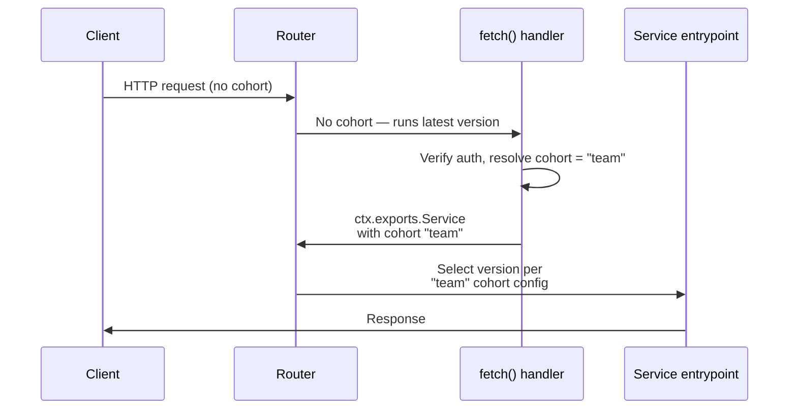

import { Details, Example, TypeScriptExample } from "~/components";

Cohort deployments let you test your deployments in production by choosing exactly who sees them.

With [gradual deployments](/workers/configuration/versions-and-deployments/gradual-deployments/), traffic is split randomly between two versions. Cohort deployments extend this by letting you define named groups — called **cohorts** — where each group gets its own version split.

Roll out to your team first, verify it works, then expand to more users. If something breaks, [rollback instantly](/workers/configuration/versions-and-deployments/rollbacks/).


Each cohort gets its own percentage split of the same two versions. Traffic that does not match any cohort uses your gradual deployment split.

If you already use gradual deployments, add cohorts alongside your existing configuration without disrupting current traffic. Refer to [How it works](#how-it-works) for how to set cohorts via [Wrangler](#with-wrangler), the [API](#with-the-api), or the Dashboard.

## Why cohort deployments

| What you can do                                   | How                                                                                        | Details                                                            |
| ------------------------------------------------- | ------------------------------------------------------------------------------------------ | ------------------------------------------------------------------ |
| **Test in production before anyone else sees it** | Route your team's traffic to a new version with a Transform Rule. No one else is affected. | [Quick start](#quick-start-roll-out-to-your-team-first)            |
| **Roll out to beta users**                        | Cookie set at signup + Transform Rule                                                      | [Example](#roll-out-to-beta-users)                                 |
| **Canary a country or region**                    | `ip.geoip.country` in Transform Rule                                                       | [Example](#canary-by-country)                                      |
| **Test per-tenant**                               | Gateway entrypoint or service binding                                                      | [Example](#test-per-tenant)                                        |
| **Control Durable Object rollout**                | Pass a cohort at `.get()` time to choose which per-user DO instances run the new version   | [Durable Objects](#durable-objects)                                |
| **Hold back a group during incident**             | Deploy stable at 100% for that cohort                                                      | [Create a cohort deployment](#create-a-cohort-deployment)          |
| **Mobile app version rollout**                    | `User-Agent` or custom header + Transform Rule                                             | [Transform Rules](#transform-rules)                                |
| **Route by API version**                          | URL path match in Transform Rule                                                           | [Transform Rules](#transform-rules)                                |
| **Internal dogfooding**                           | Gateway entrypoint with auth check                                                         | [Application logic](#application-logic-gateway-entrypoint-pattern) |
| **Instant rollback**                              | Deploy the stable version at 100% and every cohort is overridden. One command.             | [Create a cohort deployment](#create-a-cohort-deployment)          |

Cohorts control which **version** runs — code, bindings, compatibility date, and static assets. This is different from feature flags, which toggle behavior inside a single version. Cohorts can catch problems that feature flags cannot: a broken compat date bump, a misconfigured binding, a bundling regression.

Cohorts are for rollout, not for permanent version divergence. Every scenario ends the same way: once you are confident, deploy the new version to everyone.

:::note
Cohort deployments share the same [two-version limit](/workers/configuration/versions-and-deployments/gradual-deployments/) as gradual deployments. All cohorts reference the same two version IDs — you can only change the _percentages_ per cohort, not use different versions.
:::

## How it works

### 1. Define cohorts in your deployment

A cohort is a name (up to 20 characters) with its own version percentage split. You can have up to **10 cohorts** per deployment, and all cohorts share the same two version IDs. Define cohorts via [Wrangler](#with-wrangler) or the [API](#with-the-api).

### 2. Determine which users belong to which cohort

You decide how to identify which requests belong to which cohort by setting the `Cloudflare-Workers-Cohort` header on incoming requests. There are three ways to do this:

| Method                                                                      | When to use                                                  | Needs code? |
| --------------------------------------------------------------------------- | ------------------------------------------------------------ | ----------- |
| [Transform Rules](#transform-rules)                                         | Match on cookies, headers, geography, URL patterns, and more | No          |
| [Gateway entrypoint pattern](#application-logic-gateway-entrypoint-pattern) | JWT verification, database lookups, custom logic             | Yes         |
| [Service bindings](#service-bindings)                                       | Upstream Worker decides the cohort                           | Yes         |

The `Cloudflare-Workers-Cohort` header is set by trusted sources — [Transform Rules](/rules/transform/request-header-modification/), your Worker code, or [service bindings](/workers/runtime-apis/bindings/service-bindings/). The platform ignores this header when it originates from an external HTTP client, so users cannot assign themselves to a cohort.

### 3. The platform routes to the right version

When a request arrives with a matching cohort header, the platform uses that cohort's version split. Requests without a cohort header use the gradual deployment split.

When multiple routing signals are present on a request, they are evaluated in this order:

1. **Version override** (`Cloudflare-Workers-Version-Overrides` header). If it matches a version in the current deployment, that version is used immediately. All other signals are ignored. Refer to [version overrides](/workers/configuration/versions-and-deployments/version-overrides/).
2. **Cohort** (`Cloudflare-Workers-Cohort` header). If it matches a defined cohort name, that cohort's version split is used.
3. **Version key** (`Cloudflare-Workers-Version-Key` header). Within the selected configuration (cohort or default), deterministic hashing picks a version. The same key always routes to the same version for a given deployment.
4. **Random percentage.** If none of the above apply, a version is picked randomly based on the gradual deployment split.

---

## Create a cohort deployment

### With the API

Use the [Create Deployment](/api/resources/workers/subresources/scripts/subresources/deployments/) endpoint. Add a `cohorts` array alongside the existing `versions` array:

```json
{
	"strategy": "percentage",
	"versions": [
		{
			"version_id": "abc123-stable-version",
			"percentage": 100
		}
	],
	"cohorts": [
		{
			"name": "internal",
			"versions": [
				{
					"version_id": "def456-new-version",
					"percentage": 100
				}
			]
		},
		{
			"name": "beta",
			"versions": [
				{
					"version_id": "abc123-stable-version",
					"percentage": 50
				},
				{
					"version_id": "def456-new-version",
					"percentage": 50
				}
			]
		}
	]
}
```

Percentages within each cohort must sum to 100. Each cohort is independent. A deployment without a `cohorts` array behaves identically to a standard [gradual deployment](/workers/configuration/versions-and-deployments/gradual-deployments/).

### With Wrangler

:::note
Minimum required Wrangler version: TODO_ADD_VERSION
:::

Deploy with cohorts (positional arguments set the gradual deployment split, `--cohort` flags define named cohorts):

```sh
npx wrangler versions deploy \
  abc123-stable-version@100% \
  --cohort internal=def456-new-version@100% \
  --cohort beta=abc123-stable-version@50%,def456-new-version@50% \
  --message "Internal on new, beta at 50/50" -y
```

You can also run `npx wrangler versions deploy` without arguments for an interactive prompt.

Check deployment status:

```sh
npx wrangler deployments status
```

Complete the rollout:

```sh
npx wrangler versions deploy def456-new-version@100% -y
```

---

## How to assign requests to cohorts

### Transform Rules

[Transform Rules](/rules/transform/request-header-modification/) let you set the `Cloudflare-Workers-Cohort` header based on any request property with no code changes to your Worker. For the full list of available fields, refer to the [Rules language fields reference](/ruleset-engine/rules-language/fields/).

Each example below sets the `Cloudflare-Workers-Cohort` header. All use the same setup in the dashboard: create a Transform Rule, write the expression, and set the header.

- **Cloudflare Access** — route your team by matching on authenticated email:

<Example>

Text in **Expression Editor**:

```txt
http.request.headers["cf-access-authenticated-user-email"][0] contains "@yourcompany.com"
```

Selected operation under **Modify request header**: _Set static_

**Header name**: `Cloudflare-Workers-Cohort`

**Value**: `internal`

</Example>

- **Cookie** — route beta users who opted in via a cookie set at signup or from a settings page:

<Example>

Text in **Expression Editor**:

```txt
http.cookie contains "cohort=beta"
```

Selected operation under **Modify request header**: _Set static_

**Header name**: `Cloudflare-Workers-Cohort`

**Value**: `beta`

</Example>

To extract the cohort name dynamically from the cookie value, use _Set dynamic_ with `regex_replace(http.cookie, ".*cohort=([^;]+).*", "$\{1\}")`.

- **Country** — canary a region before going global:

<Example>

Text in **Expression Editor**:

```txt
ip.geoip.country in {"US" "CA" "GB"}
```

Selected operation under **Modify request header**: _Set static_

**Header name**: `Cloudflare-Workers-Cohort`

**Value**: `canary`

</Example>

- **IP range** — route traffic from your office network:

<Example>

Text in **Expression Editor**:

```txt
ip.src in {192.0.2.0/24}
```

Selected operation under **Modify request header**: _Set static_

**Header name**: `Cloudflare-Workers-Cohort`

**Value**: `internal`

</Example>

- **Hostname** — canary one domain in a multi-domain setup:

<Example>

Text in **Expression Editor**:

```txt
http.host eq "beta.example.com"
```

Selected operation under **Modify request header**: _Set static_

**Header name**: `Cloudflare-Workers-Cohort`

**Value**: `canary`

</Example>

- **URL path** — route a specific API version:

<Example>

Text in **Expression Editor**:

```txt
starts_with(http.request.uri.path, "/v2")
```

Selected operation under **Modify request header**: _Set static_

**Header name**: `Cloudflare-Workers-Cohort`

**Value**: `apiv2`

</Example>

- **User-Agent** — route a specific mobile app version:

<Example>

Text in **Expression Editor**:

```txt
http.user_agent contains "MyApp/2.0"
```

Selected operation under **Modify request header**: _Set static_

**Header name**: `Cloudflare-Workers-Cohort`

**Value**: `appv2`

</Example>

- **Request header** — route based on metadata from an upstream service or API gateway:

<Example>

Text in **Expression Editor**:

```txt
http.request.headers["x-tenant-id"][0] eq "acme"
```

Selected operation under **Modify request header**: _Set static_

**Header name**: `Cloudflare-Workers-Cohort`

**Value**: `canary`

</Example>

### Gateway entrypoint pattern (application logic)

When you need custom logic to determine the cohort — like verifying a JWT, querying a database, or looking up a tenant — use the **gateway entrypoint pattern**.

This splits your Worker into two parts:

1. A **`fetch` handler** that determines the cohort and forwards to the business logic via a [loopback binding](/workers/runtime-apis/context/#exports).
2. A **`Service` entrypoint** that contains your application code. This is the part that gets version-routed per cohort.

<TypeScriptExample>

```ts
import { WorkerEntrypoint } from "cloudflare:workers";

// fetch handler — always runs the latest version
export default {
	async fetch(request: Request, env: Env, ctx: ExecutionContext) {
		const user = await getUser(request, env);

		let cohort = undefined;
		if (user.email.endsWith("@mycompany.com")) cohort = "internal";
		else if (user.plan === "free") cohort = "free";

		// Pass cohort to version-routed entrypoint
		return cohort
			? ctx.exports.Service({ version: { cohort } }).handle(request)
			: ctx.exports.Service().handle(request);
	},
};

// Service entrypoint — version-routed based on cohort
export class Service extends WorkerEntrypoint {
	async handle(request: Request) {
		return new Response("OK");
	}
}
```

</TypeScriptExample>

**Important details:**

- **The `fetch` handler always runs the latest version.** Only the `Service` entrypoint is version-routed. Keep `fetch` minimal.
- **Loopback calls without a cohort are version-locked.** If you call `ctx.exports.Service()` without passing `version: \{ cohort \}`, the platform routes to the same version the caller is already running. You must explicitly pass a cohort to get cohort-based routing.
- **Requires a compatibility flag.** Enable [`enable_ctx_exports`](/workers/configuration/compatibility-flags/#enable-ctxexports) in your Wrangler configuration.

This all happens within a single request. The client sends one request and receives one response.



### Service bindings

When Worker A calls Worker B through a [service binding](/workers/runtime-apis/bindings/service-bindings/), cohorts do not propagate automatically. Worker A must pass the cohort explicitly:

```ts
// Worker A — resolves cohort and passes to Worker B
export default {
	async fetch(request, env, ctx) {
		const user = await getUser(request, env);
		const cohort = user.plan === "free" ? "free" : undefined;

		// Pass cohort explicitly to downstream Worker
		const result = cohort
			? await env.WORKER_B({ version: { cohort } }).processRequest(request)
			: await env.WORKER_B.processRequest(request);

		return new Response(result);
	},
};
```

If Worker A does not pass a cohort, Worker B falls back to its default version configuration.

---

## Durable Objects

With [gradual deployments](/workers/configuration/versions-and-deployments/gradual-deployments/#gradual-deployments-for-durable-objects), each [Durable Object](/durable-objects/) instance is assigned a version based on a hash of its ID. You have no control over which instances get the new version. The hash decides, and it could put any instance on untested code.

Cohort deployments give you that control for [per-entity instances](#per-entity-instances) where each user, tenant, or resource has their own Durable Object. You pass a cohort at `.get()` time, and the platform routes that instance to the version your deployment config maps the cohort to. For [shared instances](#shared-instances) where multiple users hit the same Durable Object, cohorts are not the right fit.

### Per-entity instances

When each user, tenant, or resource has their own Durable Object instance (for example, user profiles, shopping carts, sessions, or per-tenant state), cohorts work cleanly. Only one user's requests reach each instance, so the cohort is always consistent. Your Worker already knows which instance each request goes to — you just add the cohort alongside it.

A Durable Object **namespace** (like `USER_DO`) is the class definition. Each **instance** within that namespace is a separate object with its own storage, identified by a unique ID. You do not need to enumerate instance IDs or set up cohorts per instance. Each request naturally hits one instance, and your Worker resolves the cohort at `.get()` time based on whatever you know about the user (their plan, their role, their email). One `if` statement in your Worker applies to every request as it comes in.


Pass a cohort at `.get()` time, set the gradual deployment split to 100% stable, and only the instances you target get the new version:

```ts
export default {
	async fetch(request: Request, env: Env) {
		const userId = getUserId(request);
		const id = env.USER_DO.idFromName(userId);

		// Only pass a cohort for the instance you want on the new version
		const isTestUser = userId === "alice";
		const stub = isTestUser
			? env.USER_DO.get(id, { version: { cohort: "canary" } })
			: env.USER_DO.get(id);

		return stub.fetch(request);
	},
};
```

In the example above, the gradual deployment split is set to 100% stable (as shown in [Create a cohort deployment](#create-a-cohort-deployment)). Every instance without a cohort stays on the stable version. Only alice's DO gets the new version. When you are confident, expand the cohort to more users or deploy to everyone.

Since each user has their own instance, alice is the only one making requests to her DO. The cohort is consistent across all of her requests. If alice's DO is [evicted](/durable-objects/concepts/durable-object-lifecycle/) from memory due to inactivity, the next request from alice sets the same cohort again. If you do not pass a cohort at all, the instance uses the gradual deployment split.

:::caution[The cohort must be known before calling `.get()`]
The cohort is set at `.get()` time, which means it must come from information available _outside_ the Durable Object. If the only place that knows a user's plan or tier is inside the DO's storage (for example, a field in its SQLite database), you cannot read that data first and then pass it as a cohort. You need to resolve the cohort from the incoming request, a KV lookup, a D1 query, or another source that your Worker can access before calling `.get()`.
:::

For a hands-on walkthrough, refer to [Tutorial: Controlled Durable Object rollouts](/workers/configuration/versions-and-deployments/testing-gradual-deployments/).

### Shared instances

For shared instances, use [gradual deployments](/workers/configuration/versions-and-deployments/gradual-deployments/#gradual-deployments-for-durable-objects) without cohorts.

When multiple users share a single Durable Object instance (for example, chat rooms, game lobbies, or collaborative documents), cohorts are not a good fit. The diagram below shows why:


The version an instance runs is not set by each user's cohort. It is set by the cohort of whichever request wakes the instance up first. Once locked, every subsequent request hits that version regardless of its cohort. This means you cannot guarantee that a specific user (for example, an enterprise customer) will not end up on the new version if they share an instance with a user from a different cohort.

Setting cohorts on shared instances adds complexity without giving you reliable control. The gradual deployment hash-based split already assigns a deterministic version per instance regardless of who calls it, which is effectively the same outcome.

### Gradual vs. cohort deployments for Durable Objects

|                                         | Gradual deployments (hash-based) | Cohort deployments (per-entity instances) |
| --------------------------------------- | -------------------------------- | ----------------------------------------- |
| Who decides the version                 | Hash of DO ID                    | Your Worker code via `.get()`             |
| You choose which instances get new code | No                               | Yes                                       |
| Sticky while in memory                  | Yes (hash is deterministic)      | Yes (locked until eviction)               |
| Persists across evictions               | Yes (hash is deterministic)      | No (next request sets new cohort)         |

---

## Observability

To see which version and cohort handled a request, use `ctx.version` in your Worker code. This lets you log cohort information, compare error rates between versions, and monitor your rollout.

```ts
export default {
	async fetch(request: Request, env: Env, ctx: ExecutionContext) {
		const { cohort, reason, metadata } = ctx.version;
		console.log(
			`version: ${metadata.id}, cohort: ${cohort}, reason: ${reason}`,
		);
		// ...
	},
};
```

`ctx.version` returns the following properties:

| Property   | Type                    | What it tells you                                                    |
| ---------- | ----------------------- | -------------------------------------------------------------------- |
| `cohort`   | `string` or `undefined` | Which cohort this request matched, if any.                           |
| `override` | `string` or `undefined` | Whether a version override was used instead of cohort routing.       |
| `key`      | `string` or `undefined` | The version key used for deterministic selection, if present.        |
| `reason`   | `string`                | How the version was selected: `override`, `versionKey`, or `random`. |
| `metadata` | `object`                | The selected version's `id`, `tag`, and `timestamp`.                 |

When no cohort, key, or override matches, `ctx.version` is an empty object.

:::caution[Do not branch on cohort in application logic]
Cohort deployments control which **version** of your code runs. The code itself should behave the same regardless of cohort. Use `ctx.version` for **observability only** — logging, metrics, and tracing.
:::

The version ID is automatically included in [Workers Logs](/workers/observability/logs/workers-logs/), [Tail Workers](/workers/observability/logs/tail-workers/), and [Logpush](/workers/observability/logs/logpush/) via the `ScriptVersion` field — no code changes needed for version-level filtering. The cohort name is not automatically included. To see it in your logs, you need the `console.log()` shown above. Since each cohort maps to a known version in your deployment, you can also filter by version ID and infer the cohort from there.

---

## Guides

### Quick start: roll out to your team first

The best way to get started. Deploy a new version, route your team's traffic to it, and verify it works. Everyone else stays on the current version.

:::note[Just need to test a single request?]
Use [version overrides](/workers/configuration/versions-and-deployments/version-overrides/) instead. One curl command with a header, no Transform Rule needed. Refer to [Version overrides vs. cohorts](/workers/configuration/versions-and-deployments/version-overrides-vs-cohorts/) to pick the right tool.
:::

**Prerequisites:**

- An existing deployed Worker. If you do not have one, [create one first](/workers/get-started/guide/).
- [Wrangler](/workers/wrangler/install-and-update/) 3.40.0 or later.
- Your Worker must be routed through a [zone](/workers/configuration/routing/) (required for Transform Rules).

#### Step 1: Upload a new version

Make any visible change to your Worker code (like modifying a response body), then upload without deploying:

```sh
npx wrangler versions upload
```

Note the **Version ID** in the output. See all versions with:

```sh
npx wrangler versions list
```

You now have two versions: the one currently serving traffic (call it `STABLE`) and the one you just uploaded (call it `NEW`).

#### Step 2: Create a Transform Rule to identify your team

Create a [Transform Rule](#assign-cohorts-with-transform-rules) in the Cloudflare dashboard that sets the `Cloudflare-Workers-Cohort` header for your team's requests. For example, use a [cookie match](#from-a-cookie), a [Cloudflare Access header](#from-cloudflare-access), or an [IP range](#from-an-ip-range).

#### Step 3: Deploy with a `team` cohort

Keep 100% of default traffic on the stable version. Create a `team` cohort that sends 100% of matching traffic to the new version:

```sh
npx wrangler versions deploy \
  STABLE_VERSION_ID@100% \
  --cohort team=NEW_VERSION_ID@100% \
  --message "Team testing new version" -y
```

Replace `STABLE_VERSION_ID` and `NEW_VERSION_ID` with your actual IDs. Nothing changes for your users yet — only requests matched by the Transform Rule see the new version.

#### Step 4: Verify

```sh
# Team member (matched by Transform Rule) — hits the new version
curl -s https://your-worker.example.com -H "Cookie: internal=true"

# Everyone else — hits the stable version
curl -s https://your-worker.example.com
```

#### Step 5: Expand or roll back

Confident it works? Expand to 10% of all traffic while keeping your team on the new version:

```sh
npx wrangler versions deploy \
  STABLE_VERSION_ID@90% NEW_VERSION_ID@10% \
  --cohort team=NEW_VERSION_ID@100% \
  --message "Expanding to 10% of default traffic" -y
```

Deploy to everyone:

```sh
npx wrangler versions deploy def456-new-version@100% -y
```

Something wrong? Roll back instantly:

```sh
npx wrangler versions deploy STABLE_VERSION_ID@100% -y
```

### Roll out to beta users

Set a `cohort=beta` cookie when users opt into your beta program (for example, from a settings page). Create a [Transform Rule](#from-a-cookie) to match it, then deploy:

```sh
npx wrangler versions deploy \
  STABLE_VERSION_ID@100% \
  --cohort beta=NEW_VERSION_ID@100% \
  --message "Beta users on new version" -y
```

Beta users see the new version. Everyone else stays on stable. When you are ready, deploy the new version to everyone.

### Canary by country

Create a [Transform Rule](#from-a-country) that matches traffic from specific countries, then deploy:

```sh
npx wrangler versions deploy \
  STABLE_VERSION_ID@100% \
  --cohort canary=STABLE_VERSION_ID@50%,NEW_VERSION_ID@50% \
  --message "50/50 canary in US and CA" -y
```

Users in the matched countries get a 50/50 split. Everyone else stays on stable.

### Test per-tenant

Use the [gateway entrypoint pattern](#assign-cohorts-with-application-logic) to resolve the cohort from a tenant ID, then deploy:

```sh
npx wrangler versions deploy \
  STABLE_VERSION_ID@100% \
  --cohort canary=NEW_VERSION_ID@100% \
  --message "Testing on acme-corp tenant" -y
```

Only requests from the targeted tenant hit the new version. All other tenants stay on stable.

### More tutorials

- **[Safe production rollouts with Astro](/workers/configuration/versions-and-deployments/ab-testing-with-cohorts/)** — Build an Astro site and use cohorts to test a new version on your team before rolling out to everyone. Shows the full server-to-client cookie loop.
- **[Controlled Durable Object rollouts](/workers/configuration/versions-and-deployments/testing-gradual-deployments/)** — Deploy new code to specific Durable Object instances instead of leaving it to chance.

---

## Limits

| Constraint                                 | Value                  |
| ------------------------------------------ | ---------------------- |
| Maximum cohorts per deployment             | 10                     |
| Maximum unique versions across all cohorts | 2                      |
| Cohort name: allowed characters            | Alphanumeric, `-`, `_` |
| Cohort name: maximum length                | 20 characters          |
| Cohort name: case sensitivity              | Case-insensitive       |

## Error handling

**At deploy time:** Invalid cohort names, duplicates, too many cohorts or versions, or percentages not summing to 100 return a `400` error.

**At runtime:** If the `Cloudflare-Workers-Cohort` header does not match any defined cohort, the request uses the default version split. No error is returned.

## Related resources

- [Tutorial: Safe production rollouts with Astro](/workers/configuration/versions-and-deployments/ab-testing-with-cohorts/) — Build an Astro site and use cohorts to test a new version on your team before rolling out to everyone.
- [Tutorial: Controlled Durable Object rollouts](/workers/configuration/versions-and-deployments/testing-gradual-deployments/) — Deploy new code to specific Durable Object instances instead of leaving it to chance.
- [Version overrides vs. cohorts](/workers/configuration/versions-and-deployments/version-overrides-vs-cohorts/) — Choose the right tool for testing and rolling out new versions.
- [Gradual deployments](/workers/configuration/versions-and-deployments/gradual-deployments/) — Percentage-based traffic splitting, version affinity, static assets, and Durable Objects behavior.
- [Version overrides](/workers/configuration/versions-and-deployments/version-overrides/) — Send a specific request to a specific version, bypassing all routing.
- [Service bindings](/workers/runtime-apis/bindings/service-bindings/) — How Workers communicate with each other.
- [`ctx.exports` API](/workers/runtime-apis/context/#exports) — Loopback bindings used in the gateway entrypoint pattern.
- [Rules language fields reference](/ruleset-engine/rules-language/fields/) — Full list of fields available in Transform Rule expressions.
