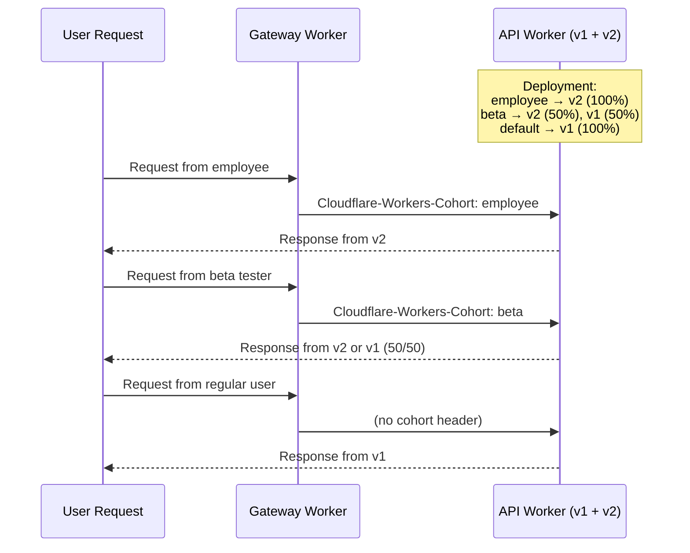

import { Example } from "~/components";

Cohort-based deployments let you roll out Worker versions to specific groups of users before deploying to everyone. You define cohorts when creating a deployment via the REST API, then route requests to cohorts using the `Cloudflare-Workers-Cohort` header.

Use cohort-based deployments when you want to:

- Deploy to internal employees first, where breaking changes have lower impact
- Roll out to beta testers who opted in to early access
- Deploy to free tier users before paid or enterprise customers
- Use different rollout speeds for different user segments

For simple traffic splitting without user segmentation, use [percentage-based deployments](/workers/configuration/versions-and-deployments/percentage-deployments/).

## How cohorts work

Each cohort has its own version configuration with independent percentages. Requests with the `Cloudflare-Workers-Cohort` header route to the matching cohort's configuration. Requests without the header use the default `versions` configuration.



## Create a deployment with cohorts

Use the REST API to create a cohort-based deployment. This example deploys a new version to 100% of employees, 50% of beta testers, and 0% of everyone else:

```bash
curl -X POST "https://api.cloudflare.com/client/v4/accounts/{account_id}/workers/scripts/{script_name}/deployments" \
  -H "Authorization: Bearer {api_token}" \
  -H "Content-Type: application/json" \
  -d '{
    "strategy": "cohorts",
    "versions": [
      { "version_id": "{stable_version_id}", "percentage": 100 }
    ],
    "cohorts": [
      {
        "name": "employee",
        "versions": [
          { "version_id": "{new_version_id}", "percentage": 100 }
        ]
      },
      {
        "name": "beta",
        "versions": [
          { "version_id": "{new_version_id}", "percentage": 50 },
          { "version_id": "{stable_version_id}", "percentage": 50 }
        ]
      }
    ]
  }'
```

### Request fields

| Field                | Type   | Required | Description                                                                  |
| -------------------- | ------ | -------- | ---------------------------------------------------------------------------- |
| `strategy`           | string | Yes      | Set to `"cohorts"`                                                           |
| `versions`           | array  | Yes      | Default version configuration when no cohort matches                         |
| `cohorts`            | array  | Yes      | Array of cohort configurations                                               |
| `cohorts[].name`     | string | Yes      | Cohort identifier (1-64 chars, alphanumeric, hyphens, underscores)           |
| `cohorts[].versions` | array  | Yes      | Version configuration for this cohort (1-2 versions, percentages sum to 100) |

## Route requests to cohorts

Set the `Cloudflare-Workers-Cohort` header on incoming requests. You can do this from an upstream Worker or using Transform Rules.

### From an upstream Worker

Use a gateway Worker to determine the cohort based on user properties:

```js
export default {
	async fetch(request, env) {
		const user = await getUser(request);
		const cohort = determineCohort(user);

		const headers = new Headers(request.headers);
		headers.set("Cloudflare-Workers-Cohort", cohort);

		return env.API_SERVICE.fetch(new Request(request, { headers }));
	},
};

function determineCohort(user) {
	if (user.email.endsWith("@yourcompany.com")) return "employee";
	if (user.betaTester) return "beta";
	if (user.plan === "free") return "free";
	return "paid";
}
```

### Using Transform Rules

Set the header based on request properties using a [request header modification rule](/rules/transform/request-header-modification/):

<Example>

Text in **Expression Editor**:

```txt
http.cookie contains "employee=true"
```

Selected operation under **Modify request header**: _Set static_

**Header name**: `Cloudflare-Workers-Cohort`

**Value**: `employee`

</Example>

### Cohort header behavior

- **Case-insensitive matching**: `EMPLOYEE` matches cohort `employee`
- **Unmatched cohorts**: If the header value does not match any cohort, the default `versions` configuration is used
- **Maximum length**: 64 characters
- **Valid characters**: `a-z`, `A-Z`, `0-9`, `-`, `_`

## Advance the rollout

Create a new deployment with updated percentages. This example increases the rollout to beta users and starts rolling out to the default (non-cohort) traffic:

```bash
curl -X POST "https://api.cloudflare.com/client/v4/accounts/{account_id}/workers/scripts/{script_name}/deployments" \
  -H "Authorization: Bearer {api_token}" \
  -H "Content-Type: application/json" \
  -d '{
    "strategy": "cohorts",
    "versions": [
      { "version_id": "{new_version_id}", "percentage": 25 },
      { "version_id": "{stable_version_id}", "percentage": 75 }
    ],
    "cohorts": [
      {
        "name": "employee",
        "versions": [{ "version_id": "{new_version_id}", "percentage": 100 }]
      },
      {
        "name": "beta",
        "versions": [{ "version_id": "{new_version_id}", "percentage": 100 }]
      }
    ]
  }'
```

## Complete the rollout

Once validation is complete, switch to the percentage strategy to deploy to 100% of all traffic:

```bash
curl -X POST "https://api.cloudflare.com/client/v4/accounts/{account_id}/workers/scripts/{script_name}/deployments" \
  -H "Authorization: Bearer {api_token}" \
  -H "Content-Type: application/json" \
  -d '{
    "strategy": "percentage",
    "versions": [{ "version_id": "{new_version_id}", "percentage": 100 }]
  }'
```

## Get current deployment

Retrieve the active deployment to see the current cohort configuration:

```bash
curl "https://api.cloudflare.com/client/v4/accounts/{account_id}/workers/scripts/{script_name}/deployments" \
  -H "Authorization: Bearer {api_token}"
```

## Constraints

| Constraint                     | Limit                                                   |
| ------------------------------ | ------------------------------------------------------- |
| Maximum cohorts per deployment | 10                                                      |
| Maximum versions per cohort    | 2                                                       |
| Cohort name length             | 1-64 characters                                         |
| Cohort name pattern            | Alphanumeric, hyphens, underscores (`^[a-zA-Z0-9_-]+$`) |

Additional requirements:

- Percentages within each cohort must sum to 100
- Cohort names must be unique within a deployment
- You must provide a `versions` array as the default configuration

## Current limitations

- **Wrangler CLI**: Cohort deployments are API-only. The `wrangler versions deploy` command does not yet support cohorts.

## Related

- [Version affinity](/workers/configuration/versions-and-deployments/gradual-deployments/#version-affinity) - ensure consistent version selection per user within a cohort
- [Version overrides](/workers/configuration/versions-and-deployments/gradual-deployments/#version-overrides) - test a specific version
- [Observability](/workers/configuration/versions-and-deployments/gradual-deployments/#observability) - track which version and cohort handled each request
