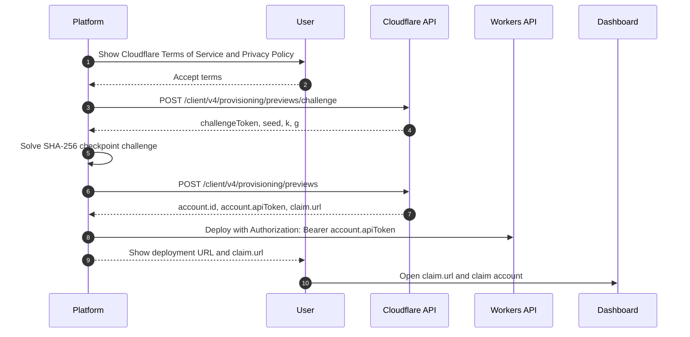
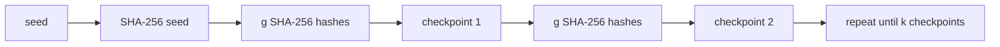

import { LinkCard, PackageManagers, Steps } from "~/components";


Use claim deployments when an AI agent or platform needs to deploy a Worker without an existing Cloudflare account, and without needing to first log in and authorize the [Wrangler CLI](/workers/wrangler/).

`wrangler deploy --temporary` creates or reuses a temporary preview account, deploys your Worker to a `workers.dev` URL, and prints a claim URL. Claim the temporary preview account within 60 minutes to keep the deployment and the Cloudflare resources created for it.

Platforms can also create temporary preview accounts directly through the Cloudflare REST API at `api.cloudflare.com`.

## Use cases

- AI-generated deployments
- Background agent sessions
- Prototyping new ideas quickly on a fresh Cloudflare account
- First-time Workers evaluations

For production and continuous integration and continuous deployment (CI/CD), use a permanent Cloudflare account with [`wrangler login`](/workers/wrangler/commands/general/#login) or a [Cloudflare API token](/fundamentals/api/get-started/create-token/). Do not use `--temporary` when the [Wrangler CLI](/workers/wrangler/) is already authenticated.

## Get started

Use the following flow to let an AI agent discover and use temporary deploys. This flow requires [Wrangler](/workers/wrangler/) 4.102.0 or later. The agent starts with the normal deploy command. If no Cloudflare credentials are available, the [Wrangler CLI](/workers/wrangler/) tells it to rerun with `--temporary`.

<Steps>

1. Install or update the [Wrangler CLI](/workers/wrangler/) to version 4.102.0 or later.

   For installation instructions, refer to [Install and update](/workers/wrangler/install-and-update/).

2. Give your AI agent a deploy prompt.

   For example:

   ```txt
   Make a very simple Hello World Cloudflare Worker in TypeScript and deploy it using the Wrangler CLI. Do not ask me questions.
   ```

3. The agent will run the deploy.

   If the [Wrangler CLI](/workers/wrangler/) has no credentials, it prints output similar to the following:

   ```txt
   To continue without logging in, rerun this command with `--temporary`.
   Wrangler will use a temporary account and print a claim URL.
   ```

   This output lets the agent discover the `--temporary` flag without you explicitly telling it to use the flag.

4. The agent will rerun the deploy with `--temporary`:

   <PackageManagers type="exec" pkg="wrangler" args="deploy --temporary" />

   The CLI prints output similar to the following:

   ```txt
   Continuing means you accept Cloudflare's Terms of Service (https://www.cloudflare.com/terms/) and Privacy Policy (https://www.cloudflare.com/privacypolicy/).

   Temporary account ready:
     Account:        example-name (created)
     Claim within:   60 minutes
     Claim URL:      https://dash.cloudflare.com/claim-preview?claimToken=<TOKEN>

   Uploaded example-worker
   Deployed example-worker triggers
     https://example-worker.example-name.workers.dev
   ```

5. The agent can redeploy before you claim the temporary preview account.

   The [Wrangler CLI](/workers/wrangler/) caches the temporary preview account and reuses it while both the account and claim URL are valid. The output shows whether the account was created or reused. The CLI clears the cached temporary preview account when you run `wrangler login` or `wrangler logout`.

   You can keep deploying changes with `wrangler deploy --temporary` while the temporary preview account remains active. If you do not claim the temporary preview account within 60 minutes, Cloudflare deletes it and its deployments.

</Steps>

## Claim the deployment

To keep the deployment, open the claim URL within 60 minutes. Sign in to Cloudflare or create an account, then follow the dashboard prompts to claim the temporary preview account.

After you claim the temporary preview account, the Worker and Cloudflare resources created in that account remain available to you. To continue using the [Wrangler CLI](/workers/wrangler/) with the claimed account, run [`wrangler login`](/workers/wrangler/commands/general/#login), then deploy without `--temporary`.

## Supported products and limits

Temporary preview accounts currently support the following Cloudflare products and limits only. Cloudflare will add support for more products over time.

| Supported product or resource                    | Temporary preview account limit                               |
| ------------------------------------------------ | ------------------------------------------------------------- |
| [Workers](/workers/)                             | Deployments on `workers.dev`                                  |
| [Workers Static Assets](/workers/static-assets/) | Up to 1,000 files, with each asset up to 5 MiB                |
| [Workers KV](/kv/)                               | Commands that use temporary credentials                       |
| [D1](/d1/)                                       | One database, with up to 100 MB per database and 100 MB total |
| [Durable Objects](/durable-objects/)             | Commands that use temporary credentials                       |
| [Hyperdrive](/hyperdrive/)                       | Up to two database configurations and 10 connections          |
| [Queues](/queues/)                               | Up to 10 queues                                               |
| [SSL/TLS certificates](/ssl/)                    | Commands that use temporary credentials                       |

## Use the REST API directly

Use the REST API flow when your platform controls the deployment experience and needs to provision a temporary preview account before the user authenticates with Cloudflare.

Make the provisioning calls from your backend. The response includes a short-lived `account.apiToken`, so do not expose the full response to browsers, client-side logs, or analytics.



The flow uses these API calls:

| Call | Endpoint                                          | Authorization               | Purpose                                 |
| ---- | ------------------------------------------------- | --------------------------- | --------------------------------------- |
| 1    | `POST /client/v4/provisioning/previews/challenge` | None                        | Request a proof-of-work challenge.      |
| 2    | `POST /client/v4/provisioning/previews`           | None                        | Create the temporary preview account.   |
| 3    | Workers API endpoints                             | `Bearer {account.apiToken}` | Deploy Workers and supported resources. |

Temporary preview accounts are available only through the public Cloudflare API region.

### Step 1: Request a challenge

Request a proof-of-work challenge before you create the temporary preview account:

```bash
curl "https://api.cloudflare.com/client/v4/provisioning/previews/challenge" \
  -X POST \
  -H "Content-Type: application/json" \
  --data '{}'
```

The response includes the challenge token, seed, and difficulty parameters:

```json
{
	"success": true,
	"result": {
		"challengeToken": "<CHALLENGE_TOKEN>",
		"seed": "<BASE64URL_32_BYTE_SEED>",
		"k": 8000,
		"g": 2000
	},
	"errors": [],
	"messages": []
}
```

### Step 2: Solve the proof of work

Solve the challenge by computing a sequential SHA-256 checkpoint chain.



Use this algorithm:

1. Decode `seed` as Base64URL. It must decode to 32 bytes.
2. Compute `checkpoint[0] = SHA-256(seed)`.
3. For each segment from `0` to `k - 1`, compute `g` sequential SHA-256 hashes from the previous checkpoint, then append the result.
4. Concatenate all `k + 1` checkpoints. Each checkpoint is 32 bytes.
5. Encode the concatenated bytes with standard Base64. Send that value as `solution.checkpoints`.

Wrangler rejects challenges when `k` or `g` is not a positive integer, when the decoded seed is not 32 bytes, or when `k * g` is greater than `64,000,000`. Use comparable bounds in your integration.

The following Node.js example returns the object required by the create request:

```js
import { createHash } from "node:crypto";

function sha256(value) {
	return createHash("sha256").update(value).digest();
}

export function solvePreviewChallenge({ challengeToken, seed, k, g }) {
	const seedBytes = Buffer.from(seed, "base64url");
	if (seedBytes.length !== 32) {
		throw new Error("seed must decode to 32 bytes");
	}
	if (!Number.isInteger(k) || k <= 0) {
		throw new Error("k must be a positive integer");
	}
	if (!Number.isInteger(g) || g <= 0) {
		throw new Error("g must be a positive integer");
	}
	if (k * g > 64_000_000) {
		throw new Error("k * g must not exceed 64,000,000");
	}

	const checkpoints = [];
	let hash = sha256(seedBytes);

	checkpoints.push(hash);

	for (let segment = 0; segment < k; segment++) {
		for (let iteration = 0; iteration < g; iteration++) {
			hash = sha256(hash);
		}

		checkpoints.push(hash);
	}

	return {
		challengeToken,
		solution: {
			checkpoints: Buffer.concat(checkpoints).toString("base64"),
		},
	};
}
```

### Step 3: Create a temporary preview account, deploy, and show the claim URL

Before you create the account, require the user to accept Cloudflare's [Terms of Service](https://www.cloudflare.com/terms/) and [Privacy Policy](https://www.cloudflare.com/privacypolicy/). Then send the proof-of-work solution with the required terms fields:

```bash
curl "https://api.cloudflare.com/client/v4/provisioning/previews" \
  -X POST \
  -H "Content-Type: application/json" \
  --data '{
    "termsOfService": "https://www.cloudflare.com/terms/",
    "privacyPolicy": "https://www.cloudflare.com/privacypolicy/",
    "acceptTermsOfService": "yes",
    "challengeToken": "<CHALLENGE_TOKEN>",
    "solution": {
      "checkpoints": "<BASE64_CHECKPOINTS>"
    }
  }'
```

The response includes the temporary account credentials and claim URL:

```json
{
	"success": true,
	"result": {
		"account": {
			"id": "<TEMPORARY_ACCOUNT_ID>",
			"name": "<TEMPORARY_ACCOUNT_NAME>",
			"type": "standard",
			"apiToken": "<TEMPORARY_ACCOUNT_API_TOKEN>",
			"tokenId": "<TEMPORARY_TOKEN_ID>",
			"expiresAt": "<ACCOUNT_EXPIRES_AT>"
		},
		"claim": {
			"token": "<CLAIM_TOKEN>",
			"url": "https://dash.cloudflare.com/claim-preview?claimToken=<CLAIM_TOKEN>",
			"expiresAt": "<CLAIM_EXPIRES_AT>"
		}
	},
	"errors": [],
	"messages": []
}
```

Request a new challenge and account if either `account.expiresAt` or `claim.expiresAt` expires.

Use `account.id` as the account identifier and `account.apiToken` as a Bearer token for supported Workers API calls. For example, you can upload and immediately deploy a Worker with the [Workers Script Upload API](/api/resources/workers/subresources/scripts/methods/update/):

```bash
curl "https://api.cloudflare.com/client/v4/accounts/$ACCOUNT_ID/workers/scripts/$SCRIPT_NAME" \
  -X PUT \
  -H "Authorization: Bearer $CLOUDFLARE_API_TOKEN" \
  -F 'metadata={"main_module":"worker.mjs","compatibility_date":"<YYYY-MM-DD>"};type=application/json' \
  -F 'worker.mjs=@worker.mjs;type=application/javascript+module'
```

To deploy static assets, bindings, versions, or other supported resources, use the same Cloudflare API calls that you use with a permanent account. Replace the account ID and API token with the temporary values returned by the provisioning response.

Use these API references for common temporary account deployments:

| Resource              | API reference                                                                                                                                                                                                                           |
| --------------------- | --------------------------------------------------------------------------------------------------------------------------------------------------------------------------------------------------------------------------------------- |
| Workers scripts       | [Workers Script Upload API](/api/resources/workers/subresources/scripts/methods/update/)                                                                                                                                                |
| Workers versions      | [Workers Versions API](/api/resources/workers/subresources/scripts/subresources/versions/methods/create/)                                                                                                                               |
| Workers deployments   | [Workers Deployments API](/api/resources/workers/subresources/scripts/subresources/deployments/methods/create/)                                                                                                                         |
| Bindings              | [Workers Script Upload API](/api/resources/workers/subresources/scripts/methods/update/) and [Workers Versions API](/api/resources/workers/subresources/scripts/subresources/versions/methods/create/)                                  |
| Workers Static Assets | [Create Assets Upload Session](/api/resources/workers/subresources/scripts/subresources/assets/subresources/upload/methods/create/) and [Upload Assets](/api/resources/workers/subresources/assets/subresources/upload/methods/create/) |
| Workers KV            | [Workers KV API](/api/resources/kv/)                                                                                                                                                                                                    |
| D1                    | [D1 API](/api/resources/d1/subresources/database/methods/create/)                                                                                                                                                                       |
| Hyperdrive            | [Hyperdrive API](/api/resources/hyperdrive/subresources/configs/methods/list/)                                                                                                                                                          |
| Queues                | [Queues API](/api/resources/queues/methods/create/)                                                                                                                                                                                     |

Show `claim.url` to the user with the deployment URL. The claim URL lets the user sign in to Cloudflare or create an account, then claim the temporary preview account and its resources.

After the user claims the account, continue future deployments through your normal authenticated Cloudflare account flow. Do not rely on the temporary account API token after it expires.

## Limits

- Temporary preview accounts expire after 60 minutes if they are not claimed.
- Before Cloudflare creates a temporary preview account, Cloudflare requires a proof-of-work check. The [Wrangler CLI](/workers/wrangler/) handles this automatically. REST API integrations must solve and return the challenge.
- Cloudflare limits how quickly you can create temporary preview accounts. If the [Wrangler CLI](/workers/wrangler/) cannot create an account because too many temporary preview accounts were requested too quickly, wait before retrying or authenticate the CLI with a permanent Cloudflare account.
- `--temporary` is only for unauthenticated use. If the [Wrangler CLI](/workers/wrangler/) can already use OAuth, `CLOUDFLARE_API_TOKEN`, or a global API key, `--temporary` returns an error.
- `--temporary` is not a global flag. It is available only on commands that can use the short-lived temporary preview account token.
- Claim URLs grant ownership of the temporary preview account. Temporary account API tokens grant access to deploy supported resources. Treat both as sensitive.
- Cloudflare applies additional abuse prevention checks to temporary preview accounts.

## Related resources

<LinkCard
	title="wrangler deploy"
	href="/workers/wrangler/commands/workers/#deploy"
	description="Review the full command reference for deploying Workers."
/>

<LinkCard
	title="Prompting"
	href="/workers/get-started/prompting/"
	description="Build Workers apps with AI prompts and MCP servers."
/>

<LinkCard
	title="Deploy an existing project"
	href="/workers/framework-guides/automatic-configuration/"
	description="Learn how the Wrangler CLI automatically detects and configures projects for Workers."
/>

<LinkCard
	title="Workers Script Upload API"
	href="/api/resources/workers/subresources/scripts/methods/update/"
	description="Upload and immediately deploy Workers through the REST API."
/>
