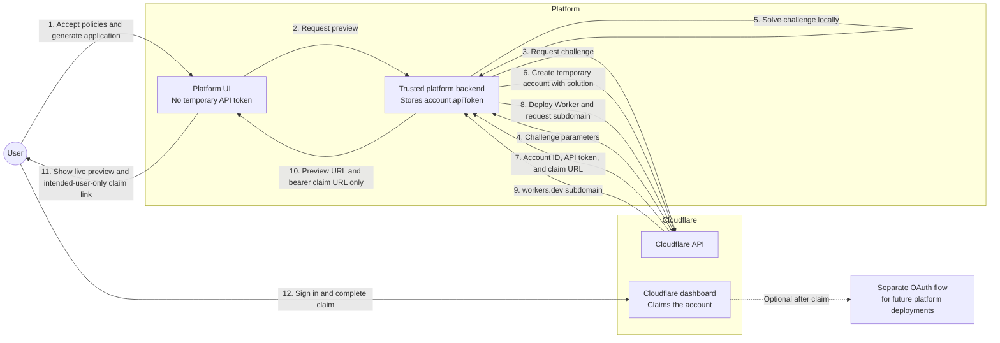

import {
	LinkCard,
	PackageManagers,
	Steps,
	TabItem,
	Tabs,
	TypeScriptExample,
} from "~/components";

Temporary preview accounts let you deploy and test [Workers](/workers/) before you authenticate with Cloudflare. You can then claim the account to keep its deployments and supported resources.

[Cloudflare Drop](https://www.cloudflare.com/drop/) demonstrates this preview-and-claim lifecycle for static sites. Platforms can use the REST API to offer a similar experience for generated applications.

For design context, refer to [Temporary Cloudflare Accounts for AI agents](https://blog.cloudflare.com/temporary-accounts/).


## Choose an integration

Choose an integration based on who controls account provisioning:

| Integration                                                       | Use when                                                 | Provisioning behavior                                           |
| ----------------------------------------------------------------- | -------------------------------------------------------- | --------------------------------------------------------------- |
| [Wrangler](/workers/wrangler/) with `wrangler deploy --temporary` | An AI agent or tool runs Wrangler                        | Wrangler creates or reuses the account and prints the claim URL |
| REST API at `api.cloudflare.com/client/v4/provisioning/previews`  | Your platform backend controls the deployment experience | Your backend receives temporary credentials and the claim URL   |

For production and continuous integration and continuous deployment (CI/CD), use a permanent Cloudflare account. Authenticate with [`wrangler login`](/workers/wrangler/commands/general/#login) or a [Cloudflare API token](/fundamentals/api/get-started/create-token/).

## Deploy with Wrangler

Use Wrangler when an AI agent or tool runs deployment commands. Wrangler manages the proof-of-work challenge, credentials, and claim URL.

Wrangler 4.102.0 or later prints guidance to rerun unauthenticated deployments with `--temporary`.

<Steps>

1. Install or update Wrangler to version 4.102.0 or later.

   For installation instructions, refer to [Install and update](/workers/wrangler/install-and-update/).

2. Give your AI agent a deployment prompt.

   For example:

   ```txt
   Make a very simple Hello World Cloudflare Worker in TypeScript and deploy it using the Wrangler CLI. Do not ask me questions.
   ```

3. Let the agent run `wrangler deploy`.

   In an unauthenticated, non-interactive session, Wrangler prints output similar to the following:

   ```txt output
   To continue without logging in, rerun this command with `--temporary`.
   Wrangler will use a temporary account and print a claim URL.
   ```

   This output tells the agent to rerun the command with `--temporary`.

4. Rerun the deployment with `--temporary`.

   <PackageManagers type="exec" pkg="wrangler" args="deploy --temporary" />

   Wrangler prints output similar to the following:

   ```txt output
   Continuing means you accept Cloudflare's Terms of Service (https://www.cloudflare.com/terms/) and Privacy Policy (https://www.cloudflare.com/privacypolicy/).

   Temporary account ready:
     Account:        example-name (created)
     Claim within:   60 minutes
     Claim URL:      https://dash.cloudflare.com/claim-preview?claimToken=<CLAIM_TOKEN>

   Uploaded example-worker
   Deployed example-worker triggers
     https://example-worker.example-name.workers.dev
   ```

5. (Optional) Redeploy changes before claiming the account.

   Wrangler caches and reuses the account while its credentials and claim URL remain valid. The output identifies whether Wrangler created or reused the account.

   Wrangler clears the cached account when you run `wrangler login` or `wrangler logout`.

   Wrangler stores these temporary values in the current operating-system user's global configuration directory. Do not share this directory between platform users.

</Steps>

## Integrate with the REST API

Use the REST API when your platform backend controls deployments. The backend provisions an account before the user authenticates, then deploys supported resources.

Make all provisioning and deployment calls from your backend. The provisioning response contains sensitive credentials and a claim URL.

The following diagram shows how the platform keeps temporary credentials in its backend while the user previews and claims the deployment:



### Request a challenge

Request a proof-of-work challenge before creating the temporary account:

```bash
curl "https://api.cloudflare.com/client/v4/provisioning/previews/challenge" \
  -X POST \
  -H "Content-Type: application/json" \
  --data '{}'
```

The response includes the challenge token, seed, and difficulty parameters:

```json
{
	"success": true,
	"result": {
		"challengeToken": "<CHALLENGE_TOKEN>",
		"seed": "<BASE64URL_32_BYTE_SEED>",
		"k": 8000,
		"g": 2000
	},
	"errors": [],
	"messages": []
}
```

### Solve the proof of work

Solve the challenge by computing a sequential SHA-256 checkpoint chain:

<Steps>

1. Decode `seed` as Base64URL. It must decode to 32 bytes.
2. Compute `checkpoint[0] = SHA-256(seed)`.
3. For each segment from `0` to `k - 1`, compute `g` sequential SHA-256 hashes from the previous checkpoint, then append the result.
4. Concatenate all `k + 1` checkpoints. Each checkpoint is 32 bytes.
5. Encode the concatenated bytes with standard Base64. Send that value as `solution.checkpoints`.

</Steps>

Before solving a challenge, require `k` and `g` to be positive integers. Reject the challenge if `seed` does not decode to 32 bytes or if `k * g` exceeds `64,000,000`.

The following Node.js example applies these bounds and returns the object required by the create request:

<TypeScriptExample filename="solve-preview-challenge.ts">

```ts
import { createHash } from "node:crypto";

type PreviewChallenge = {
	challengeToken: string;
	seed: string;
	k: number;
	g: number;
};

function sha256(value: Uint8Array): Buffer {
	return createHash("sha256").update(value).digest();
}

export function solvePreviewChallenge({
	challengeToken,
	seed,
	k,
	g,
}: PreviewChallenge) {
	const seedBytes = Buffer.from(seed, "base64url");
	if (seedBytes.length !== 32) {
		throw new Error("seed must decode to 32 bytes");
	}
	if (!Number.isInteger(k) || k <= 0) {
		throw new Error("k must be a positive integer");
	}
	if (!Number.isInteger(g) || g <= 0) {
		throw new Error("g must be a positive integer");
	}
	if (k * g > 64_000_000) {
		throw new Error("k * g must not exceed 64,000,000");
	}

	const checkpoints: Buffer[] = [];
	let hash = sha256(seedBytes);

	checkpoints.push(hash);

	for (let segment = 0; segment < k; segment++) {
		for (let iteration = 0; iteration < g; iteration++) {
			hash = sha256(hash);
		}

		checkpoints.push(hash);
	}

	return {
		challengeToken,
		solution: {
			checkpoints: Buffer.concat(checkpoints).toString("base64"),
		},
	};
}
```

</TypeScriptExample>

:::caution[Production execution]
This synchronous Node.js solver is CPU-intensive and blocks the event loop. Run it outside the main request thread, such as in a worker thread or background job.
:::

### Create a temporary account

Require the user to accept Cloudflare's [Terms of Service](https://www.cloudflare.com/terms/) and [Privacy Policy](https://www.cloudflare.com/privacypolicy/) before account creation. Set `acceptTermsOfService` to `"yes"` only after the user accepts both.

Then send the proof-of-work solution with the required policy fields:

```bash
curl "https://api.cloudflare.com/client/v4/provisioning/previews" \
  -X POST \
  -H "Content-Type: application/json" \
  --data '{
    "termsOfService": "https://www.cloudflare.com/terms/",
    "privacyPolicy": "https://www.cloudflare.com/privacypolicy/",
    "acceptTermsOfService": "yes",
    "challengeToken": "<CHALLENGE_TOKEN>",
    "solution": {
      "checkpoints": "<BASE64_CHECKPOINTS>"
    }
  }'
```

The response includes temporary credentials and a claim URL:

```json
{
	"success": true,
	"result": {
		"account": {
			"id": "<TEMPORARY_ACCOUNT_ID>",
			"name": "<TEMPORARY_ACCOUNT_NAME>",
			"type": "standard",
			"apiToken": "<TEMPORARY_ACCOUNT_API_TOKEN>",
			"tokenId": "<TEMPORARY_TOKEN_ID>",
			"expiresAt": "<ACCOUNT_EXPIRES_AT>"
		},
		"claim": {
			"token": "<CLAIM_TOKEN>",
			"url": "https://dash.cloudflare.com/claim-preview?claimToken=<CLAIM_TOKEN>",
			"expiresAt": "<CLAIM_EXPIRES_AT>"
		}
	},
	"errors": [],
	"messages": []
}
```

Before using the response, confirm that `success` is `true`. Verify that `account.id`, `account.apiToken`, `account.expiresAt`, `claim.url`, and `claim.expiresAt` are present.

### Deploy supported resources

Use `account.id` and `account.apiToken` with supported Cloudflare API endpoints. Use temporary values only with supported resource operations.

Temporary account tokens do not grant every permanent-account API permission. Unsupported operations return an authorization error.

The following examples upload and deploy a Worker with the [Workers Script Upload API](/api/resources/workers/subresources/scripts/methods/update/), then retrieve the account's `workers.dev` subdomain.

<Tabs>

<TabItem label="REST API">

```bash
curl "https://api.cloudflare.com/client/v4/accounts/$CLOUDFLARE_ACCOUNT_ID/workers/scripts/$SCRIPT_NAME" \
  -X PUT \
  -H "Authorization: Bearer $CLOUDFLARE_API_TOKEN" \
  -F 'metadata={"main_module":"worker.mjs","compatibility_date":"<YYYY-MM-DD>"};type=application/json' \
  -F 'worker.mjs=@worker.mjs;type=application/javascript+module'
```

Call the [Get Subdomain endpoint](/api/operations/worker-subdomain-get-subdomain/) with the temporary credentials:

```bash
curl "https://api.cloudflare.com/client/v4/accounts/$CLOUDFLARE_ACCOUNT_ID/workers/subdomain" \
  -H "Authorization: Bearer $CLOUDFLARE_API_TOKEN"
```

For a script available on `workers.dev`, combine `result.subdomain` with the script name to create the deployment URL: `https://<SCRIPT_NAME>.<SUBDOMAIN>.workers.dev`.

</TabItem>

<TabItem label="TypeScript SDK">

Use the [Cloudflare TypeScript SDK](https://github.com/cloudflare/cloudflare-typescript) for supported resource operations after provisioning the temporary account:

```typescript
import Cloudflare from "cloudflare";

export async function deployWorker(
	accountId: string,
	apiToken: string,
	scriptName: string,
	compatibilityDate: string,
	scriptContent: string,
) {
	const client = new Cloudflare({ apiToken });
	const workerModule = new File([scriptContent], "worker.mjs", {
		type: "application/javascript+module",
	});

	await client.workers.scripts.update(scriptName, {
		account_id: accountId,
		metadata: {
			main_module: "worker.mjs",
			compatibility_date: compatibilityDate,
		},
		files: [workerModule],
	});

	const { subdomain } = await client.workers.subdomains.get({
		account_id: accountId,
	});

	return `https://${scriptName}.${subdomain}.workers.dev`;
}
```

</TabItem>

</Tabs>

Provide the deployment URL and `claim.url` to the intended user.

## Claim the account

The intended user must complete the claim within 60 minutes. Opening the claim URL before the deadline is not enough.

They open the URL, sign in to Cloudflare or create an account, then complete the dashboard prompts.

If the user does not complete the claim, Cloudflare deletes the account and its resources.

With Wrangler, rerun `wrangler deploy --temporary` if the temporary credentials or claim URL expire. Wrangler provisions a new account and prints a new claim URL.

For REST integrations, request a new challenge and account if `account.expiresAt` or `claim.expiresAt` passes before the claim.

After the claim, the Worker and supported resources remain in the claimed account.

To continue with Wrangler, run [`wrangler login`](/workers/wrangler/commands/general/#login), then deploy without `--temporary`. Claiming does not grant the platform permanent access to the account.

For later deployments, connect the claimed account through your normal authenticated flow, such as a [Cloudflare OAuth client](/fundamentals/oauth/create-an-oauth-client/).

## Supported resources

The following table summarizes supported capabilities and limits. Temporary credentials do not grant every operation for these resources.

| Supported product or resource                                        | Supported capability or limit                                                                               |
| -------------------------------------------------------------------- | ----------------------------------------------------------------------------------------------------------- |
| [Workers](/workers/)                                                 | Deployments on `workers.dev`                                                                                |
| [Workers Static Assets](/workers/static-assets/)                     | Up to 1,000 files, with each asset up to 5 MiB                                                              |
| [Workers KV](/kv/)                                                   | Create, list, rename, and delete namespaces; put, get, list, and delete keys; bulk put, get, and delete      |
| [D1](/d1/)                                                           | One database, with up to 100 MB per database and 100 MB total                                               |
| [Durable Objects](/durable-objects/)                                 | Deploy Workers with Durable Object bindings and migrations                                                  |
| [Hyperdrive](/hyperdrive/)                                           | Up to two database configurations and 10 connections                                                        |
| [Queues](/queues/)                                                   | Up to 10 queues                                                                                             |
| [mTLS and CA certificates](/workers/wrangler/commands/certificates/) | `wrangler cert` upload, list, and delete operations                                                         |

## Security and limits

### Protect temporary values

- `account.apiToken` authorizes supported resource operations. Never expose it in browser responses or client-side code.
- Treat `claim.url` like a bearer credential. Anyone with the URL can claim ownership of the temporary account.
- Store both values only in backend storage or server-side session storage scoped to the intended user. Deliver `claim.url` only to that user.
- Exclude both values from logs, analytics, and support telemetry. Delete stored copies when they are no longer needed and no later than either returned expiration time.

### Limits

- Cloudflare requires a proof-of-work check before creating an account. Wrangler handles the check, while REST integrations must submit a solution.
- Cloudflare rate limits temporary account creation. Wait before retrying, or authenticate with a permanent account.
- `--temporary` supports unauthenticated use only. Existing OAuth, API token, or global API key credentials cause an error.
- `--temporary` is not a global flag. Only commands that support temporary credentials include it.
- Temporary account provisioning is available only through the default public API endpoint. It is unavailable through the FedRAMP High API endpoint.
- Cloudflare may reject requests that fail additional abuse-prevention checks.

## Related resources

<LinkCard
	title="wrangler deploy"
	href="/workers/wrangler/commands/workers/#deploy"
	description="Review the full command reference for deploying Workers."
/>

<LinkCard
	title="Prompting"
	href="/workers/get-started/prompting/"
	description="Build Workers apps with AI prompts and MCP servers."
/>

<LinkCard
	title="Deploy an existing project"
	href="/workers/framework-guides/automatic-configuration/"
	description="Learn how the Wrangler CLI automatically detects and configures projects for Workers."
/>
