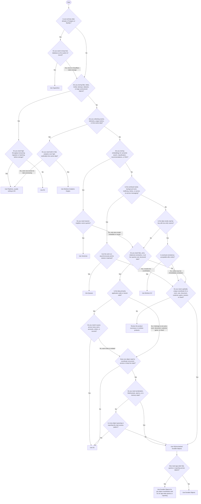

import { Render, Details } from "~/components";

This guide describes the storage & database products available as part of Cloudflare Workers, including recommended use-cases and best practices.

## Choose a storage product

The following table maps Cloudflare storage and database products to common industry terms and recommended use cases. Use the table to compare products, then use the decision tree to choose the first product to evaluate.

<Render file="storage-products-table" product="workers" />

Applications can build on multiple storage and database products. For example, use R2 for files, KV for cached configuration, Queues for background work, and D1 or Durable Objects for application state.

## Decision tree

Start with the shape of your data and the guarantees your application needs. Some applications use more than one product.

:::note[Pages Functions]

Storage options can also be used by your front-end application built with Cloudflare Pages. For more information on available storage options for Pages applications, refer to the [Pages Functions bindings documentation](/pages/functions/bindings/).

:::

## SQL database options

There are three options for SQL-based databases available when building applications with Workers.

- **Hyperdrive** if you have an existing Postgres or MySQL database, require large (1TB, 100TB or more) single databases, and/or want to use your existing database tools. You can also connect Hyperdrive to database platforms like [PlanetScale](https://planetscale.com/) or [Neon](https://neon.tech/).
- **D1** for relational application data, especially when you need SQL queries across users, accounts, products, orders, customer records, or other structured datasets.
- **Durable Objects** for per-object state that needs coordination, serialization, or WebSockets, such as a room, document, user, customer, game, session, or shard. SQLite-backed Durable Objects are also useful when the data belongs to one globally unique object.

### Session storage

We recommend using [Workers KV](/kv/) for storing session data, credentials (API keys), and/or configuration data. These are typically read at high rates (thousands of RPS or more), are not typically modified (within KV's 1 write RPS per unique key limit), and do not need to be immediately consistent.

Frequently read keys benefit from KV's [internal cache](/kv/concepts/how-kv-works/), and repeated reads to these "hot" keys will typically see latencies in the 500µs to 10ms range.

Authentication frameworks like [OpenAuth](https://openauth.js.org/docs/storage/cloudflare/) use Workers KV as session storage when deployed to Cloudflare, and [Cloudflare Access](/cloudflare-one/access-controls/policies/) uses KV to securely store and distribute user credentials so that they can be validated as close to the user as possible and reduce overall latency.

## Product overviews

### Workers KV

Workers KV is an eventually consistent key-value data store that caches on the Cloudflare global network.

It is ideal for projects that require:

- High volumes of reads and/or repeated reads to the same keys.
- Low-latency global reads (typically within 10ms for hot keys)
- Per-object time-to-live (TTL).
- Distributed configuration and/or session storage.

To get started with KV:

- Read how [KV works](/kv/concepts/how-kv-works/).
- Create a [KV namespace](/kv/concepts/kv-namespaces/).
- Review the [KV Runtime API](/kv/api/).
- Learn about KV [Limits](/kv/platform/limits/).

### R2

R2 is S3-compatible blob storage that allows developers to store large amounts of unstructured data without egress fees associated with typical cloud storage services.

It is ideal for projects that require:

- Storage for files which are infrequently accessed.
- Large object storage (for example, gigabytes or more per object).
- Strong consistency per object.
- Asset storage for websites (refer to [caching guide](/r2/buckets/public-buckets/#caching))

To get started with R2:

- Read the [Get started guide](/r2/get-started/).
- Learn about R2 [Limits](/r2/platform/limits/).
- Review the [R2 Workers API](/r2/api/workers/workers-api-reference/).

### Durable Objects

Durable Objects provide low-latency coordination and consistent storage for the Workers platform through global uniqueness and a transactional storage API.

- Global Uniqueness guarantees that there will be a single instance of a Durable Object class with a given ID running at once, across the world. Requests for a Durable Object ID are routed by the Workers runtime to the Cloudflare data center that owns the Durable Object.
- The transactional storage API provides strongly consistent key-value storage to the Durable Object. Each Object can only read and modify keys associated with that Object. Execution of a Durable Object is single-threaded, but multiple request events may still be processed out-of-order from how they arrived at the Object.

It is ideal for projects that require:

- Real-time collaboration (such as a chat application or a game server).
- Consistent storage.
- Data locality.

To get started with Durable Objects:

- Read the [introductory blog post](https://blog.cloudflare.com/introducing-workers-durable-objects/).
- Review the [Durable Objects documentation](/durable-objects/).
- Get started with [Durable Objects](/durable-objects/get-started/).
- Learn about Durable Objects [Limits](/durable-objects/platform/limits/).

### D1

[D1](/d1/) is Cloudflare’s native serverless database. With D1, you can create a database by importing data or defining your tables and writing your queries within a Worker or through the API.

D1 is ideal for:

- Persistent, relational storage for user data, account data, and other structured datasets.
- Use-cases that require querying across your data ad-hoc (using SQL).
- Workloads with a high ratio of reads to writes (most web applications).

To get started with D1:

- Read [the documentation](/d1)
- Follow the [Get started guide](/d1/get-started/) to provision your first D1 database.
- Review the [D1 Workers Binding API](/d1/worker-api/).

:::note
If your working data size exceeds 10 GB (the maximum size for a D1 database), consider splitting the database into multiple, smaller D1 databases.
:::

### Queues

Cloudflare Queues allows developers to send and receive messages with guaranteed delivery. It integrates with [Cloudflare Workers](/workers) and offers at-least once delivery, message batching, and does not charge for egress bandwidth.

Queues is ideal for:

- Offloading work from a request to schedule later.
- Send data from Worker to Worker (inter-Service communication).
- Buffering or batching data before writing to upstream systems, including third-party APIs or [Cloudflare R2](/queues/examples/send-errors-to-r2/).

To get started with Queues:

- [Set up your first queue](/queues/get-started/).
- Learn more [about how Queues works](/queues/reference/how-queues-works/).

### Hyperdrive

Hyperdrive is a service that accelerates queries you make to MySQL and Postgres databases, making it faster to access your data from across the globe, irrespective of your users’ location.

Hyperdrive allows you to:

- Connect to an existing database from Workers without connection overhead.
- Cache frequent queries across Cloudflare's global network to reduce response times on highly trafficked content.
- Reduce load on your origin database with connection pooling.

To get started with Hyperdrive:

- [Connect Hyperdrive](/hyperdrive/get-started/) to your existing database.
- Learn more [about how Hyperdrive speeds up your database queries](/hyperdrive/concepts/how-hyperdrive-works/).

## Pipelines

Pipelines is a streaming ingestion service that allows you to ingest high volumes of real time data, without managing any infrastructure.

Pipelines allows you to:

- Ingest data at extremely high throughput (tens of thousands of records per second or more)
- Batch and write data directly to object storage, ready for querying
- (Future) Transform and aggregate data during ingestion

To get started with Pipelines:

- [Create a Pipeline](/pipelines/getting-started/) that can batch and write records to R2.

### Analytics Engine

Analytics Engine is Cloudflare's time-series and metrics database that allows you to write unlimited-cardinality analytics at scale using a built-in API to write data points from Workers and query that data using SQL directly.

Analytics Engine allows you to:

- Expose custom analytics to your own customers
- Build usage-based billing systems
- Understand the health of your service on a per-customer or per-user basis
- Add instrumentation to frequently called code paths, without impacting performance or overwhelming external analytics systems with events

Cloudflare uses Analytics Engine internally to store and product per-product metrics for products like D1 and R2 at scale.

To get started with Analytics Engine:

- Learn how to [get started with Analytics Engine](/analytics/analytics-engine/get-started/)
- See [an example of writing time-series data to Analytics Engine](/analytics/analytics-engine/recipes/usage-based-billing-for-your-saas-product/)
- Understand the [SQL API](/analytics/analytics-engine/sql-api/) for reading data from your Analytics Engine datasets

### Vectorize

Vectorize is a globally distributed vector database that enables you to build full-stack, AI-powered applications with Cloudflare Workers and [Workers AI](/workers-ai/).

Vectorize allows you to:

- Store embeddings from any vector embeddings model (Bring Your Own embeddings) for semantic search and classification tasks.
- Add context to Large Language Model (LLM) queries by using vector search as part of a [Retrieval Augmented Generation](/workers-ai/guides/tutorials/build-a-retrieval-augmented-generation-ai/) (RAG) workflow.
- [Filter on vector metadata](/vectorize/reference/metadata-filtering/) to reduce the search space and return more relevant results.

To get started with Vectorize:

- [Create your first vector database](/vectorize/get-started/intro/).
- Combine [Workers AI and Vectorize](/vectorize/get-started/embeddings/) to generate, store and query text embeddings.
- Learn more about [how vector databases work](/vectorize/reference/what-is-a-vector-database/).

<Render file="durable-objects-vs-d1" product="durable-objects" />
