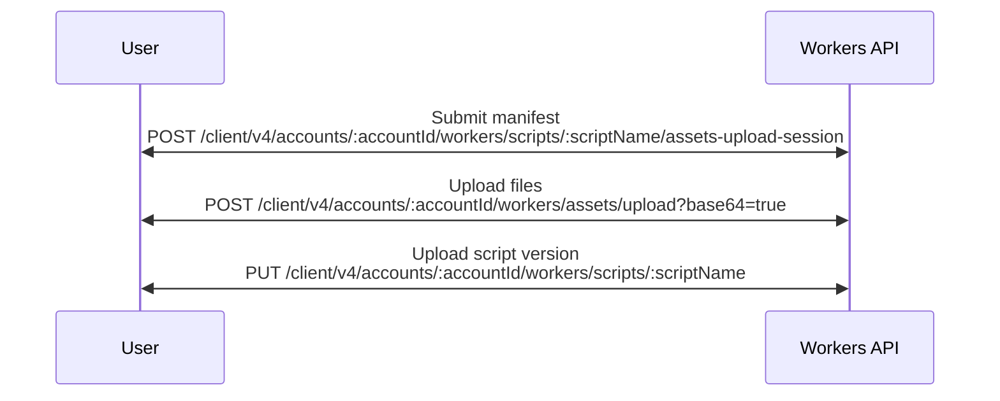
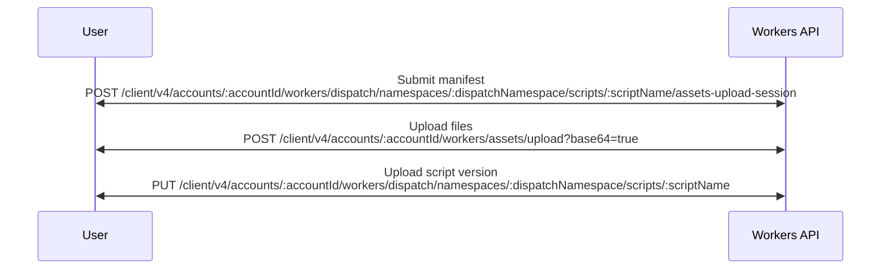

import {
	Badge,
	Description,
	FileTree,
	InlineBadge,
	Render,
	TabItem,
	Tabs,
	TypeScriptExample,
} from "~/components";

:::note

Directly uploading assets via APIs is an advanced approach which, unless you are building a programmatic integration, most users will not need. Instead, we encourage users to deploy your Worker with [Wrangler](/workers/static-assets/get-started/#1-create-a-new-worker-project-using-the-cli).

:::

Our API empowers users to upload and include static assets as part of a Worker. These static assets can be served for free, and additionally, users can also fetch assets through an optional [assets binding](/workers/static-assets/binding/) to power more advanced applications. This guide will describe the process for attaching assets to your Worker directly with the API.

<Tabs syncKey="workers-vs-platforms">
<TabItem label="Workers">

</TabItem>
<TabItem label="Workers for Platforms">

</TabItem>
</Tabs>

The asset upload flow can be distilled into three distinct phases:

1. Registration of a manifest
2. Upload of the assets
3. Deployment of the Worker

## Upload manifest

The asset manifest is a ledger which keeps track of files we want to use in our Worker. This manifest is used to track assets associated with each Worker version, and eliminate the need to upload unchanged files prior to a new upload.

The [manifest upload request](/api/resources/workers/subresources/scripts/subresources/assets/subresources/upload/methods/create/) describes each file which we intend to upload. Each file is its own key representing the file path and name, and is an object which contains metadata about the file.

`hash` represents a 32 hexadecimal character hash of the file, while `size` is the size (in bytes) of the file.

<Tabs syncKey="workers-vs-platforms">
<TabItem label="Workers">
```bash
curl -X POST https://api.cloudflare.com/client/v4/accounts/{account_id}/workers/scripts/{script_name}/assets-upload-session \
--header 'content-type: application/json' \
--header 'Authorization: Bearer <API_TOKEN>' \
--data '{
  "manifest": {
		"/filea.html": {
			"hash": "08f1dfda4574284ab3c21666d1",
			"size": 12
		},
		"/fileb.html": {
			"hash": "4f1c1af44620d531446ceef93f",
			"size": 23
		},
		"/filec.html": {
			"hash": "54995e302614e0523757a04ec1",
			"size": 23
		}
	}
}'
```
</TabItem>
<TabItem label="Workers for Platforms">
```bash
curl -X POST https://api.cloudflare.com/client/v4/accounts/{account_id}/workers/dispatch/namespaces/{dispatch_namespace}/scripts/{script_name}/assets-upload-session \
--header 'content-type: application/json' \
--header 'Authorization: Bearer <API_TOKEN>' \
--data '{
  "manifest": {
		"/filea.html": {
			"hash": "08f1dfda4574284ab3c21666d1",
			"size": 12
		},
		"/fileb.html": {
			"hash": "4f1c1af44620d531446ceef93f",
			"size": 23
		},
		"/filec.html": {
			"hash": "54995e302614e0523757a04ec1",
			"size": 23
		}
	}
}'
```
</TabItem>
</Tabs>

The resulting response will contain a JWT, which provides authentication during file upload. The JWT is valid for one hour.

In addition to the JWT, the response instructs users how to optimally batch upload their files. These instructions are encoded in the `buckets` field. Each array in `buckets` contains a list of file hashes which should be uploaded together. Unmodified files will not be returned in the `buckets` field (as they do not need to be re-uploaded) if they have recently been uploaded in previous versions of your Worker.

```json
{
	"result": {
		"jwt": "<UPLOAD_TOKEN>",
		"buckets": [
			["08f1dfda4574284ab3c21666d1", "4f1c1af44620d531446ceef93f"],
			["54995e302614e0523757a04ec1"]
		]
	},
	"success": true,
	"errors": null,
	"messages": null
}
```

:::note

If all assets have been previously uploaded, `buckets` will be empty, and `jwt` will contain a completion token. Uploading files is not necessary, and you can skip directly to [uploading a new script or version](/workers/static-assets/direct-upload/#createdeploy-new-version).

:::

### Limitations

- Limits differ based on account plan. Refer to [Account Plan Limits](/workers/platform/limits/#account-plan-limits) for more information on limitations of static assets.

## Upload Static Assets

The [file upload API](/api/resources/workers/subresources/assets/subresources/upload/methods/create/) requires files be uploaded using `multipart/form-data`. The contents of each file must be base64 encoded, and the `base64` query parameter in the URL must be set to `true`.

The provided `Content-Type` header of each file part will be attached when eventually serving the file. If you wish to avoid sending a `Content-Type` header in your deployment, `application/null` may be sent at upload time.

The `Authorization` header must be provided as a bearer token, using the JWT (upload token) from the aforementioned manifest upload call.

Once every file in the manifest has been uploaded, a status code of 201 will be returned, with the `jwt` field present. This JWT is a final "completion" token which can be used to create a deployment of a Worker with this set of assets. This completion token is valid for 1 hour.

## Create/Deploy New Version

[Script](/api/resources/workers/subresources/scripts/methods/update/), [Version](/api/resources/workers/subresources/scripts/subresources/versions/methods/create/), and [Workers for Platform script](/api/resources/workers_for_platforms/subresources/dispatch/subresources/namespaces/subresources/scripts/methods/update/) upload endpoints require specifying a metadata part in the form data. Here, we can provide the completion token from the previous (upload assets) step.

```bash title="Example Worker Metadata Specifying Completion Token"
{
  "main_module": "main.js",
  "assets": {
    "jwt": "<completion_token>"
  },
  "compatibility_date": "2021-09-14"
}
```

If this is a Worker which already has assets, and you wish to just re-use the existing set of assets, we do not have to specify the completion token again. Instead, we can pass the boolean `keep_assets` option.

```bash title="Example Worker Metadata Specifying keep_assets"
{
  "main_module": "main.js",
  "keep_assets": true,
  "compatibility_date": "2021-09-14"
}
```

Asset [routing configuration](/workers/wrangler/configuration/#assets) can be provided in the `assets` object, such as `html_handling` and `not_found_handling`.

```bash title="Example Worker Metadata Specifying Asset Configuration"
{
  "main_module": "main.js",
  "assets": {
    "jwt": "<completion_token>",
    "config" {
      "html_handling": "auto-trailing-slash"
    }
  },
  "compatibility_date": "2021-09-14"
}
```

Optionally, an assets binding can be provided if you wish to fetch and serve assets from within your Worker code.

```bash title="Example Worker Metadata Specifying Asset Binding"
{
  "main_module": "main.js",
  "assets": {
    ...
  },
  "bindings": [
    ...
    {
      "name": "ASSETS",
      "type": "assets"
    }
    ...
  ]
  "compatibility_date": "2021-09-14"
}
```

## Programmatic Example

This example is from [cloudflare-typescript](https://github.com/cloudflare/cloudflare-typescript/blob/main/examples/workers/script-with-assets-upload.ts).

<TypeScriptExample>

```ts
#!/usr/bin/env -S npm run tsn -T

/**
 * Create a Worker that serves static assets
 *
 * This example demonstrates how to:
 * - Upload static assets to Cloudflare Workers
 * - Create and deploy a Worker that serves those assets
 *
 * Docs:
 * - https://developers.cloudflare.com/workers/static-assets/direct-upload
 *
 * Prerequisites:
 * 1. Generate an API token: https://developers.cloudflare.com/fundamentals/api/get-started/create-token/
 * 2. Find your account ID: https://developers.cloudflare.com/fundamentals/setup/find-account-and-zone-ids/
 * 3. Find your workers.dev subdomain: https://developers.cloudflare.com/workers/configuration/routing/workers-dev/
 *
 * Environment variables:
 *   - CLOUDFLARE_API_TOKEN (required)
 *   - CLOUDFLARE_ACCOUNT_ID (required)
 *   - ASSETS_DIRECTORY (required)
 *   - CLOUDFLARE_SUBDOMAIN (optional)
 *
 * Usage:
 *   Place your static files in the ASSETS_DIRECTORY, then run this script.
 *   Assets will be available at: my-script-with-assets.$subdomain.workers.dev/$filename
 */

import crypto from 'crypto';
import fs from 'fs';
import { readFile } from 'node:fs/promises';
import { extname } from 'node:path';
import path from 'path';
import { exit } from 'node:process';

import Cloudflare from 'cloudflare';

interface Config {
  apiToken: string;
  accountId: string;
  assetsDirectory: string;
  subdomain: string | undefined;
  workerName: string;
}

interface AssetManifest {
  [path: string]: {
    hash: string;
    size: number;
  };
}

interface UploadPayload {
  [hash: string]: string; // base64 encoded content
}

const WORKER_NAME = 'my-worker-with-assets';
const SCRIPT_FILENAME = `${WORKER_NAME}.mjs`;

function loadConfig(): Config {
  const apiToken = process.env['CLOUDFLARE_API_TOKEN'];
  if (!apiToken) {
    throw new Error('Missing required environment variable: CLOUDFLARE_API_TOKEN');
  }

  const accountId = process.env['CLOUDFLARE_ACCOUNT_ID'];
  if (!accountId) {
    throw new Error('Missing required environment variable: CLOUDFLARE_ACCOUNT_ID');
  }

  const assetsDirectory = process.env['ASSETS_DIRECTORY'];
  if (!assetsDirectory) {
    throw new Error('Missing required environment variable: ASSETS_DIRECTORY');
  }

  if (!fs.existsSync(assetsDirectory)) {
    throw new Error(`Assets directory does not exist: ${assetsDirectory}`);
  }

  const subdomain = process.env['CLOUDFLARE_SUBDOMAIN'];

  return {
    apiToken,
    accountId,
    assetsDirectory,
    subdomain: subdomain || undefined,
    workerName: WORKER_NAME,
  };
}

const config = loadConfig();
const client = new Cloudflare({
  apiToken: config.apiToken,
});

/**
 * Recursively reads all files from a directory and creates a manifest
 * mapping file paths to their hash and size.
 */
function createManifest(directory: string): AssetManifest {
  const manifest: AssetManifest = {};

  function processDirectory(currentDir: string, basePath = ''): void {
    try {
      const entries = fs.readdirSync(currentDir, { withFileTypes: true });

      for (const entry of entries) {
        const fullPath = path.join(currentDir, entry.name);
        const relativePath = path.join(basePath, entry.name);

        if (entry.isDirectory()) {
          processDirectory(fullPath, relativePath);
        } else if (entry.isFile()) {
          try {
            const fileContent = fs.readFileSync(fullPath);
            const extension = extname(relativePath).substring(1);

            // Generate a hash for the file
            const hash = crypto
              .createHash('sha256')
              .update(fileContent.toString('base64') + extension)
              .digest('hex')
              .slice(0, 32);

            // Normalize path separators to forward slashes
            const manifestPath = `/${relativePath.replace(/\\/g, '/')}`;

            manifest[manifestPath] = {
              hash,
              size: fileContent.length,
            };

            console.log(`Added to manifest: ${manifestPath} (${fileContent.length} bytes)`);
          } catch (error) {
            console.warn(`Failed to process file ${fullPath}:`, error);
          }
        }
      }
    } catch (error) {
      throw new Error(`Failed to read directory ${currentDir}: ${error}`);
    }
  }

  processDirectory(directory);

  if (Object.keys(manifest).length === 0) {
    throw new Error(`No files found in assets directory: ${directory}`);
  }

  console.log(`Created manifest with ${Object.keys(manifest).length} files`);
  return manifest;
}

/**
 * Generates the Worker script content that serves static assets
 */
function generateWorkerScript(exampleFile: string): string {
  return `
export default {
  async fetch(request, env, ctx) {
    const url = new URL(request.url);

    // Serve a simple index page at the root
    if (url.pathname === '/') {
      return new Response(
        \`<!DOCTYPE html>
<html>
<head>
  <title>Static Assets Worker</title>
  <style>
    body { font-family: Arial, sans-serif; max-width: 800px; margin: 50px auto; padding: 20px; }
    h1 { color: #f38020; }
    .asset-info { background: #f5f5f5; padding: 15px; border-radius: 5px; }
  </style>
</head>
<body>
  <h1>This Worker serves static assets!</h1>
  <div class="asset-info">
    <p><strong>To access your assets,</strong> add <code>/filename</code> to the URL.</p>
    <p>Try visiting <a href="\${url.origin}/${exampleFile}">/${exampleFile}</a></p>
  </div>
</body>
</html>\`,
        {
          status: 200,
          headers: { 'Content-Type': 'text/html' }
        }
      );
    }

    // Serve static assets for all other paths
    return env.ASSETS.fetch(request);
  }
};
  `.trim();
}

/**
 * Creates upload payloads from buckets and manifest
 */
async function createUploadPayloads(
  buckets: string[][],
  manifest: AssetManifest,
  assetsDirectory: string
): Promise<UploadPayload[]> {
  const payloads: UploadPayload[] = [];

  for (const bucket of buckets) {
    const payload: UploadPayload = {};

    for (const hash of bucket) {
      // Find the file path for this hash
      const manifestEntry = Object.entries(manifest).find(
        ([_, data]) => data.hash === hash
      );

      if (!manifestEntry) {
        throw new Error(`Could not find file for hash: ${hash}`);
      }

      const [relativePath] = manifestEntry;
      const fullPath = path.join(assetsDirectory, relativePath);

      try {
        const fileContent = await readFile(fullPath);
        payload[hash] = fileContent.toString('base64');
        console.log(`Prepared for upload: ${relativePath}`);
      } catch (error) {
        throw new Error(`Failed to read file ${fullPath}: ${error}`);
      }
    }

    payloads.push(payload);
  }

  return payloads;
}

/**
 * Uploads asset payloads
 */
async function uploadAssets(
  payloads: UploadPayload[],
  uploadJwt: string,
  accountId: string
): Promise<string> {
  let completionJwt: string | undefined;

  console.log(`Uploading ${payloads.length} payload(s)...`);

  for (let i = 0; i < payloads.length; i++) {
    const payload = payloads[i]!;
    console.log(`Uploading payload ${i + 1}/${payloads.length}...`);

    try {
      const response = await client.workers.assets.upload.create(
        {
          account_id: accountId,
          base64: true,
          body: payload,
        },
        {
          headers: { Authorization: `Bearer ${uploadJwt}` },
        }
      );

      if (response?.jwt) {
        completionJwt = response.jwt;
      }
    } catch (error) {
      throw new Error(`Failed to upload payload ${i + 1}: ${error}`);
    }
  }

  if (!completionJwt) {
    throw new Error('Upload completed but no completion JWT received');
  }

  console.log('✅ All assets uploaded successfully');
  return completionJwt;
}

async function main(): Promise<void> {
  try {
    console.log('🚀 Starting Worker creation and deployment with static assets...');
    console.log(`📁 Assets directory: ${config.assetsDirectory}`);

    console.log('📝 Creating asset manifest...');
    const manifest = createManifest(config.assetsDirectory);
    const exampleFile = Object.keys(manifest)[0]?.replace(/^\//, '') || 'file.txt';

    const scriptContent = generateWorkerScript(exampleFile);

    let worker;
    try {
      worker = await client.workers.beta.workers.get(config.workerName, {
        account_id: config.accountId,
      });
      console.log(`♻️  Worker ${config.workerName} already exists. Using it.`);
    } catch (error) {
      if (!(error instanceof Cloudflare.NotFoundError)) { throw error; }
      console.log(`✏️  Creating Worker ${config.workerName}...`);
      worker = await client.workers.beta.workers.create({
        account_id: config.accountId,
        name: config.workerName,
        subdomain: {
          enabled: config.subdomain !== undefined,
        },
        observability: {
          enabled: true,
        },
      });
    }

    console.log(`⚙️  Worker id: ${worker.id}`);
    console.log('🔄 Starting asset upload session...');

    const uploadResponse = await client.workers.scripts.assets.upload.create(
      config.workerName,
      {
        account_id: config.accountId,
        manifest,
      }
    );

    const { buckets, jwt: uploadJwt } = uploadResponse;

    if (!uploadJwt || !buckets) {
      throw new Error('Failed to start asset upload session');
    }

    let completionJwt: string;

    if (buckets.length === 0) {
      console.log('✅ No new assets to upload!');
      // Use the initial upload JWT as completion JWT when no uploads are needed
      completionJwt = uploadJwt;
    } else {
      const payloads = await createUploadPayloads(
        buckets,
        manifest,
        config.assetsDirectory
      );

      completionJwt = await uploadAssets(
        payloads,
        uploadJwt,
        config.accountId
      );
    }

    console.log('✏️  Creating Worker version...');

    // Create a new version with assets
    const version = await client.workers.beta.workers.versions.create(worker.id, {
      account_id: config.accountId,
      main_module: SCRIPT_FILENAME,
      compatibility_date: new Date().toISOString().split('T')[0]!,
      bindings: [
        {
          type: 'assets',
          name: 'ASSETS',
        },
      ],
      assets: {
        jwt: completionJwt,
      },
      modules: [
        {
          name: SCRIPT_FILENAME,
          content_type: 'application/javascript+module',
          content_base64: Buffer.from(scriptContent).toString('base64'),
        },
      ],
    });

    console.log('🚚 Creating Worker deployment...');

    // Create a deployment and point all traffic to the version we created
    await client.workers.scripts.deployments.create(config.workerName, {
      account_id: config.accountId,
      strategy: 'percentage',
      versions: [
        {
            percentage: 100,
            version_id: version.id,
          },
        ],
    });

    console.log('✅ Deployment successful!');

    if (config.subdomain) {
      console.log(`
🌍 Your Worker is live!
📍 Base URL: https://${config.workerName}.${config.subdomain}.workers.dev/
📄 Try accessing: https://${config.workerName}.${config.subdomain}.workers.dev/${exampleFile}
`);
    } else {
      console.log(`
⚠️  Set up a route, custom domain, or workers.dev subdomain to access your Worker.
Add CLOUDFLARE_SUBDOMAIN to your environment variables to set one up automatically.
`);
    }
  } catch (error) {
    console.error('❌ Deployment failed:', error);
    exit(1);
  }
}

main();
```

</TypeScriptExample>
