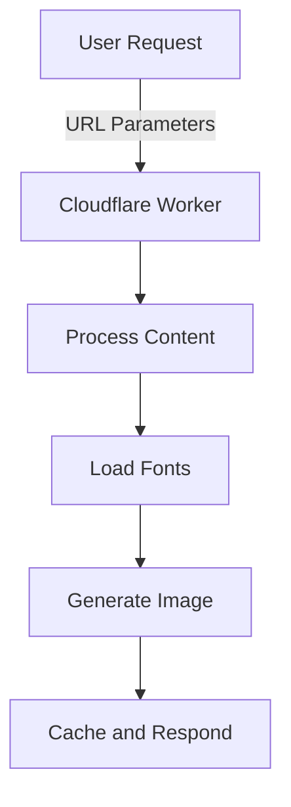

import { PackageManagers, Render, Tabs, TabItem, WranglerConfig } from "~/components";

Social media thrives on compelling visuals. With Cloudflare Workers, you can effortlessly generate dynamic Open Graph (OG) images that grab attention and boost platform performance. In this tutorial, you'll learn how to create a customizable OG image generator powered by serverless edge computing. Cloudflare Workers enable you to deliver blazing-fast visuals globally, ensuring a seamless experience for your users. Let's dive in to see how you can take your OG images to the next level with Cloudflare Workers.

What you will accomplish:

    - Dynamically create stunning OG images using React and Tailwind CSS.
    - Optimize performance with built-in caching.
    - Customize visuals with flexible fonts and design options.

By the end, you will have a robust solution to enhance your social media presence.

GitHub repository: [Generate Dynamic OG Images using Cloudflare Workers](https://github.com/mohdlatif/og-image-generator-cloudflare-worker)

## Why use Cloudflare Workers?

Building OG image generators can be challenging, especially when it comes to ensuring global performance, scalability, and speed. This is where Cloudflare Workers excel.

- Global Reach: Deliver your images with ultra-low latency, no matter where your users are located.
- Serverless Simplicity: Focus on building features, not managing infrastructure.
- Unparalleled Performance: Process and serve requests at the edge for blazing-fast load times.

By leveraging Cloudflare Workers, you get a serverless edge-computing environment that is not only cost-efficient but also perfectly optimized for modern web applications.

## Workflow overview

When a user requests an OG image, the following happens:

1. Request Received: A URL with parameters is sent to a Cloudflare Worker.
2. Content Processed: The Worker extracts text, style, and font configurations from the URL.
3. Font Loaded: Fonts are retrieved using one of four methods, like Google Fonts or local files.
4. Image Generated: The image is built using React components styled with Tailwind CSS.
5. Response Cached: The final image is returned and cached for future requests.

Here is how the process flows:



### Key benefits

- **Edge computing**: Generates images at the edge using Cloudflare Workers
- **Modern rendering**: Utilizes Vercel's Satori library for high-quality image generation
- **Flexible styling**: Supports both Tailwind CSS and inline styles
- **Font versatility**: Multiple font loading strategies for different use cases
- **Performance optimized**: Built-in caching and optimization
- **Customizable**: Easy to extend with new styles and font configurations
- **Developer friendly**: TypeScript support and modular architecture

## Before you begin

<Render file="prereqs" product="workers" />

1. Install [Nodejs](https://nodejs.org/en) on your machine.

You should also have:

- Basic familiarity with TypeScript and React.
- A text editor or IDE of your choice.

## 1. Set up your development environment

Create a new Cloudflare Workers project using the Hono framework:

<PackageManagers
	type="create"
	pkg="cloudflare@latest"
	args="og-image-generator --template cloudflare-workers --pm npm"
/>

Navigate to the project directory:

```bash
cd og-image-generator
```

## 2. Install required dependencies

Add the necessary packages to your project:

<Tabs> <TabItem label="npm">

```sh
npm add @cloudflare/pages-plugin-vercel-og autoprefixer postcss-cli react react-dom tailwindcss
npm add -d @cloudflare/workers-types @types/node @types/react @types/react-dom @vercel/og wrangler
```

</TabItem> <TabItem label="npm">

```sh
npm install @cloudflare/pages-plugin-vercel-og autoprefixer postcss-cli react react-dom tailwindcss
npm install -d @cloudflare/workers-types @types/node @types/react @types/react-dom @vercel/og
```

</TabItem> <TabItem label="yarn">

```sh
yarn add @cloudflare/pages-plugin-vercel-og autoprefixer postcss-cli react react-dom tailwindcss
yarn add -d @cloudflare/workers-types @types/node @types/react @types/react-dom @vercel/og
```

</TabItem> <TabItem label="pnpm">

```sh
pnpm add @cloudflare/pages-plugin-vercel-og autoprefixer postcss-cli react react-dom tailwindcss
pnpm add -d @cloudflare/workers-types @types/node @types/react @types/react-dom @vercel/og
```

</TabItem> </Tabs>

## 3. Configure project settings

### Update package.json

Update the `package.json` file to include the type module and deployment scripts:

```json title="package.json"
{
	"name": "og-image-generator-cloudlfare-worker",
	"module": "index.ts",
	"version": "1.0.0",
	"type": "module",
	"scripts": {
		"dev": "wrangler dev src/index.ts",
		"deploy": "wrangler deploy --minify src/index.ts"
	}
	// ...
}
```

The `type: "module"` field enables ES modules support, and the `--minify` flag in the deploy script ensures your Worker code is optimized for production.

### Configure TypeScript

Update the `tsconfig.json` file with the following configuration:

```json title="tsconfig.json"
{
	"compilerOptions": {
		"target": "ESNext",
		"lib": ["ESNext"],
		"moduleDetection": "force",
		"jsx": "react-jsx",
		"module": "ESNext",
		"moduleResolution": "bundler",
		"types": ["node-types", "hono", "@cloudflare/workers-types/2023-07-01"],
		"resolveJsonModule": true,
		"esModuleInterop": true,
		"allowJs": true,
		"checkJs": false,
		"noEmit": true,
		"isolatedModules": true,
		"allowSyntheticDefaultImports": true,
		"forceConsistentCasingInFileNames": true,
		"strict": true,
		"skipLibCheck": true,
		"noFallthroughCasesInSwitch": true,
		"noUnusedLocals": false,
		"noUnusedParameters": false,
		"noPropertyAccessFromIndexSignature": false
	},
	"baseUrl": "./",
	"paths": {
		"@/*": ["./src/*"]
	}
}
```

Key TypeScript configuration features:

- React JSX support with `jsx: "react-jsx"`
- ES modules configuration with `module: "ESNext"`
- Cloudflare Workers types integration
- Path aliases for cleaner imports
- Strict type checking enabled
- Modern JavaScript features support

### Configure Wrangler for runtime compatibility and static assets

Before starting, ensure your `wrangler.toml / wrangler.json` file includes these essential configurations:

<WranglerConfig>
```toml title="wrangler.toml"
compatibility_date = "2024-11-06"
compatibility_flags = [ "nodejs_compat_v2" ]
assets = { directory = "public",  binding = "ASSETS" }
minify = true
[build]
watch_dir = "public"
```
</WranglerConfig>

The [`nodejs_compat` flag](/workers/configuration/compatibility-flags/#nodejs-compatibility-flag) enables runtime compatibility features required by the OG image generation library, ensuring all necessary APIs are available in the Workers environment. While we utilize a modern JavaScript runtime for development, this flag maintains consistency across environments. The `assets` configuration maps your Worker's public directory, allowing direct access to static files like fonts, images, and favicons through URL paths (for example, `/fonts/Inter.ttf`, `/images/logo.png`).

## 4. Configure font loading strategies

The generator supports four different font loading strategies, each with its own benefits:

1. **Google Fonts API** (Recommended for web fonts)

   - Best for popular web fonts with dynamic text
   - Pros: Optimized delivery, wide font selection
   - Cons: Makes HTTP requests to Google Fonts API for each image generation

2. **GitHub-hosted fonts** (Alternative for Google Fonts)

   - Best for stable, version-controlled fonts
   - Pros: Direct access to font files
   - Cons: Manual updates needed

3. **Direct URL fonts** (For custom hosted fonts)

   - Best for self-hosted or third-party fonts
   - Pros: Complete control over font sources
   - Cons: Requires hosting infrastructure

4. **Local font files** (For offline/private fonts)
   - Best for custom or licensed fonts
   - Pros: No external dependencies
   - Cons: Increases Worker bundle size

Choose your strategy based on:

- Font licensing requirements
- Performance needs
- Hosting preferences
- Update frequency

Create a `fonts` directory inside your `public` folder to store any local font files:

```bash
mkdir -p public/fonts
```

This directory will store any font files (like `.ttf`, `.otf`) that you want to serve directly from your Worker.

Create a new file for handling different font loading methods:

```typescript title="src/getFonts.ts"
import type { Context } from 'hono';

// Define font weights and styles (matching types from getFonts.ts)
type Style = 'normal' | 'italic';
type Weight = 100 | 200 | 300 | 400 | 500 | 600 | 700 | 800 | 900;

type FontConfig = {
	path: string;
	weight: Weight;
	style?: Style;
};

/**
 * Fetches fonts from GitHub repository with caching support
 *
 * Used for accessing fonts stored in Google Fonts' GitHub repository.
 * Currently configured for Inria Sans Regular and Bold variants.
 *
 * @returns Promise<Array> of font objects, each containing:
 *          - data: ArrayBuffer of the font file
 *          - name: Font family name
 *          - style: The font's style ('normal' or 'italic')
 *          - weight: The font's weight (500 or 700)
 *
 * @throws Error if any font fails to fetch from GitHub
 *
 * @example
 * const fonts = await githubFonts();
 *
 */
export const githubFonts = async () => {
	const base = 'https://raw.githubusercontent.com/google/fonts/main/ofl/inriasans/';

	// Define font files to fetch with their properties
	const list = [
		['InriaSans-Regular.ttf', 'Inria Sans', 500, 'normal' as Style] as const,
		['InriaSans-Bold.ttf', 'Inria Sans', 700, 'normal' as Style] as const,
	];

	// Map each font definition to a fetch promise with caching
	const fonts = list.map(async ([file, name, weight, style]) => {
		const url = `${base}${file}`;
		const cache = caches.default;
		const cacheKey = url;
		const res = await cache.match(cacheKey);
		if (res) {
			const data = await res.arrayBuffer();
			return { data, name, style, weight };
		} else {
			const res = await fetch(url);
			const data = await res.arrayBuffer();
			await cache.put(cacheKey, new Response(data, { status: 200 }));
			return { data, name, style, weight };
		}
	});

	return Promise.all(fonts);
};

/**
 * Fetches a font from Google Fonts API with specific text, weight, and style
 *
 * This function:
 * 1. Constructs a Google Fonts API URL with the specified parameters
 * 2. Fetches the CSS containing the font URL
 * 3. Extracts and fetches the actual font file
 * 4. Returns the font data in a format compatible with Vercel OG Image
 *
 * @param text - The text to be rendered (affects font subset optimization)
 * @param font - The name of the font family (e.g., "Roboto", "Open Sans")
 * @param weight - Font weight (100-900), defaults to 400
 * @param style - Font style ('normal' or 'italic'), defaults to 'normal'
 *
 * @returns Promise containing font object with:
 *          - data: ArrayBuffer of the font file
 *          - name: Font family name
 *          - style: The font's style
 *          - weight: The font's weight
 *
 * @throws Error if the font fails to fetch or if the CSS parsing fails
 *
 * @example
 * const font = await googleFont(
 *   'Hello World',
 *   'Roboto',
 *   700,
 *   'italic'
 * );
 *
 */
export async function googleFont(
	text: string,
	font: string,
	weight: Weight = 400,
	style: Style = 'normal'
): Promise<{ data: ArrayBuffer; name: string; style: Style; weight: Weight }> {
	const fontFamilyFetchName = font.replace(/ /g, '+');
	const API = `https://fonts.googleapis.com/css2?family=${fontFamilyFetchName}:ital,wght@${
		style === 'italic' ? '1' : '0'
	},${weight}&text=${encodeURIComponent(text)}`;

	const css = await (
		await fetch(API, {
			headers: {
				'User-Agent':
					'Mozilla/5.0 (Macintosh; U; Intel Mac OS X 10_6_8; de-at) AppleWebKit/533.21.1 (KHTML, like Gecko) Version/5.0.5 Safari/533.21.1',
			},
		})
	).text();
	// console.log(API, css);
	const resource = css.match(/src: url\((.+)\) format\('(opentype|truetype)'\)/);
	// console.log('resource', resource);
	if (!resource) {
		throw new Error('Failed to fetch font');
	}

	const res = await fetch(resource[1]);
	const data = await res.arrayBuffer();

	return {
		data,
		name: font,
		style,
		weight: weight as Weight,
	};
}

// -------------------------------- Direct Access Font -------------------------------- //

/**
 * Fetches a font directly from a URL and handles caching
 *
 * @param url - Direct URL to the font file (e.g., 'https://example.com/fonts/Inter-Regular.ttf')
 * @param name - Font family name to be used for referencing the font
 * @param weight - Font weight (100-900), defaults to 400
 * @param style - Font style ('normal' or 'italic'), defaults to 'normal'
 *
 * @returns Promise containing a font object with:
 *          - data: ArrayBuffer of the font file
 *          - name: Font family name
 *          - style: The font's style
 *          - weight: The font's weight
 *
 * @throws Error if the font fails to load or if the request fails
 *
 * @example
 * const font = await directFont(
 *   'https://example.com/fonts/Inter-Bold.ttf',
 *   'Inter',
 *   700,
 *   'normal'
 * );
 *
 */
export const directFont = async (
	url: string,
	name: string,
	weight: Weight = 400,
	style: Style = 'normal'
): Promise<{ data: ArrayBuffer; name: string; style: Style; weight: Weight }> => {
	try {
		const cache = caches.default;
		const cacheKey = url;

		// console.log(`[Font] Attempting to fetch: ${name} from ${url}`);

		const cachedRes = await cache.match(cacheKey);
		if (cachedRes) {
			// console.log(`[Font] Cache HIT: ${name}`);
			const data = await cachedRes.arrayBuffer();
			return { data, name, style, weight };
		}

		// console.log(`[Font] Cache MISS: ${name}`);
		const res = await fetch(new URL(url));
		if (!res.ok) {
			throw new Error(`HTTP error! status: ${res.status}`);
		}

		const data = await res.arrayBuffer();
		await cache.put(cacheKey, new Response(data, { status: 200 }));
		// console.log(`[Font] Cached new font: ${name}`);

		return { data, name, style, weight };
	} catch (error) {
		// console.error(`[Font] Error loading ${name}:`, error);
		throw error;
	}
};

// -------------------------------- Local Font -------------------------------- //

/**
 * Loads and processes multiple local font files from the /fonts directory
 *
 * @param c - Hono context object used to construct the full font URL
 * @param fonts - Array of font configurations, each containing:
 *               - path: Relative path to font file in /fonts directory
 *               - weight: Font weight (100-900)
 *               - style: Font style ('normal' or 'italic'), defaults to 'normal'
 *
 * @returns Promise<Array> of font objects, each containing:
 *          - data: ArrayBuffer of the font file
 *          - name: Consistent font-family name for all variants
 *          - style: The font's style ('normal' or 'italic')
 *          - weight: The font's weight (100-900)
 *
 * @throws Error if any font file fails to load or if the request fails
 *
 * @example
 * const fonts = await getLocalFonts(c, [
 *   { path: 'Inter-Regular.ttf', weight: 400 },
 *   { path: 'Inter-Bold.ttf', weight: 700 }
 * ]);
 */
export const getLocalFonts = async (
	c: Context,
	fonts: FontConfig[]
): Promise<Array<{ data: ArrayBuffer; name: string; style: Style; weight: Weight }>> => {
	try {
		const fontPromises = fonts.map(async ({ path, weight, style = 'normal' }) => {
			const name = 'font-family';

			// Use c.req.url as the base URL
			const fontUrl = new URL(`/fonts/${path}`, c.req.url).toString();
			const response = await c.env.ASSETS.fetch(fontUrl);

			if (!response.ok) {
				throw new Error(
					`Failed to load font: ${path} - Status: ${response.status} ${response.statusText}. URL: ${fontUrl}
					}`
				);
			}

			const data = await response.arrayBuffer();

			return {
				data,
				name,
				style,
				weight,
			};
		});

		return Promise.all(fontPromises);
	} catch (error: unknown) {
		throw new Error(`Failed to load fonts: ${error instanceof Error ? error.message : String(error)}`);
	}
};

/**
 * Single font loader utility - wraps getLocalFonts for simpler use cases
 *
 * @param c - Hono context for getting domain URL
 * @param fontPath - Path to the font file
 * @param weight - Font weight (100-900)
 * @param style - Font style ('normal' or 'italic')
 *
 * @returns Promise containing a single font object with:
 *          - data: ArrayBuffer of the font file
 *          - name: Font family name
 *          - style: The font's style
 *          - weight: The font's weight
 *
 * @example
 * const font = await getLocalFont(c, 'Inter-Regular.ttf', 400, 'normal');
 */
export const getLocalFont = async (c: Context, fontPath: string, weight: Weight = 400, style: Style = 'normal') => {
	const fonts = await getLocalFonts(c, [{ path: fontPath, weight, style }]);
	return fonts[0];
};
```

:::note
The font loading system supports multiple strategies including Google Fonts, GitHub-hosted fonts, direct URL fonts, and local fonts. Choose the strategy that best fits your needs.
:::

## 5. Configure image loading

The generator supports loading images from your Worker's assets. Create an `images` directory inside your `public` folder to store any image files:

```bash
mkdir -p public/images
```

Create a new file for handling image loading:

```typescript title="src/loadImage.ts"
import { Context } from "hono";

export async function loadImage(
	c: Context,
	imagePath: string,
): Promise<string | null> {
	try {
		if (!c.env?.ASSETS) {
			throw new Error("ASSETS binding is not configured");
		}

		const imageUrl = new URL(imagePath, c.req.url).toString();
		const imageData = await c.env.ASSETS.fetch(imageUrl);

		// Get content-type from response
		const contentType = imageData.headers.get("content-type") || "image/png";

		const arrayBuffer = await imageData.arrayBuffer();
		const base64Image = Buffer.from(arrayBuffer).toString("base64");
		return `data:${contentType};base64,${base64Image}`;
	} catch (error) {
		console.warn(`Failed to load image ${imagePath}:`, error);
		return null;
	}
}
```

This utility function:

- Loads images from your Worker's assets
- Automatically detects image content type
- Converts images to base64 for use in OG images
- Provides fallback handling if image loading fails

Use it in your templates like this:

```typescript
const logoImage = await loadImage(c, "/images/your-logo.png");
```

:::note
Make sure your images are stored in the `public/images` directory and referenced with paths starting with `/images/`.
:::

## 6. Implement the OG image generator

Create the main image generation handler:

```typescript title="src/og.tsx"
import { Hono } from "hono";

import { ImageResponse } from "@cloudflare/pages-plugin-vercel-og/api";

const app = new Hono();

export default app.get("/", async (c) => {
	const { mainText, description, footerText } = c.req.query(); // Implementation details
});
```

## 7. Add visual styles

The OG image generator includes four distinct styles that can be selected via the `style` query parameter. The style selection is handled through a simple query parameter in the URL:

```typescript
style = 1; // Default professional style
style = 2; // Eco-tech theme
style = 3; // Corporate brand style
style = 4; // GitHub profile style
```

If no style parameter is provided or an invalid value is used, the generator defaults to Style 1. Here's how to use each style:

### Style 1: Professional (Default)


```txt
/og?style=1&mainText=Building%20the%20Future&description=Modern%20web%20development
```

Features:

- Blue gradient background
- Frosted glass card effect
- Perfect for blog posts and articles

### Style 2: Eco-Tech


```txt
/og?style=2&mainText=Green%20Summit&description=Sustainable%20Innovation
```

Features:

- Green gradient theme
- Semi-transparent overlay
- Ideal for environmental or sustainability content

### Style 3: Corporate


```txt
/og?style=3&mainText=Company%20Update&description=Q4%20Results
```

Features:

- Warm gradient background
- Logo integration
- Professional corporate layout

### Style 4: GitHub Profile


```txt
/og?style=4
```

Features:

- Minimal design
- GitHub avatar integration
- Perfect for developer profiles

:::tip
You can combine any style with other parameters like `mainText`, `description`, and `footerText` to customize the output further.
:::

The style selection is implemented using a ternary chain in the code:

```typescript title="src/index.ts"
const SocialCardTemplate =
	c.req.query("style") === "2"
		? Style2()
		: c.req.query("style") === "3"
			? Style3()
			: c.req.query("style") === "4"
				? Style4()
				: Style1();
```

This implementation allows for easy addition of new styles in the future by simply adding new conditions to the chain and corresponding style components.

```typescript title="src/og.tsx"
function Style1() {
  return (
    <div tw="flex flex-col w-full h-full p-12 bg-gradient-to-br from-blue-900 to-indigo-700">
      {/* Style implementation */}
    </div>
  );
}
```

## 8. Configure caching

Enable caching to:

- Reduce computation costs
- Improve response times
- Decrease origin server load
- Provide consistent performance

Here's how to implement caching with customizable durations:

```typescript title="src/index.ts"
import { Hono } from "hono";
import { cache } from "hono/cache";

const app = new Hono()
	.use(
		"*",
		cache({
			cacheName: async (c) => {
				const url = new URL(c.req.url);
				return `${c.req.method} ${url.pathname}${url.searchParams}`;
			},
			cacheControl: "max-age=86400",
		}),
	)
	.route("og", og);
```

:::caution
Make sure to configure appropriate cache durations based on your application's needs. The example uses a 24-hour cache duration.
:::

## Set up TypeScript type definitions

Let's create our type definitions to ensure smooth TypeScript integration. Create a new file `src/type.d.ts`:

```typescript title="src/type.d.ts"
interface CacheStorage {
	default: Cache;
}

declare module "@cloudflare/pages-plugin-vercel-og/api" {
	import { ImageResponse as VercelImageResponse } from "@vercel/og";
	export declare class ImageResponse extends Response {
		constructor(...args: ConstructorParameters<typeof VercelImageResponse>);
	}
}

declare module "*.woff2" {
	const content: ArrayBuffer;
	export default content;
}

declare module "*.woff" {
	const content: ArrayBuffer;
	export default content;
}

declare module "*.ttf" {
	const content: ArrayBuffer;
	export default content;
}
```

These type definitions are crucial for our project because they:

- Enable TypeScript to understand Cloudflare's cache storage
- Add proper typing for the Vercel OG image response
- Allow direct importing of font files (`.woff2`, `.woff`, `.ttf`)

With these definitions in place, you will get full TypeScript support and autocompletion throughout your project. This makes development smoother and helps catch potential issues early.

## 9. Deploy your Worker

Deploy the application to Cloudflare Workers:

```bash
npm run deploy
```

## Usage examples

Generate OG images by making `GET` requests:

```txt
https://your-worker.workers.dev/og?mainText=Hello%20World&description=A%20dynamic%20OG%20image&style=1
```

You can customize the image by adjusting query parameters:

- `mainText`: Main heading
- `description`: Detailed description
- `footerText`: Footer content
- `style`: Visual style (1-4)

## Conclusion

Congratulations! You have successfully harnessed the power of Cloudflare Workers to build a dynamic OG image generator. By leveraging the global edge network and serverless architecture, your application now delivers high-performance visuals with ease. Whether you are scaling for millions of users or iterating on design tweaks, Cloudflare Workers ensure your images are always fast, reliable, and stunning.

This solution provides:

- Fast generation times through edge computing
- Multiple font loading options
- Pre-designed visual styles
- Built-in caching support


## Source Code:

```typescript title="src/og.tsx"
import { Hono, Context } from 'hono';
import { ImageResponse } from '@cloudflare/pages-plugin-vercel-og/api';
import { githubFonts, googleFont, directFont, getLocalFont, getLocalFonts } from './getFonts';
import { loadImage } from './loadImage';

const app = new Hono();

export default app.get('/', async (c) => {
	try {
		const { mainText, description, footerText } = c.req.query();

		// Add input validation
		if (!mainText || !description || !footerText) {
			throw new Error('Missing required query parameters');
		}

		const SocialCardTemplate = await (async () => {
			const style = c.req.query('style');
			console.log('Selected style:', style);

			switch (style) {
				case '2':
					return Style2();
				case '3':
					return await Style3();
				case '4':
					return Style4();
				default:
					return Style1();
			}
		})();

		// ---------------------------------------- //
		// Font Configuration

		// ********************** Google Fonts ********************** //
		// const font = await googleFont(
		// 	`${mainText ?? ''}${description ?? ''}${footerText ?? ''}`,
		// 	'Noto Sans JP',
		// 	900,
		// 	'normal'
		// );

		// ********************** Github Fonts ********************** //
		// const font = await githubFonts();

		// ********************** Direct Font ********************** //
		// const font = await directFont(
		// 	'https://github.com/Synesthesias/PLATEAU-SDK-for-Unity-GameSample/raw/refs/heads/main/Assets/Font/DotGothic16-Regular.ttf',
		// 	'DotGothic16',
		// 	400,
		// 	'normal'
		// );

		// ********************** Local Font ********************** //
		// const font = await getLocalFont(c, 'Poppins-Regular.ttf', 400, 'normal');

		// ********************** Local Fonts ********************** //
		const font = await getLocalFonts(c, [
			{ path: 'Poppins-Regular.ttf', weight: 400 },
			{ path: 'Poppins-Medium.ttf', weight: 500 },
			{ path: 'Poppins-SemiBold.ttf', weight: 600 },
			{ path: 'Poppins-Bold.ttf', weight: 700 },
			{ path: 'Poppins-Black.ttf', weight: 900 },
		]);

		// END Font Configuration

		// console.log(font);
		// -----------------------------------------

		function Style1() {
			//http://127.0.0.1:8787/og?mainText=Building%20the%20Future%20of%20Web%20Development&description=Explore%20modern%20frameworks,%20serverless%20architecture,%20and%20cutting-edge%20tools%20that%20power%20the%20next%20generationof%20web%20applications&footerText=%F0%9F%9A%80%20Powered%20by%20Next.js%20%E2%80%A2%20TypeScript%20%E2%80%A2%20Tailwind%20CSS&style=1
			return (
				<div
					style={{
						width: '100%',
						height: '100%',
						display: 'flex',
						flexDirection: 'column',
						padding: '48px',
						backgroundImage: 'linear-gradient(135deg, rgb(30, 58, 138) 0%, rgb(67, 56, 202) 100%)',
					}}
				>
					<div
						style={{
							flex: 1,
							display: 'flex',
							flexDirection: 'column',
							padding: '48px',
							backgroundColor: 'rgba(255, 255, 255, 0.1)',
							borderRadius: '24px',
							border: '1px solid rgba(255, 255, 255, 0.2)',
						}}
					>
						<div style={{ display: 'flex', flexDirection: 'column', alignItems: 'center', justifyContent: 'center' }}>
							<div tw="text-6xl font-black text-white text-center">{mainText}</div>
							<div
								style={{ marginTop: '24px' }}
								tw="text-2xl text-blue-100 text-center max-w-4xl"
							>
								{description}
							</div>
						</div>
						<div
							style={{
								marginTop: 'auto',
								display: 'flex',
								justifyContent: 'center',
								alignItems: 'center',
								borderTop: '1px solid rgba(255, 255, 255, 0.2)',
								paddingTop: '32px',
							}}
							tw="text-xl text-blue-200"
						>
							{footerText}
						</div>
					</div>
				</div>
			);
		}

		function Style2() {
			//http://127.0.0.1:8787/og?mainText=Green%20Technology%20Summit%202024&description=Join%20industry%20leaders%20in%20sustainable%20tech%20for%20three%20days%20of%20innovation,%20collaboration,%20and%20impact&footerText=%F0%9F%8C%B1%20December%2015-17%20%E2%80%A2%20Virtual%20and%20In-Person%20%E2%80%A2%20Register%20Now&style=2
			return (
				<div
					style={{
						width: '100%',
						height: '100%',
						display: 'flex',
						flexDirection: 'column',
						padding: '48px',
						backgroundImage: 'linear-gradient(90deg, rgb(6, 95, 70) 0%, rgb(13, 148, 136) 50%, rgb(6, 95, 70) 100%)',
					}}
				>
					<div
						style={{
							flex: 1,
							display: 'flex',
							flexDirection: 'column',
							padding: '48px',
							backgroundColor: 'rgba(0, 0, 0, 0.2)',
							borderRadius: '24px',
							border: '1px solid rgba(52, 211, 153, 0.3)',
						}}
					>
						<div style={{ display: 'flex', flexDirection: 'column', alignItems: 'center', justifyContent: 'center' }}>
							<div
								style={{
									background: 'linear-gradient(90deg, rgba(167, 243, 208, 0.5) 0%, rgba(204, 251, 241, 0.5) 100%)',
									WebkitBackgroundClip: 'text',
									WebkitTextFillColor: 'transparent',
								}}
								tw="text-7xl font-black text-center p-4"
							>
								{mainText}
							</div>
						</div>
						<div
							style={{
								marginTop: '32px',
								display: 'flex',
								flexDirection: 'column',
								justifyContent: 'center',
								alignItems: 'center',
							}}
						>
							<div tw="text-2xl text-emerald-100 text-center">{description}</div>
							<div
								style={{
									marginTop: 'auto',
									borderTop: '1px solid rgba(52, 211, 153, 0.3)',
									paddingTop: '32px',
								}}
								tw="font-medium text-xl text-emerald-200"
							>
								{footerText}
							</div>
						</div>
					</div>
				</div>
			);
		}
		//http://127.0.0.1:8787/og?mainText=A%20Seamless%20Approach%20Using%20Cloudflare%20Hono,%20Vercel%20OG,%20and%20Tailwind%20CSS&description=Discover%20the%20future%20of%20Open%20Graph%20image%20generation%20with%20a%20seamless%20integration%20of%20Cloudflare%20Workers,%20Hono,%20Vercel%20OG,%20and%20Tailwind%20CSS.%20This%20demo%20highlights%20a%20lightning-fast,%20serverless%20approach%20to%20crafting%20dynamic,%20beautifully%20styled%20OG%20images.%20Perfect%20for%20boosting%20social%20media%20engagement%20and%20standing%20out%20online.&footerText=%F0%9F%9A%80%20Built%20with%20Cloudflare%20Workers,%20Hono,%20Vercel%20OG,%20and%20Tailwind%20CSS%20|%20%E2%9A%A1%20Fast,%20Scalable,%20and%20Stylish&style=3
		async function Style3() {
			try {
				const logoImage = await loadImage(c, '/images/cf-logo-v-rgb.png');

				return (
					<span
						tw="relative w-full h-full flex flex-col justify-between items-start"
						style={{
							display: 'flex',
							backgroundImage: 'linear-gradient(0deg, rgba(247,108,86,1) 0%, rgba(167,194,195,1) 70%)',
						}}
					>
						{logoImage && (
							<span tw="my-3 px-5 flex items-center">
								
							</span>
						)}
						<span tw="flex flex-col px-8 max-w-5xl">
							<h1 tw="text-black text-6xl font-bold"> {mainText} </h1>
							<p tw="text-gray-900 text-2xl font-medium"> {description} </p>
						</span>

						<span tw="flex flex-col px-8 pb-8">
							<p tw="text-gray-900 text-xl font-extrabold">{footerText}</p>
						</span>
					</span>
				);
			} catch (error) {
				console.error('Style3 rendering error:', error);
				throw error;
			}
		}
		function Style4() {
			return (
				<div
					style={{
						display: 'flex',
						fontSize: 60,
						color: 'black',
						background: '#f6f6f6',
						width: '100%',
						height: '100%',
						paddingTop: 50,
						flexDirection: 'column',
						justifyContent: 'center',
						alignItems: 'center',
					}}
				>
					<p tw="font-bold text-red-800">https://github.com/mohdlatif</p>
					
				</div>
			);
		}

		return new ImageResponse(SocialCardTemplate, {
			width: 1200,
			height: 630,
			fonts: Array.isArray(font) ? [...font] : [font],
		});
	} catch (error: any) {
		console.error('OG Image generation error:', error);
		return c.json({ error: 'Failed to generate image', details: error.message }, 500);
	}
});
```

```typescript title="src/index.ts"
import { Hono } from 'hono';
import og from './og';
import { logger } from 'hono/logger';
import { cache } from 'hono/cache';

const app = new Hono()
	.use('*', logger())
	// .use(
	// 	'*',
	// 	cache({
	// 		cacheName: async (c) => {
	// 			const url = new URL(c.req.url);
	// 			const params = url.searchParams.toString();
	// 			return `${c.req.method} ${url.pathname}${params}`;
	// 		},
	// 		cacheControl: 'max-age=86400', // 24 hour
	// 	})
	// )
	.get('/', (c) => {
		return c.text('Hello from OG Image Generator on Cloudflare Worker!');
	})
	.route('og', og);

export default app;
```

```typescript title="src/style.css"
/* src/styles.css */
@import 'tailwindcss/base';
@import 'tailwindcss/components';
@import 'tailwindcss/utilities';
```

```typescript title="worker-configuration.d.ts"
// Generated by Wrangler by running `wrangler types --env-interface CloudflareBindings`

interface CloudflareBindings {
	ASSETS: Fetcher;
}
```

The complete source code is available on [GitHub](https://github.com/mohdlatif/og-image-generator-cloudflare-worker).

## Related resources

- [Cloudflare Workers documentation](/workers/)
- [Hono framework](https://hono.dev/)
- [Vercel OG Image Generation](https://vercel.com/docs/functions/og-image-generation)
- [Cloudflare page plugin vercel/og](/pages/functions/plugins/vercel-og/)
- [Tailwind CSS](https://tailwindcss.com/)
