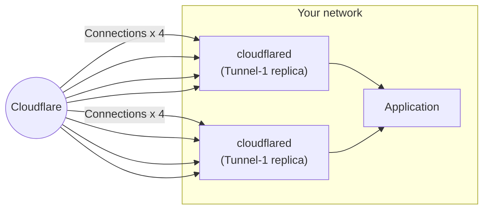

---
{}

---

```mermaid
graph LR
    C((Cloudflare))
    subgraph E[Your network]
        cf1["cloudflared <br> (Tunnel-1 replica)"]
        cf2["cloudflared <br> (Tunnel-1 replica)"]
        S1[Application]
        cf1-->S1
        cf2-->S1
    end
    C -- "Connections x 4 <br>"--> cf1
    C --> cf1
    C --> cf1
    C --> cf1
    C -- Connections x 4--> cf2
    C --> cf2
    C --> cf2
    C --> cf2
```
