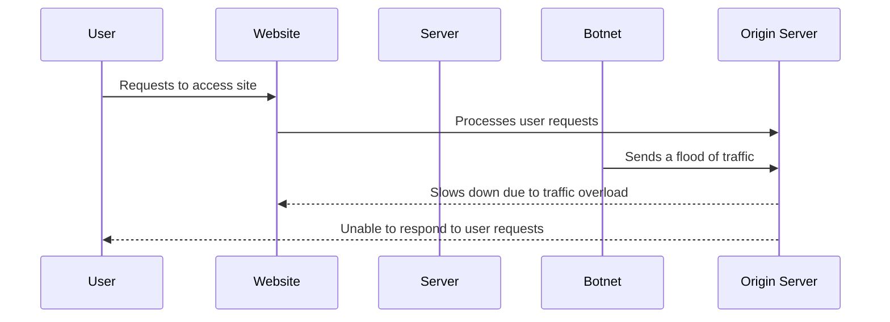

---
{}

---

A distributed denial-of-service (DDoS) attack is where a large number of computers or devices, usually controlled by a single attacker, attempt to access a website or online service all at once. This flood of traffic can overwhelm the website's origin servers, causing the site to slow down or even crash.

 
