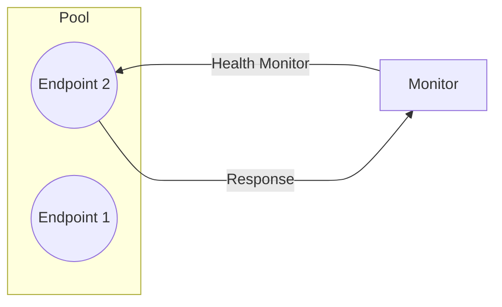

---
{}

---

```mermaid
    flowchart RL
      accTitle: Load balancing monitor flow
      accDescr: Monitors issue health monitor requests, which validate the current status of servers within each pool.
      Monitor -- Health Monitor ----> Endpoint2
      Endpoint2 -- Response ----> Monitor
      subgraph Pool
      Endpoint1((Endpoint 1))
      Endpoint2((Endpoint 2))
      end
```
