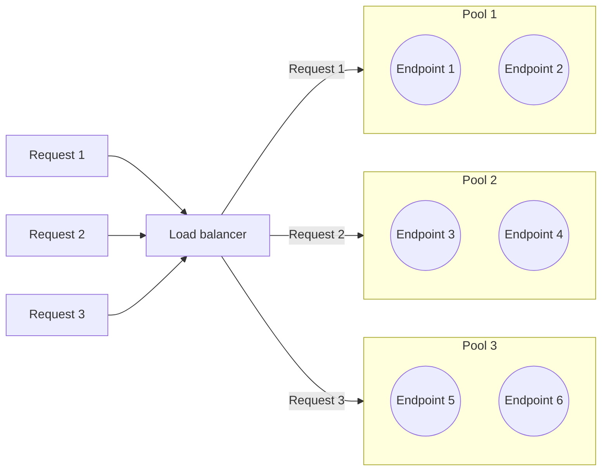

---
{}

---

```mermaid
    flowchart LR
      accTitle: Load balancing flow
      accDescr: Load balancing involves a load balancer, pools, endpoints, monitors, and health monitors.
      B[Request 1] --> A
      C[Request 2] --> A
      D[Request 3] --> A
      A[Load balancer] -- Request 1 --> P1
      A -- Request 2 --> P2
      A -- Request 3 --> P3
      subgraph P1 [Pool 1]
      Endpoint1((Endpoint 1))
      Endpoint2((Endpoint 2))
      end
      subgraph P2 [Pool 2]
      Endpoint3((Endpoint 3))
      Endpoint4((Endpoint 4))
      end
      subgraph P3 [Pool 3]
      Endpoint5((Endpoint 5))
      Endpoint6((Endpoint 6))
      end
```
