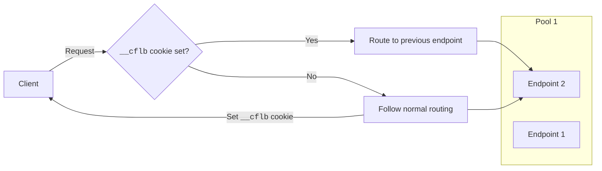

---
{}

---

Session affinity automatically directs requests from the same client to the same endpoint:

1. When a client makes its first request, Cloudflare sets a `__cflb` cookie on the client (to track the associated endpoint).
2. Subsequent requests by the same client are forwarded to that endpoint for the duration of the cookie and as long as the endpoint remains healthy.
3. If the cookie expires or the endpoint becomes unhealthy, Cloudflare sets a new cookie tracking the new failover endpoint.

 

All cookie-based sessions default to 23 hours unless you set a custom session *Time to live* (TTL).

The session cookie is secure when [Always Use HTTPS](/ssl/edge-certificates/additional-options/always-use-https/) is enabled. Additionally, HttpOnly is always enabled for the cookie to prevent cross-site scripting attacks.
