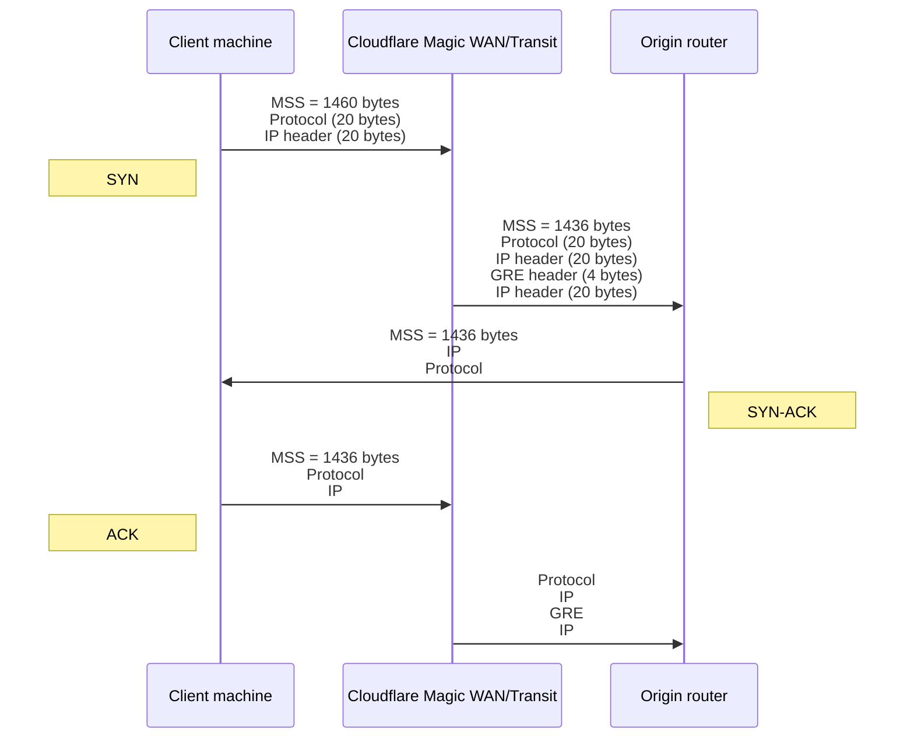

import { Markdown } from "~/components"

### Set maximum segment size

 

The SYN-ACK packet sent to the client during TCP handshake encodes the value for maximum segment size (MSS). Egress packets are routed via your ISP interface, and each packet must comply with the standard Internet routable maximum transmission unit (MTU), which is 1500 bytes.

Cloudflare {props.one} uses tunnels to deliver packets from our global network to your data centers. Cloudflare encapsulates these packets adding new headers.

<Markdown text={props.two} />

:::caution[Important]

Refer to your device documentation to check if it sets IPsec MSS clamping automatically. If that is not the case and you are using IPsec inside GRE, you have to set MSS clamp manually.

Set MSS clamp at the IPsec tunnel interface and subtract 24 bytes from your current MSS value, which may be 1360 bytes or lower. This is because the physical interface will see IPsec-encrypted packets, not TCP packets, and MSS clamping will not apply to those.

:::

| Standard Internet Routable MTU       | 1500 bytes |
| ------------------------------------ | ---------- |
| -	    Original IP header             | 20 bytes   |
| -     Original protocol header (TCP) | 20 bytes   |
| -	    New IP header                  | 20 bytes   |
| -	    New protocol header (GRE)      | 4 bytes    |
| =	    Maximum segment size (MSS)     | 1436 bytes |

Unless you apply these MSS settings at the origin, client machines do not know that they must use an MSS of 1436 bytes when sending packets to your origin.
