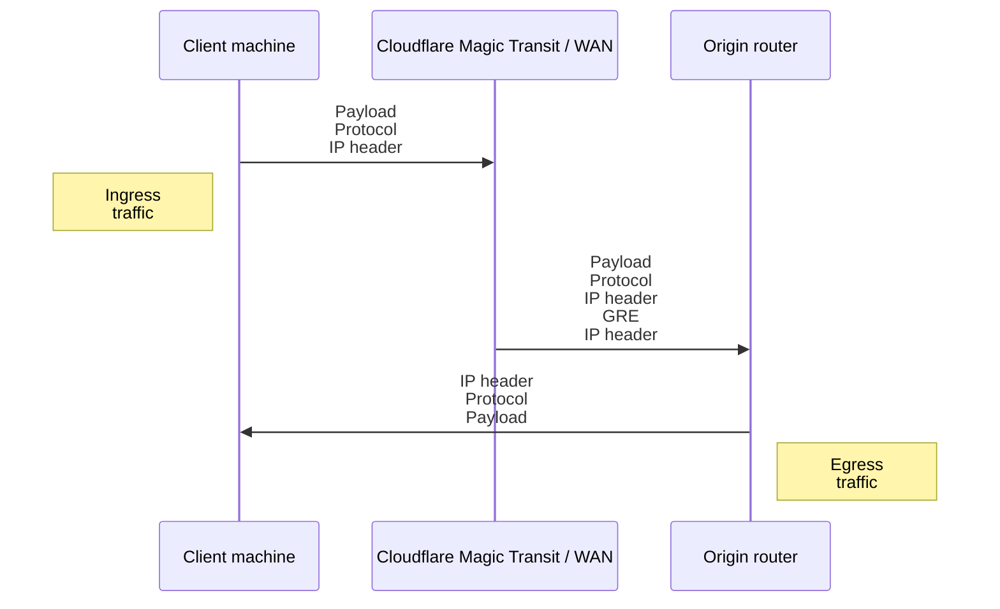
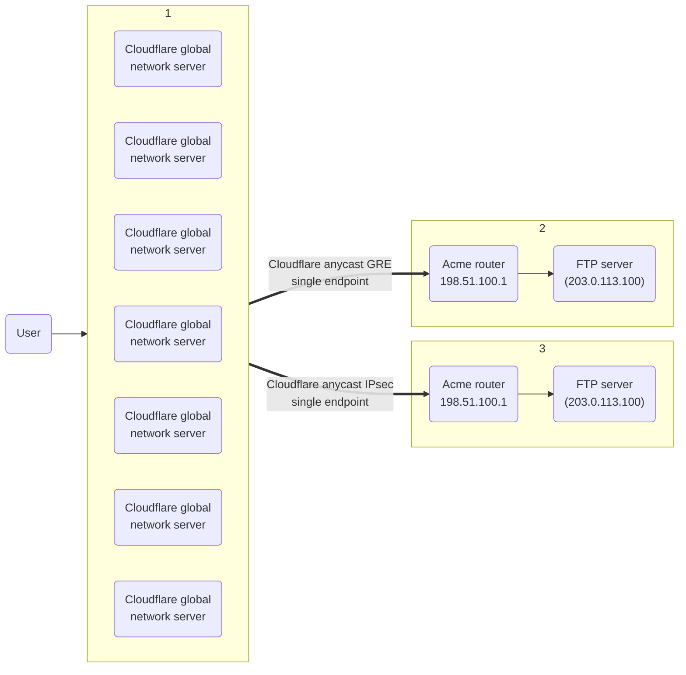

---
params:
  - productName
  - mssURL
  - productURL
  - tunnelEndpoints
---

import { GlossaryTooltip, Markdown, Details } from "~/components";

## Tunnels and encapsulation

{props.productName} uses <GlossaryTooltip term="GRE tunnel" link="https://www.cloudflare.com/learning/network-layer/what-is-gre-tunneling/">Generic Routing Encapsulation (GRE)</GlossaryTooltip> and <GlossaryTooltip term="IPsec tunnel" link="https://www.cloudflare.com/learning/network-layer/what-is-ipsec/">IPsec tunnels</GlossaryTooltip> to transmit packets from Cloudflare's global network to your origin network. Cloudflare sets up tunnel endpoints on global network servers inside your network namespace, and you set up tunnel endpoints on routers at your data center.

To accommodate additional header data introduced by encapsulation, the <GlossaryTooltip term="maximum segment size (MSS)">maximum segment size (MSS)</GlossaryTooltip> must be adjusted so that packets comply with the standard Internet routable maximum transmission unit (MTU), which is 1500 bytes.

For instructions, refer to <a href={props.mssURL}>Set Maximum segment size</a>.

This diagram illustrates the flow of traffic with {props.productName}.

 

:::note
By default, egress packets are routed by your ISP interface, not Cloudflare.
:::

## Anycast

{props.productName} uses <GlossaryTooltip term="anycast" link="https://www.cloudflare.com/learning/cdn/glossary/anycast-network/">anycast</GlossaryTooltip> IP addresses for Cloudflare's tunnel endpoints. In the anycast model, any server in any data center can receive traffic and must be capable of encapsulating and decapsulating packets for any tunnel.

This works with <GlossaryTooltip term="GRE tunnel">GRE</GlossaryTooltip> tunnels because the GRE protocol is stateless. Each packet is processed independently and does not require any negotiation or coordination between tunnel endpoints. Tunnel endpoints are technically bound to IP addresses but do not need to be bound to specific devices. Any device that can strip off the outer headers and then route the inner packet can handle any GRE packet sent over the tunnel.

For <GlossaryTooltip term="IPsec tunnel">IPsec</GlossaryTooltip> tunnels, the customer's router negotiates the creation of an IPsec tunnel with Cloudflare using the <GlossaryTooltip term="Internet key exchange (IKE)">Internet Key Exchange (IKE)</GlossaryTooltip> protocol. Next, the Cloudflare server that handled that negotiation will propagate the details of that newly created IPsec tunnel (traffic selectors, keys, etc.) across Cloudflare's data centers. The result is that any Cloudflare server can then handle traffic for that IPsec tunnel, even though only one Cloudflare server actually negotiated the setup of that tunnel.

Cloudflare's anycast architecture provides a conduit to your tunnel for every server in every data center on Cloudflare's global network as shown in the image below.

## IPsec tunnels

[IPsec](https://www.cloudflare.com/learning/network-layer/what-is-ipsec/) is a group of protocols that are used together to set up encrypted connections between devices. It helps keep data sent over public networks secure. IPsec is often used to set up VPNs, and it works by encrypting IP packets, along with authenticating the source where the packets come from.

For information on how to set up an IPsec tunnel, refer to <a href={props.tunnelEndpoints}>Configure tunnel endpoints</a>. To learn more about the configuration parameters {props.productName} uses to create an IPsec tunnel, keep reading.

### How IKEv2 is used to establish an IPsec tunnel

{props.productName} uses the following stages to establish an IPsec tunnel:

- **Initial Exchange** (`IKE_SA_INIT`): IKE peers negotiate parameters for the IKE Security Association (SA) and establish a shared secret used for key derivation. After this exchange, the peers have a secure communication channel but they have not yet authenticated each other. If supported, the peers will also perform NAT detection in this exchange.
- **Auth Exchange** (`IKE_AUTH`): Using the secure tunnel established in the initial exchange, IKE peers mutually authenticate each other. After authentication, the IKE security association (SA) is established. Next, the peers negotiate and establish an IPsec tunnel, known as a Child SA.

:::note
It is important to note that the IKE SA and the Child SA are separate things, each with their own parameters. The Child SA is the actual IPsec tunnel where user traffic flows (that is, the dataplane). The IKE SA is used to set up and manage the Child SA.
:::

In summary, an IKE SA is created that uses certain cryptographic transforms. That IKE SA is then used to create a Child SA which itself uses certain cryptographic transforms. The configuration section below details which of these transforms for IKE SAs and Child SAs are currently supported by {props.productName}.

### Supported configuration parameters

Below is a list of the configuration parameters supported by Magic WAN. Choose which ones to use based on what your appliance supports.

IKE SA is sometimes referred to as Phase 1 as per IKEv1 language.

- **Encryption**

  - AES-GCM-16 with 128-bit or 256-bit key length
  - AES-CBC with 256-bit key length

- **Integrity** (sometimes referred to as Authentication)

  - SHA2-256

- **Diffie-Hellman group**:

  Below is a list of all Diffie-Hellman (DH) groups supported by Cloudflare.

  :::caution
  Cloudflare recommends that you use only one DH group when configuring your device, specifically **DH group 14**.
  :::

  - DH group 20 (384-bit random ECP group)
  - DH group 14 (2048-bit MODP group)
  - DH group 5 (1536-bit MODP group)

- **Pseudorandom function (PRF)** (not to be confused with PFS. PRF is often not a configurable setting.)
  - SHA2-256
  - SHA2-384
  - SHA2-512

The Child SA. Sometimes referred to as Phase 2 as per IKEv1 language.

- **Encryption**:

  - AES-GCM-16 with 128-bit or 256-bit key length
  - AES-CBC with 128-bit or 256-bit key length

- **Integrity** (sometimes referred to as Authentication.)

  - SHA2-256
  - SHA-1

  :::note
  When using AES-GCM-16, an integrity algorithm is not required because AES GCM includes integrity checking (since it is an AEAD algorithm). Even when using an AEAD algorithm, however, some routers still require an integrity algorithm to be selected.
  :::

- **PFS group** (sometimes referred to as Phase 2 Diffie-Hellman Group. Not to be confused with PRF.)

  Below is a list of all Diffie-Hellman (DH) groups supported by Cloudflare.

  :::caution
  Cloudflare recommends that you use only one DH group when configuring your device, specifically **DH group 14**.
  :::

  - DH group 20 (384-bit random ECP group)
  - DH group 14 (2048-bit MODP group)
  - DH group 5 (1536-bit MODP group)

- The IKE version must be IKEv2.
- The IKE authentication method must be Pre-Shared Key (PSK).
- If your router is behind NAT and requires NAT traversal (NAT-T), then your router must initiate IKE communication on port `4500`. Most devices support configuring NAT-T to begin on port `4500` (exceptions include at least some versions of the Cisco ASA). NAT-T is not supported for IKE sessions which begin on port `500` and then switch to port `4500`.
- (Uncommon) Extended Sequence Numbers (ESN) must be disabled.
- If your tunnels need replay protection, enable Dead Peer Detection (DPD) in your router and select the option that restarts your IKE session when a DPD timeout occurs. This "restart" option ensures that the connection can recover in the event that a Cloudflare server goes offline. If your router does not expose this setting, check the router documentation for its dead peer detection behavior.

- Disable <a href={props.productURL}>anti-replay protection</a>.
- **`NULL` encryption for IPsec:** This option should not be used unless necessary as it reduces security because IPsec traffic is not encrypted. You must explicitly opt in to use this option.

### Supported IKE ID formats

{props.productName} supports the following IKE ID types for IPsec:

- **Format**: `ipsec@<TUNNEL_ID>.<ACCOUNT_ID>.ipsec.cloudflare.com`
- **Example**: `ipsec@f5407d8db1a542b196c59f6d04ba8bd1.123456789.ipsec.cloudflare.com`

- **Format**: `<TUNNEL_ID>.<ACCOUNT_ID>.ipsec.cloudflare.com`
- **Example**: `f5407d8db1a542b196c59f6d04ba8bd1.123456789.ipsec.cloudflare.com`

- **Format**: `<ACCOUNT_ID>_<TUNNEL_ID>`
- **Example**: `123456789_f5407d8db1a542b196c59f6d04ba8bd1`

Additionally, the IKE ID type of `ID_IPV4_ADDR` is supported if the following two conditions are met:

1. The IPsec tunnel’s `customer_endpoint` value is set.
2. The combination of `cloudflare_endpoint` and `customer_endpoint` is unique among the customer’s IPsec tunnels.

:::caution
Make sure each IPsec tunnel has a unique combination of a <a href={props.tunnelEndpoints}>Cloudflare endpoint and customer endpoint</a>. If this combination is not unique among your IPsec tunnels, you should use one of the custom IKE formats (`ID_RFC822_ADDR`, `ID_FQDN`, or `ID_KEY_ID`) to specify the tunnel ID and account ID. This helps Cloudflare link the IKE packet to the right IPsec tunnel for tasks like authentication.
:::
