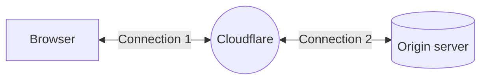

---
{}

---

Your zone's **SSL/TLS Encryption Mode** controls how Cloudflare manages two connections: one between your visitors and Cloudflare, and the other between Cloudflare and your origin server.

