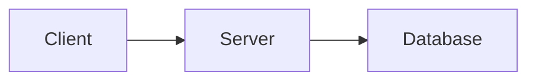
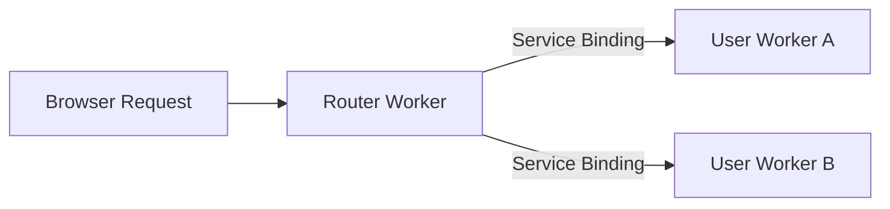

# Mermaid Diagram Rendering

Build-time rendering of Mermaid diagrams using [beautiful-mermaid](https://github.com/lukilabs/beautiful-mermaid) with Cloudflare branding (orange `#f6821f`), light/dark theme support, and annotation footers.

## Architecture

The system has two rendering paths:

1. **Build-time (primary)**: The rehype plugin renders `` ```mermaid `` code fences to inline SVG at build time. Theme switching works via CSS custom properties — no JavaScript needed. This handles ~95% of diagrams.

2. **Client-side (fallback)**: A slim script renders legacy `<pre class="mermaid">` blocks that use JSX template expressions (which cannot be resolved at build time). These ~9 blocks use `beautiful-mermaid` client-side for consistent rendering.

Both paths use the same library (`beautiful-mermaid`) and the same Cloudflare-branded theme.

## Usage

### Basic Diagram

````markdown

````

### With Title and Accessibility

````markdown

````

The `accTitle` appears in the annotation footer and as a `<title>` element inside the SVG for accessibility. `accDescr` becomes a `<desc>` element for screen readers. Always include both.

## How It Works

### Build-time path (code fences)

1. Rehype plugin (`src/plugins/rehype/mermaid.ts`) finds `<code class="language-mermaid">` elements
2. Calls `renderMermaidSVG()` from `beautiful-mermaid` with CSS variable references (`var(--mermaid-bg)`, etc.)
3. Post-processes the SVG: strips Google Fonts import, injects `<title>`/`<desc>` for accessibility
4. Parses SVG into HAST nodes via `hast-util-from-html`
5. Replaces the code block with a `.mermaid-container` div containing the SVG and optional annotation footer
6. CSS custom properties (defined in `mermaid.css`) drive theme switching via the cascade

### Client-side path (legacy `<pre>` blocks)

1. Script (`src/scripts/mermaid.ts`) finds `<pre class="mermaid">` elements
2. Renders each using `renderMermaidSVG()` with hard-coded theme colors (CSS variable approach does not work here because colors must be resolved at render time)
3. Observes `data-theme` attribute changes and re-renders on theme switch

## Supported Diagram Types

- Flowcharts (`flowchart` / `graph`) — all directions (TD, LR, BT, RL)
- State diagrams (`stateDiagram-v2`)
- Sequence diagrams (`sequenceDiagram`)
- Class diagrams (`classDiagram`)
- ER diagrams (`erDiagram`)

## Customization

- **Theme colors**: Edit `--mermaid-*` CSS custom properties in `src/styles/mermaid.css`
- **Render options**: Edit `RENDER_OPTIONS` in `src/plugins/rehype/mermaid.ts`
- **Client theme**: Edit `getThemeOptions()` in `src/scripts/mermaid.ts`

## Troubleshooting

- **Diagram shows raw text with yellow background**: Build-time render failed — check build output for `[rehype-mermaid]` warnings. Validate syntax at [mermaid.live](https://mermaid.live/)
- **No annotation footer**: Ensure `accTitle` is included in the diagram definition
- **Colors wrong in dark mode**: Check `--mermaid-*` variables in `mermaid.css` for `:root[data-theme="dark"]`
- **Legacy `<pre>` block not rendering**: Check browser console for `[mermaid]` warnings

## Related Files

- `src/plugins/rehype/mermaid.ts` — Build-time renderer (rehype plugin)
- `src/scripts/mermaid.ts` — Client-side fallback for legacy blocks
- `src/styles/mermaid.css` — Styles and theme variables
